# La placa

## Presentación {#presentacion}

<!-- Fuente: https://echidna.es/hardware/echidna-shield/ -->

### Características

- Escudo para Arduino
- Sensores integrados: pulsadores, joystick, acelerómetro, luz
- Actuadores integrados: LEDs, LED RGB, audio
- Flexible: entradas y salidas disponibles para complementos
- 8 Entradas tipo Makey Makey
- Conexión BlueTooth
- Open Source Hardware Certification OSHWA UID ES000007

### Esquema de componentes

### Componentes
#### [Pulsadores](#pulsadores)

Es un componente electromecánico que permite abrir o cerrar un circuito con un solo estado estable

#### [Joystick](#joystick)

Es un mando que consta de dos potenciómetros uno para el eje X y otro para el eje Y.

#### [Sensor Luz LDR](#sensor-de-luz-ldr)

“Light Dependent Resistor”, es una resistencia cuyo valor depende de la cantidad de luz que incide sobre ella.

#### [LED RGB](#led-rgb)

Light Emitting Diode y Red Green Blue, Son 3 LEDes Rojo, Verde y Azul en la misma cápsula.

#### [Audio](#audio)

Dispone de dos salidas para reproducir audio: el zumbador y el jack, ambos con un regulador de volumen.

#### [MkMk](#conexiones-mkmk)

Echidna dispone de 8 Conectores MkMk que le permiten detectar gran variedad de objetos.

#### [Acelerómetro](#acelerometro)

Sensor de aceleraciones basado en condensadores dentro de una estructura  

#### [LEDs ROG](#leds)

Light Emitting Diode se usan como testigos (indicadores) y como fuente de iluminación.

Modo Sensores/Modo MkMk

[Alimentación](#alimentacion)

[Complementos](#complementos)

Documentación

## Alimentación {#alimentacion}

<!-- Fuente: https://echidna.es/hardware/echidna-shield/alimentacion-echidnashield/ -->

### Formas de alimentar la placa
1\. Mediante la **conexión USB**: esta forma es válida para la mayoría de las funciones, toda la placa recibe una tensión regulada de 5V proporcionada por el cable USB, generalmente con un límite de 500mA.

2\. Mediante el **Jack de alimentación**: todas las partes reciben una tensión regulada internamente de 5V y 1A máx. Nos da la posibilidad de seleccionar Vin para alimentar los pines I/O con la potencia que proporciona el alimentador externo (no superar 1A de corriente constante)

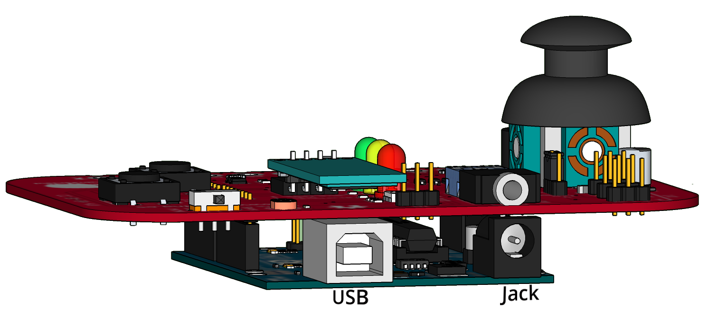

### Selector de alimentación
El jumper de alimentación permite seleccionar la alimentación de las I/O.

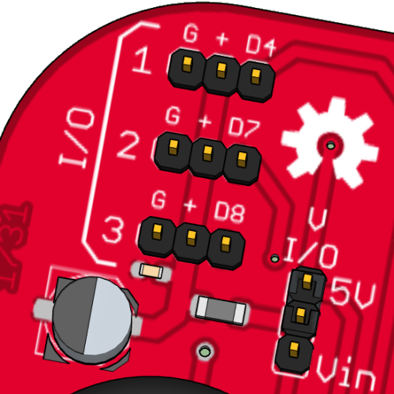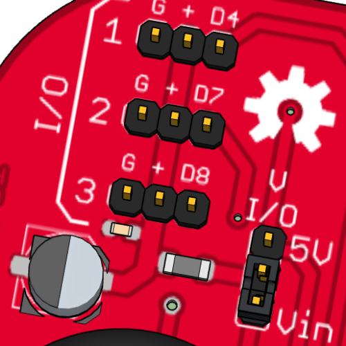

### Selector 5v
En caso de querer alimentar las I/O desde los 5 Volts procedentes del Arduino el jumper debe estar colocado en esta posición. Aconsejado para sensores externos que necesiten una tensión estabilizada.

¡No utilizar la alimentación 5V cuando los servos a controlar consuman más de 300 mA!\* De lo contrario se sobrepasaría el regulador de Arduino.

### Selector alimentación Vin  (Alimentación externa)
Aconsejado para alimentar servos u otros dispositivos conectados a I/O que consuman más de 300 mA con alimentación externa por el Jack de alimentación.

La alimentación de los servos cuenta con un filtro L-C para evitar que lleguen los parásitos de los motores al procesador.

## Modo sensores / Modo MkMk {#modo-sensores-modo-mkmk}

<!-- Fuente: https://echidna.es/hardware/echidna-shield/modo-sensores-modo-mkmk-shield/ -->

### Selector Modo Sensores/Modo MkMk

Es un conmutador que selecciona entre el Modo Sensores y el Modo Makey Makey.

### Modo sensores
En el modo sensores tenemos activo todos los componentes de la placa exceptuando las conexiones MkMk.

### Modo MkMk

En este modo tenemos activas todas las salidas, las I/0 y las conexiones MkMk.

# Componentes

## LEDs {#leds}

<!-- Fuente: https://echidna.es/hardware/componentes/leds/ -->

### Descripción

Acrónimo de **Light Emitting Diode,** basado en el fenómeno de electroluminiscencia. Se usan como testigos (indicadores) y como fuente de iluminación.

### Funcionamiento
Al aplicar tensión emite luz, por lo tanto podemos controlar su encendido apagado en digital “1” enciende, “0” apaga y su brillo en las salidas PWM

Todos los LEDes se conectan con una resistencia serie “Rs” para controlar la tensión/corriente aplicada.

### Pines

- D11~ «Gre»: salida digital y PWM
- D12 «Orn»: salida digital
- D13 «Red»: salida digital

**Digital:** se enciende con un «1» y se apaga con un «0».

**PWM:** en la salida D11~ «Gre» se puede regular la intensidad luminosa con un valor de 0 a 255.

### [Hoja de características](paginas/leds/DataSheet-LED.pdf)

## Pulsadores {#pulsadores}

<!-- Fuente: https://echidna.es/hardware/componentes/pulsadores/ -->

### Descripción

Es un componente electromecánico que permite abrir o cerrar un circuito con un solo estado estable.

### Funcionamiento
Está conectado con una resistencia a masa formando un  circuito denominado pull-down, que proporciona un “0” (0V) sin pulsar y un “1” (5V) cuando pulsamos.

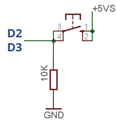

### Pines

Entradas digitales: **D2** «SR» y **D3** «SL». Dan 0 si el pulsador no está pulsado y 1 si está pulsado.

### [Hoja de características](paginas/pulsadores/DataSheet-button.pdf)

## Joystick {#joystick}

<!-- Fuente: https://echidna.es/hardware/componentes/joystick/ -->

### Descripción

Es un mando que consta de dos potenciómetros uno para el eje X y otro para el eje Y. Este modelo cuenta además con un pulsador.

### Funcionamiento
Permite transferir el movimiento del mando en una tensión proporcional entre 0-4,88V ( 0-999 de lectura analógica) \* en la salida de cada eje (X, Y).

En la posición de reposo los valores rondan 2,5V (520 de lectura analógica) \*, el pulsador del joystick está conectado con el pulsador «SR» (D2).

\* Debido a las tolerancias de los componentes estos valores pueden ser distintos en cada placa.

### Pines

- A0: eje X del joystick, entrada analógica
- A1: eje Y del joystick, entrada analógica
- D2: pulsador del joystick, entrada digital

Valores que da el joystick:

- En reposo, valores en torno a 512 en los dos ejes.
- En el eje X, 0 a la izquierda y 1023 a la derecha.
- En el eje Y, 0 abajo y 1023 arriba.

### [Hoja de características](paginas/joystick/DataSheet-Joystick.pdf)

## Sensor de luz (LDR) {#sensor-de-luz-ldr}

<!-- Fuente: https://echidna.es/hardware/componentes/sensor-luz-ldr/ -->

### Descripción

LDR es el acrónimo de “Light Dependent Resistor”, es una resistencia cuyo valor depende de la cantidad de luz que incide sobre ella. Generalmente se fabrica con sulfuro de cadmio.

### Funcionamiento
La LDR proporciona valores altos de resistencia (en torno al MΩ) con poca luz y valores bajos con mucha luz. Gracias a conectarla con una resistencia en serie forma un divisor de tensión que consigue invertir la lógica del funcionamiento, de forma que con mucha luz proporciona valores altos de tensión 4,9V = 999 (de lectura analógica) \* y valores bajos con poca luz (0,0V = 000).

\* Debido a las tolerancias de los componentes estos valores pueden ser distintos en cada placa.

### Pines

A5 «LDR»: entrada analógica.

### [Hoja de características](https://www.advancedphotonix.com/wp-content/uploads/2015/07/DS-NSL-4132.pdf)

## LED RGB {#led-rgb}

<!-- Fuente: https://echidna.es/hardware/componentes/led-rgb/ -->

### Descripción

LED RGB acrónimos de Light Emitting Diode y Red Green Blue, es decir son tres LEDes Rojo, Verde y Azul en la misma cápsula.

### Funcionamiento
El LED RGB podemos controlarlo digitalmente, encendiendo o apagando cada LED y ajustar la luminosidad mediante PWM “analógico”.

**Control digital:** podemos encender y apagar cada uno de los LED RGB, lo que nos permite formar 2³\=8 colores diferentes.

**Control “analógico” PWM:** podemos controlar el brillo de cada LED, variando su intensidad luminosa desde 0 a 255, lo que permite formar 256 × 256 × 256, más de 16 millones de colores.

Todos los LEDes se conectan con una resistencia serie “Rs” para controlar la tensión/corriente aplicada.

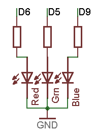

### Pines

- D9~ «RGB_R»: salida digital y PWM
- D5~ «RGB_G»: salida digital y PWM
- D6~ «RGB_B»: salida digital y PWM

Como salidas PWM, con un valor entre 0 y 255 se regula la intensidad de cada LED y, con ella, el color que emite.

### [Hoja de características](paginas/led-rgb/DataSheet-LEDRGB.pdf)

## Audio {#audio}

<!-- Fuente: https://echidna.es/hardware/componentes/audio/ -->

### Descripción

Disponemos de dos salidas para reproducir audio, el zumbador y el jack al que podemos conectar auriculares o altavoces autoamplificados. Al conectar una clavija de audio en el jack se desconecta el zumbador.

Además contamos con un potenciómetro que permite ajustar el volumen del sonido.

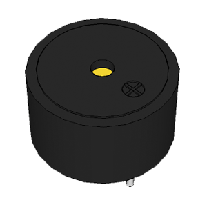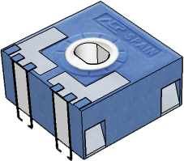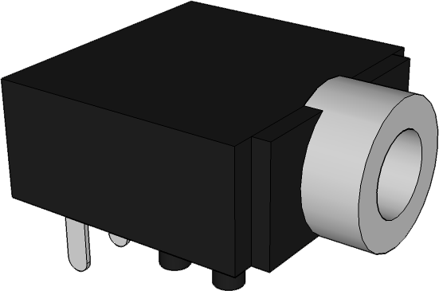

### Funcionamiento
En D10~ podemos reproducir señales entre 31 Hz y 20 KHz.

El zumbador al ser excitado por una señal con una frecuencia determinada vibra reproduciendo un sonido. Hay que tener en cuenta que su frecuencia central es de 2,3 Khz, con lo que si nos alejamos mucho de esa frecuencia no sonará con calidad. (Do = C4 = 262 Hz) (cuidado con el volumen, a bajo nivel el zumbador puede no resultar audible).

En la salida del jack conectamos un equipo externo de audio que nos permite reproducir las frecuencias de entrada con más calidad (cuidado con el volumen, puede dañar los auriculares e incluso llegar al umbral doloroso en los oídos).

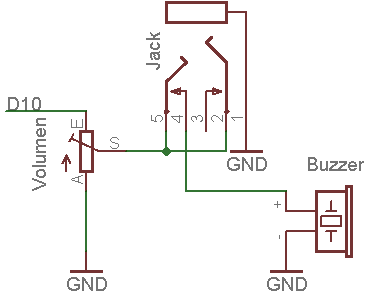

### Pines

D10~ «Buzz»: salida PWM. Con un valor entre 0 y 255 se modula la frecuencia del sonido.

### [Hoja de características](paginas/audio/F-CM12P-LF.pdf)

## Acelerómetro {#acelerometro}

<!-- Fuente: https://echidna.es/hardware/componentes/acelerometro-shield/ -->

### Descripción

Sensor de aceleraciones basado en condensadores diferenciales dentro de una estructura micro-mecanizada.

Proporciona una tensión que depende de la aceleración.

### Funcionamiento
Mide la aceleración en los ejes (X, Y) de Echidna, en la posición de reposo proporciona un valor de 1,56V= 320 (de lectura analógica)\* y en sus extremos los valores 0,8V =159 – 2,40V=490.

\* Debido a las tolerancias de los componentes estos valores pueden ser distintos en cada placa.

### Pines

- A2 «Ace_X»: entrada analógica
- A3 «Ace_Y»: entrada analógica

### [Hoja de características](paginas/acelerometro-shield/DataSheet-MMA7361L.pdf)

## Conexiones MkMk {#conexiones-mkmk}

<!-- Fuente: https://echidna.es/hardware/componentes/conexiones-mkmk-shield/ -->

### Descripción

Una conexión MkMk es un conector que permite detectar gran variedad de objetos al conectarlos entre una entrada y el común. Echidna dispone de 8 conexiones MkMk.

### Funcionamiento
Cada conexión MkMk es parte de un divisor de tensión con una resistencia muy elevada, por lo que al conectar un elemento que conduce electricidad, aunque sea tenuemente, al cerrar el circuito con el punto común, la tensión de la entrada sube y es detectada. La tensión umbral de detección depende de cada material/persona.

### Pines

- A0 MkMk0: entrada analógica
- A1 MkMk1: entrada analógica
- A2 MkMk2: entrada analógica
- A3 MkMk3: entrada analógica
- A4 MkMk4: entrada analógica
- A5 MkMk5: entrada analógica
- D2 MkMk6: entrada digital
- D3 MkMk7: entrada digital

En las entradas analógicas (A0 a A5) se compara el valor leído, de 0 a 1023, con un umbral, que puede variar según el objeto. En las digitales (D2 y D3) se lee directamente 0 o 1.

# Complementos

## Complementos {#complementos}

<!-- Fuente: https://echidna.es/hardware/echidna-shield/complementos-echidna-shield/ -->

Estos son algunos de los **componentes** que se pueden usar para complementar la funcionalidades de **EchidnaShield,** para conectarlos se disponen de las **I/O y la entrada analógica IN.**

#### [Servomotor Posición](#servomotor-de-posicion)

Son motores de corriente continua que permiten posicionarlo en un ángulo entre 0 y 180º.

#### Servomotor Continuo

Son motores de corriente continua con una reductora y electrónica de control que permiten controlar el sentido de giro.

#### Sensor Temperatura

Es un sensor de temperatura calibrado cuya salida es lineal, y donde cada 10 mV equivale a 1ºC

#### Infrarrojos distancia

Es un sensor de distancia que proporciona una tensión según la cantidad de infrarrojo que rebota en una superficie.

#### Complemento Conexiones MkMk

Pinzas cocodrilo y cinta conductiva

#### [Bluetooth](#bluetooth)

Es un transceptor que permite conectar dispositivos Bluetooth a la placa Arduino.

## Servomotor de posición {#servomotor-de-posicion}

<!-- Fuente: https://echidna.es/hardware/complementos/servomotor-de-posicion-shield/ -->

### Descripción

Son motores de corriente continua con una reductora y electrónica de control que permiten posicionarlo en un ángulo entre 0 y 180º.

### Funcionamiento
Se controla mediante pulsos de 1-2 ms en periodos de 20 ms.

En la práctica se usa una librería que nos permite indicar directamente el ángulo.

### Elementos de conexión
Se conecta directamente con sus cables. Es aconsejable colocar el jumper de alimentación en Vin y alimentar Arduino mediante el jack  de alimentación.

### Pines

- I/O 1: pin D4
- I/O 2: pin D7
- I/O 3: pin D8

El servomotor de posición se controla indicando el ángulo, de 0 a 180 grados.

### [Hoja de características](paginas/servomotor-de-posicion-shield/DatasheetServoPosicion.pdf)

## Servomotor continuo {#servomotor-continuo}

<!-- Fuente: https://echidna.es/hardware/complementos/servomotor-continuo-shield/ -->

### Descripción

Son motores de corriente continua con una reductora y electrónica de control que permiten controlar el sentido de giro.

### Funcionamiento
Se controla mediante pulsos de 1-2 ms en periodos de 20 ms.

En la práctica se usa una librería que nos permite indicar directamente el el sentido de giro.

### Elementos de conexión
Se conecta directamente con sus cables. Es aconsejable colocar el jumper de alimentación en Vin y alimentar Arduino mediante el jack  de alimentación.

### Pines

- I/O 1: pin D4
- I/O 2: pin D7
- I/O 3: pin D8

El servomotor continuo se controla indicando el sentido de giro.

### [Hoja de características](paginas/servomotor-continuo-shield/DataSheeetServoContinuo.pdf)

## Sensor de temperatura LM35 {#sensor-de-temperatura-lm35}

<!-- Fuente: https://echidna.es/hardware/complementos/sensor-temperatura-lm35-shield/ -->

### Descripción

Es un sensor de temperatura calibrado cuya salida es lineal y donde cada 10 mv equivale a 1 ºC

### Funcionamiento
Se conecta directamente al conector IN (5V, GND, A4). Proporciona 10 mv por ºC. Teniendo en cuenta que 5V son 1024 “pasos” en la medida analógica, podemos obtener la temperatura mediante la siguiente operación:

temperatura = (lectura Analogica\* 5.0 \* 100.0)/1024.0

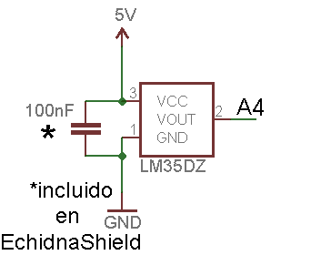

### Elementos de conexión
Para conectar el sensor necesitamos tres cables dupont-dupont hembra-hembra. También se puede usar una protoboard y tres cables dupont-dupont macho hembra.

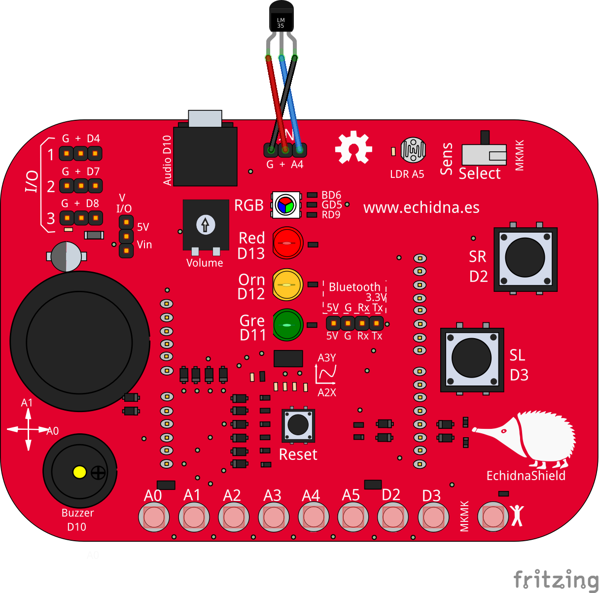

### Pines

Entrada analógica A4 (IN). Para conocer la temperatura se lee el valor del sensor y se convierte a grados: cada 10 mV es 1 °C.

### [Hoja de características](paginas/sensor-temperatura-lm35-shield/lm35.pdf)

## Bluetooth {#bluetooth}

<!-- Fuente: https://echidna.es/hardware/complementos/bluetooth-shield/ -->

### Descripción

Es un transceptor que permite conectar dispositivos Bluetooth a la placa Arduino.

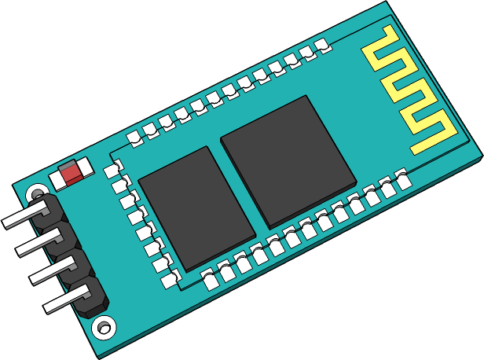

### Funcionamiento
Envía y recibe datos a través del puerto serie vía Bluetooth

### Esquema y conexión
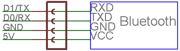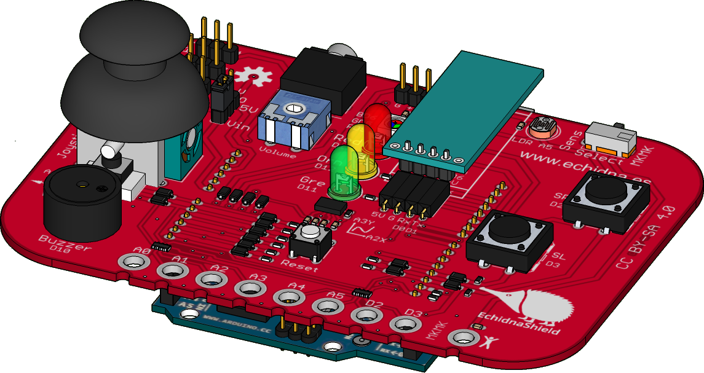

### Pines

- D0 (Rx): recepción de datos
- D1 (Tx): transmisión de datos

Se comunica a través del puerto serie Tx/Rx, es necesario programar Arduino previamente a la conexión del Bluetooth, ya que si no este bloquea la comunicación por cable.

### [Hoja de características](paginas/bluetooth-shield/hc06.pdf)

# Documentación

## Documentación técnica {#documentacion-tecnica}

<!-- Fuente: https://echidna.es/hardware/echidna-shield/documentacion-echidnashield/ -->

### Esquemático

### Open Source Hardware Certification
EchidnaShield está certificada como Open Source Hardware con registro OSHWA UID ES000007

### Licencia
La placa Echidna Shield se publica con la licencia CERN-OHL-W 2.0. No se permite su reproducción bajo la marca Echidna.

### Fritzing

