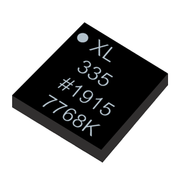
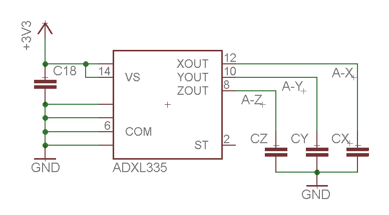

# Acelerómetro Black

<!-- https://echidna.es/hardware/componentes/acelerometro-black/ -->

## Descripción

Sensor de aceleraciones basado en condensadores diferenciales dentro de una estructura micro-mecanizada.

Proporciona una tensión que depende de la aceleración.

## Funcionamiento:

Mide la aceleración en los ejes (X, Y) en un rango de +- 3g, en la posición de reposo proporciona un valor de 1,75V = 359 (de lectura analógica)\* y en sus extremos los valores 1,39V =285\* – 2,10V=428\*.

\* Debido a las tolerancias de los componentes estos valores pueden ser distintos en cada placa.

## Programación:

- A2 “Ace\_X”: Entrada analógica
- A3 “Ace\_Y”: Entrada analógica

Lectura y almacenamiento de los valores del sensor:

## [Hoja de características](./ADXL335.pdf)
