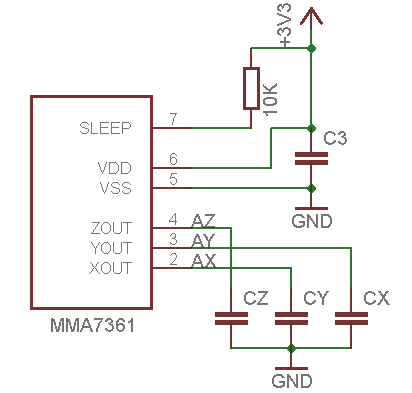

# Acelerómetro Shield

<!-- https://echidna.es/hardware/componentes/acelerometro-shield/ -->

## Descripción

Sensor de aceleraciones basado en condensadores diferenciales dentro de una estructura micro-mecanizada.

Proporciona una tensión que depende de la aceleración.

## Funcionamiento:

Mide la aceleración en los ejes (X, Y) de Echidna, en la posición de reposo proporciona un valor de 1,56V= 320 (de lectura analógica)\* y en sus extremos los valores 0,8V =159 – 2,40V=490.

\* Debido a las tolerancias de los componentes estos valores pueden ser distintos en cada placa.

## Programación:

- A2 “Ace\_X”: Entrada analógica
- A3 “Ace\_Y”: Entrada analógica

Lectura y almacenamiento de los valores del sensor:

## [Hoja de características](./DataSheet-MMA7361L.pdf)
