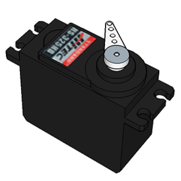
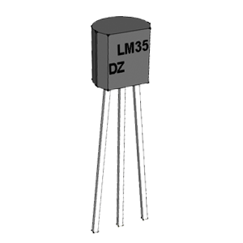
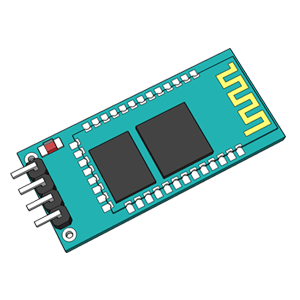

# Complementos EchidnaShield

<!-- https://echidna.es/hardware/echidna-shield/complementos-echidna-shield/ -->

Estos son algunos de los **componentes** que se pueden usar para complementar la funcionalidades de **EchidnaShield,** para conectarlos se disponen de las **I/O y la entrada analógica IN.**

### [Servomotor Posición](/ecosistema/placas-anteriores/)

Son motores de corriente continua que permiten posicionarlo en un ángulo entre 0 y 180º.

[Saber más](/ecosistema/placas-anteriores/)

### Servomotor Continuo

Son motores de corriente continua con una reductora y electrónica de control que permiten controlar el sentido de giro.

[Saber más](/ecosistema/placas-anteriores/)

### Sensor Temperatura

Es un sensor de temperatura calibrado cuya salida es lineal, y donde cada 10 mV equivale a 1ºC

[Saber más](/ecosistema/placas-anteriores/)

### Infrarrojos distancia

Es un sensor de distancia que proporciona una tensión según la cantidad de infrarrojo que rebota en una superficie.

[Saber más](/ecosistema/echidnablack2/complementos/infrarrojos-distancia/)

### Complemento Conexiones MkMk

Pinzas cocodrilo y cinta conductiva

[Saber Más](/ecosistema/echidnablack2/complementos/conexiones-mkmk/)

### [Bluetooth](/ecosistema/placas-anteriores/)

Es un transceptor que permite conectar dispositivos Bluetooth a la placa Arduino.

[Saber más](/ecosistema/placas-anteriores/)
