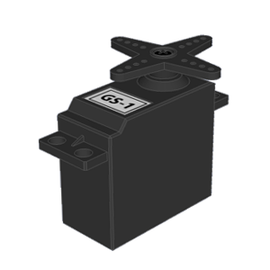
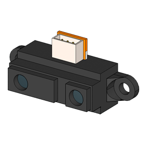
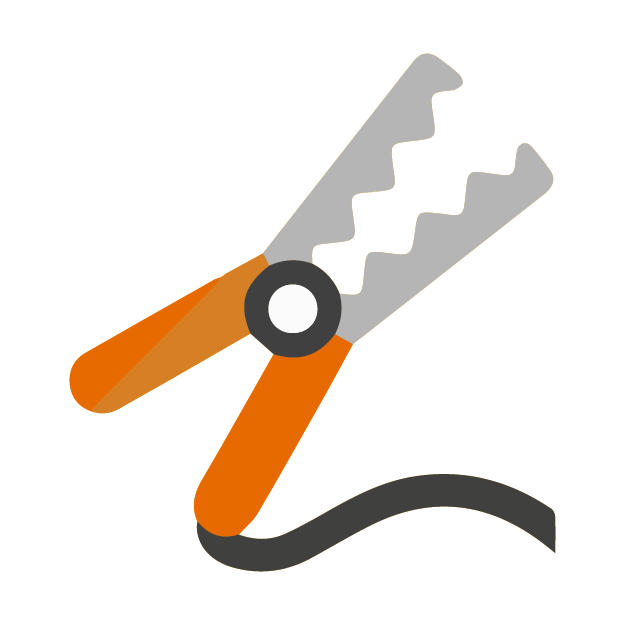

# Complementos EchidnaBlack

<!-- https://echidna.es/hardware/echidnablack/complementos-echidnablack/ -->

Estos son algunos de los **componentes** que se pueden usar para complementar la funcionalidades de **EchidnaBlack,** para conectarlos se disponen de las **I/O y la entrada analógica IN.**

### [Servomotor Posición](/ecosistema/echidnablack2/complementos/servomotor-posicion/)

Son motores de corriente continua que permiten posicionarlo en un ángulo entre 0 y 180º.

[Saber más](/ecosistema/echidnablack2/complementos/servomotor-posicion/)

### [Servomotor Continuo](/ecosistema/echidnablack2/complementos/servomotor-continuo/)

Son motores de corriente continua con una reductora y electrónica de control que permiten controlar el sentido de giro.

[Saber más](/ecosistema/echidnablack2/complementos/servomotor-continuo/)

### [Infrarrojos distancia](/ecosistema/echidnablack2/complementos/infrarrojos-distancia/)

Es un sensor de distancia que proporciona una tensión según la cantidad de infrarrojo que rebota en una superficie.

[Saber más](/ecosistema/echidnablack2/complementos/infrarrojos-distancia/)

### [Complementos conexiones MkMk](/ecosistema/echidnablack2/complementos/conexiones-mkmk/)

Pinzas cocodrilo y cinta conductiva para realizar las conexiones MkMk.  

[Saber más](/ecosistema/echidnablack2/complementos/conexiones-mkmk/)

### [Bluetooth](/ecosistema/echidnablack2/complementos/bluetooth/)

Es un transceptor que permite conectar dispositivos Bluetooth a la placa Arduino.

[Saber más](/ecosistema/echidnablack2/complementos/bluetooth/)
