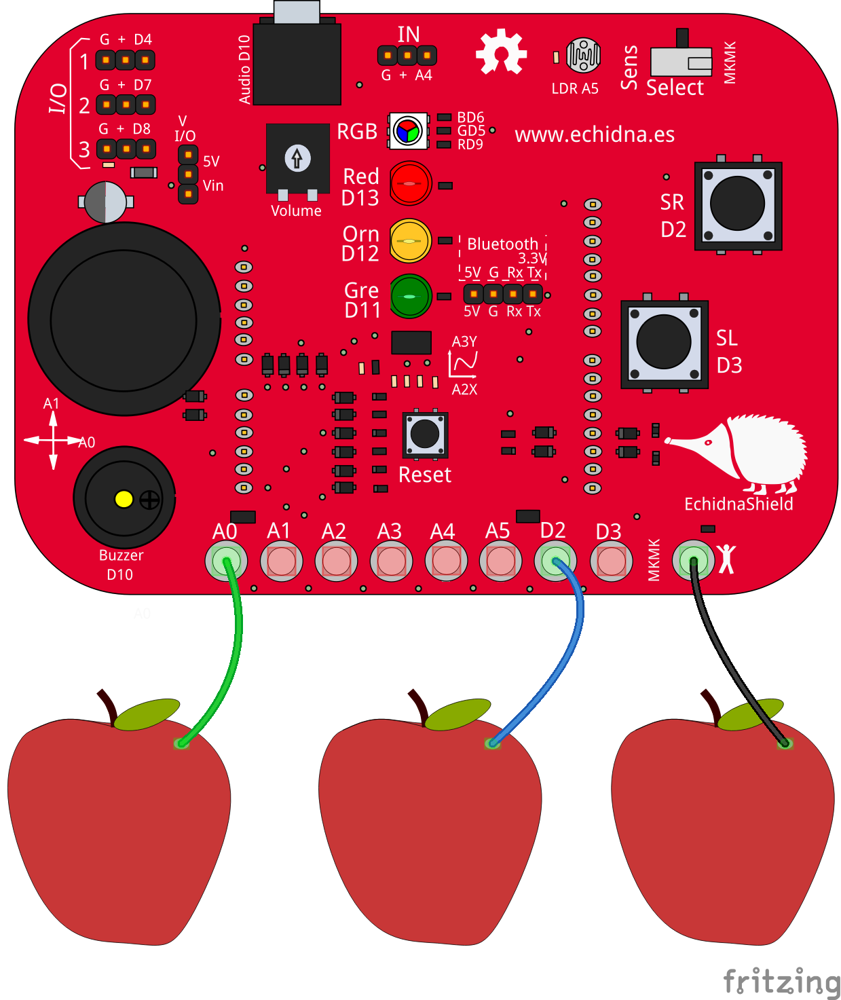
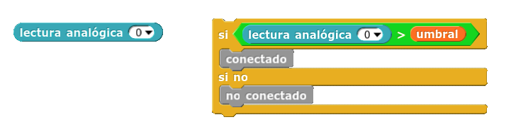
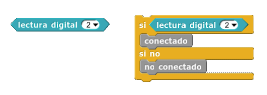

# Conexiones MkMk Shield

<!-- https://echidna.es/hardware/componentes/conexiones-mkmk-shield/ -->

## Descripción

Una conexión MkMk es un conector que permite detectar gran variedad de objetos al conectarlos entre una entrada y el común. Echidna dispone de 8 conexiones MkMk.

## Funcionamiento:

Cada conexión MkMk es parte de un divisor de tensión con una resistencia muy elevada, por lo que al conectar un elemento que conduce electricidad, aunque sea tenuemente, al cerrar el circuito con el punto común, la tensión de la entrada sube y es detectada. La tensión umbral de detección depende de cada material/persona.

## Programación:

- A0 MkMk0: Entrada analógica
- A1 MkMk1: Entrada analógica
- A2 MkMk2: Entrada analógica
- A3 MkMk3: Entrada analógica
- A4 MkMk4: Entrada analógica
- A5 MkMk5: Entrada analógica
- D2 MkMk6: Entrada digital
- D3 MkMk7: Entrada digital

En los **pines analógicos** A0-A5 comparamos el valor leido (0-1023) con un umbral (que puede variar para cada objeto):

En los **pines digitales** D2/D3 se lee directamente como 0 o 1:

