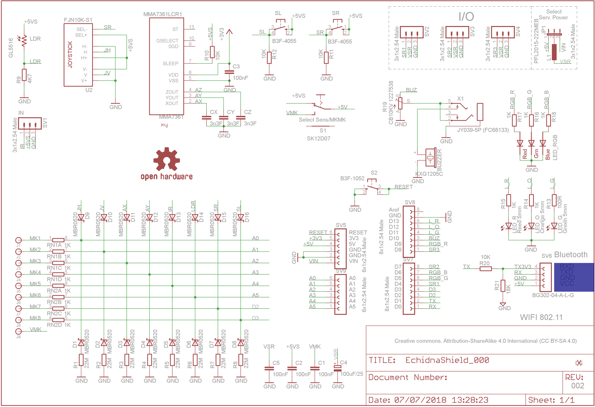
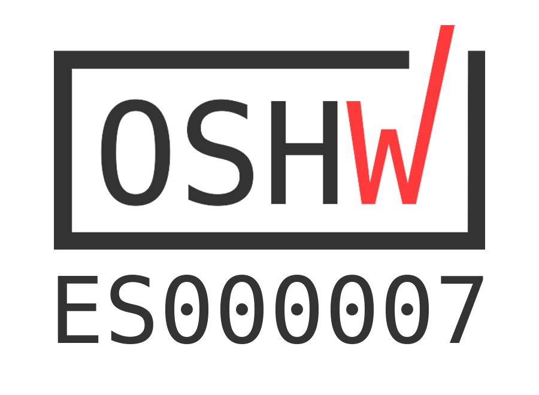
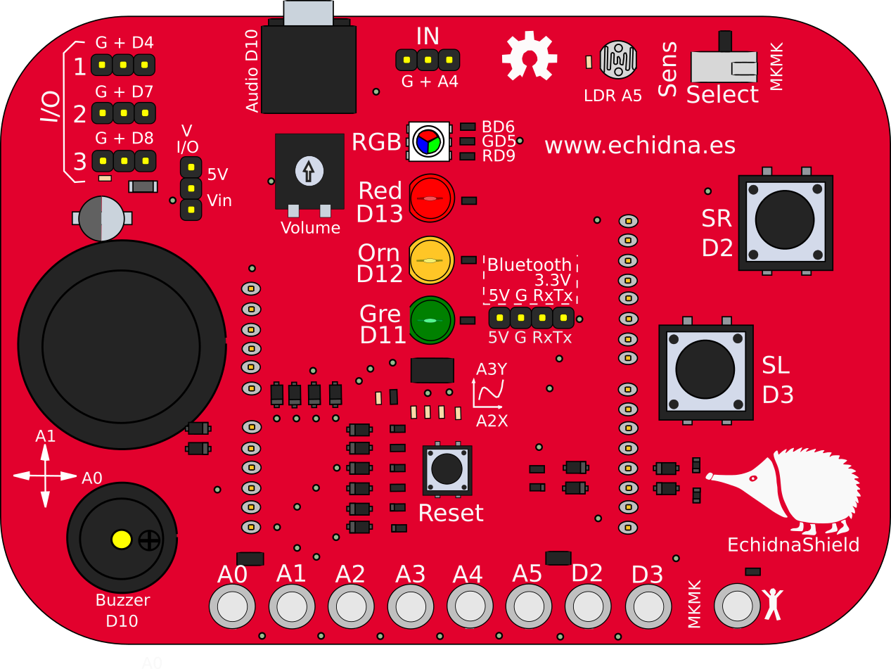

# Documentación EchidnaShield

<!-- https://echidna.es/hardware/echidna-shield/documentacion-echidnashield/ -->

## Esquemático:

## Open Source Hardware Certification:

EchidnaShield está certificada como Open Source Hardware con registro OSHWA UID ES000007

## Licencia:

La placa Echidna Shield se publica bajo licencia se publica bajo licencia CERN-OHL-W 2.0. No se permite su reproducción bajo la marca Echidna.

## Fritzing:

