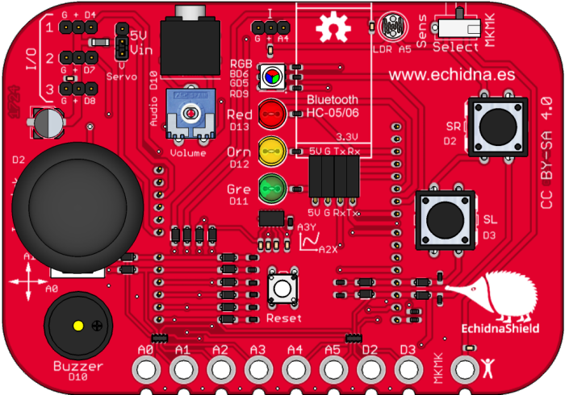
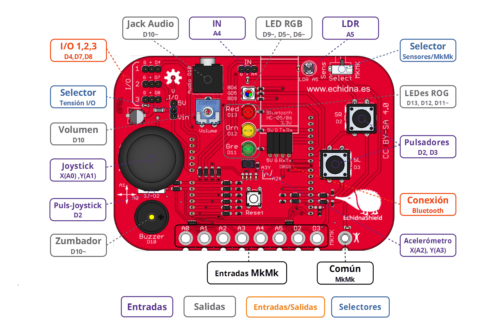
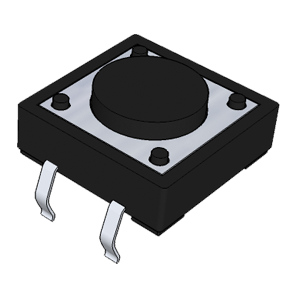
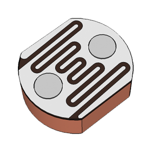
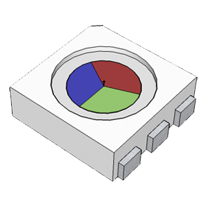
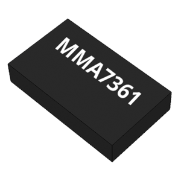
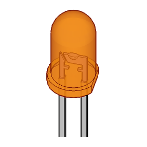

# Echidna Shield

<!-- https://echidna.es/hardware/echidna-shield/ -->

## Características:

- Escudo para Arduino
- Sensores integrados: pulsadores, joystick, acelerómetro, luz
- Actuadores integrados: LEDs, LED RGB, audio
- Flexible: entradas y salidas disponibles para complementos
- 8 Entradas tipo Makey Makey
- Conexión BlueTooth
- Open Source Hardware Certification OSHWA UID ES000007

## Esquema de componentes:

## Componentes:

### [Pulsadores](/ecosistema/echidnablack2/pulsadores/)

Es un componente electromecánico que permite abrir o cerrar un circuito con un solo estado estable

[SABER MÁS](/ecosistema/echidnablack2/pulsadores/)

### [Joystick](/ecosistema/echidnablack2/joystick/)

Es un mando que consta de dos potenciómetros uno para el eje X y otro para el eje Y.

[SABER MÁS](/ecosistema/echidnablack2/joystick/)

### [Sensor Luz LDR](/ecosistema/echidnablack2/sensor-luz-ldr/)

“Light Dependent Resistor”, es una resistencia cuyo valor depende de la cantidad de luz que incide sobre ella.

[SABER MÁS](/ecosistema/echidnablack2/sensor-luz-ldr/)

### [LED RGB](/ecosistema/echidnablack2/led-rgb/)

Light Emitting Diode y Red Green Blue, Son 3 LEDes Rojo, Verde y Azul en la misma cápsula.

[Saber más](/ecosistema/echidnablack2/led-rgb/)

### [Audio](/ecosistema/echidnablack2/audio/)

Dispone de dos salidas para reproducir audio: el zumbador y el jack, ambos con un regulador de volumen.

[Saber más](/ecosistema/echidnablack2/audio/)

### [MkMk](/ecosistema/placas-anteriores/)

Echidna dispone de 8 Conectores MkMk que le permiten detectar gran variedad de objetos.

[SABER MÁS](/ecosistema/placas-anteriores/)

### [Acelerómetro](/ecosistema/placas-anteriores/)

Sensor de aceleraciones basado en condensadores dentro de una estructura  

[Saber más](/ecosistema/placas-anteriores/)

### [LEDs ROG](/ecosistema/echidnablack2/leds/)

Light Emitting Diode se usan como testigos (indicadores) y como fuente de iluminación.

[Saber más](/ecosistema/echidnablack2/leds/)

[Modo Sensores/Modo MkMk](/ecosistema/placas-anteriores/)

[Alimentación](/ecosistema/placas-anteriores/)

[Complementos](/ecosistema/placas-anteriores/)

[Documentación](/ecosistema/placas-anteriores/)
