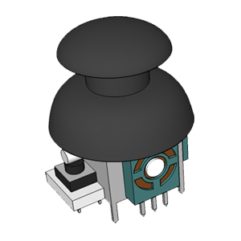
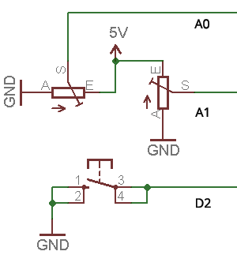

# Joystick

<!-- https://echidna.es/hardware/componentes/joystick/ -->

## Descripción

Es un mando que consta de dos potenciómetros uno para el eje X y otro para el eje Y. Este modelo cuenta además con un pulsador.

## Funcionamiento:

Permite transferir el movimiento del mando en una tensión proporcional entre 0-4,88V ( 0-999 de lectura analógica) \* en la salida de cada eje (X, Y).

En la posición de reposo los valores rondan 2,5V (520 de lectura analógica) \*, el pulsador del Joystick está conectado con el pulsador “SL”.

\* Debido a las tolerancias de los componentes estos valores pueden ser distintos en cada placa.

## Programación:

Pines:

- A0: Eje x del joystick entrada analógica
- A1 : Eje y del joystick entrada analógica
- D2 : Pulsador entrada digital

Programación en EchidnaML:

En el bloque podemos seleccionar eje x, o eje y

Valores proporcionados por el joystick:

- El joystick en reposo proporciona valores en torno a 512 en el eje x e y.
- En el eje x proporciona valor de 0 a la izquierda y valor 1023 a la derecha.
- En el eje y valor 0 abajo y 1023 arriba.

## [Hoja de características](./DataSheet-Joystick.pdf)
