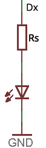

# LEDs

<!-- https://echidna.es/hardware/componentes/leds/ -->

## Descripción

Acrónimo de **Light Emitting Diode,** basado en el fenómeno de electroluminiscencia. Se usan como testigos (indicadores) y como fuente de iluminación.

## Funcionamiento:

Al aplicar tensión emite luz, por lo tanto podemos controlar su encendido apagado en digital “1” enciende, “0” apaga y su brillo en las salidas PWM

Todos los LEDes se conectan con una resistencia serie “Rs” para controlar la tensión/corriente aplicada.

## Programación:

- D11~ “Gre”: Salida Digital y PWM
- D12 “Orn”: Salida Digital
- D13 “Red”: Salida Digital

**Digital:** Podemos modificar su estado enviando un “0” para Apagado y un “1” para encendido.

En **EchidnaML** programamos los LEDs con el siguiente bloque, seleccionando el LED y el estado.

**PWM:** En la salida D11~ “Gre” podemos enviar el valor de intensidad luminosa de 0 a 255.

En **EchidnaML** programamos el LED Verde con el siguiente bloque ajustando su intensidad luminosa entre 0 -255.

## [Hoja de características](./DataSheet-LED.pdf)
