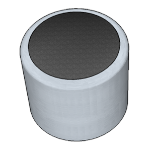
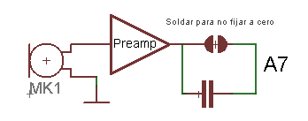
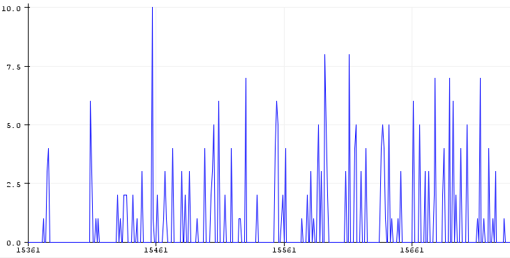
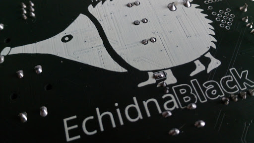
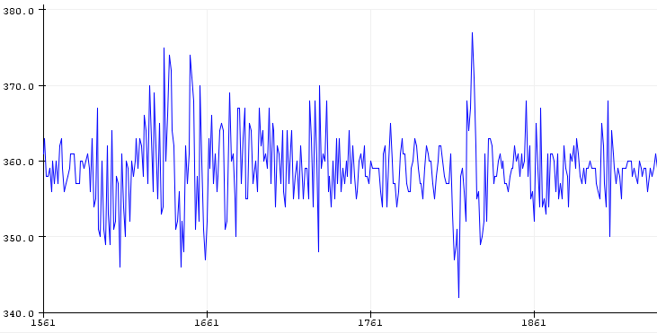

# Micrófono

<!-- https://echidna.es/hardware/componentes/microfono/ -->

## Descripción

Transductor acústico-eléctrico piezoeléctrico que nos entrega una señal eléctrica de similares características que el sonido que recibe.

## Funcionamiento:

El micrófono entrega una señal que es necesario amplificar mediante circuitos electrónicos y se conecta a la entrada analógica A7, dispone de un puente de soldadura que permite fijar el nivel.

Sin modificar la soldadura nos proporciona una señal analógica en la entrada A7, que varia de cero a un valor de 3V aproximadamente, como se muestra en la imagen:

## Modificación del funcionamiento:

Si realizamos una pequeña soldadura como podemos ver en la imagen de la cara inferior (entre las patas delanteras de Echidna) la señal que nos proporciona ahora está centrada en 1,75V= 360 de señal analógica, el resultado se muestra en imagen.

## Programación:

Entrada Analógica A7.

En **EchidnaML** podemos usar el siguiente bloque para leer el micrófono.

## [Hoja de características](https://www.sameskydevices.com/product/resource/cmc-5042pf-ac.pdf)
