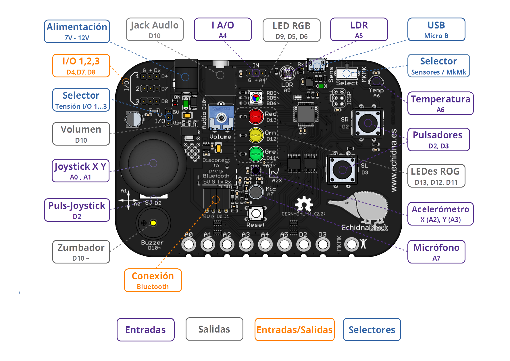
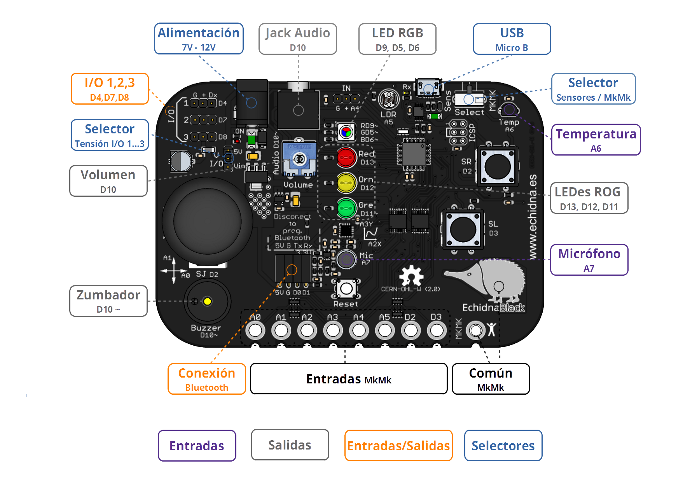

# Modo Sensores modo MkMk Black

<!-- https://echidna.es/hardware/echidnablack/modo-sensores-modo-mkmk-black/ -->

## **Selector Modo Sensores/ Modo MkMk**

Es un conmutador que selecciona entre el Modo Sensores y el Modo Makey Makey.

## **Modo sensores**

En el modo sensores tenemos activo todos los componentes de la placa exceptuando las conexiones MkMk.

## Modo MkMk

En este modo tenemos activas todas las salidas, las I/0 y las conexiones MkMk.

