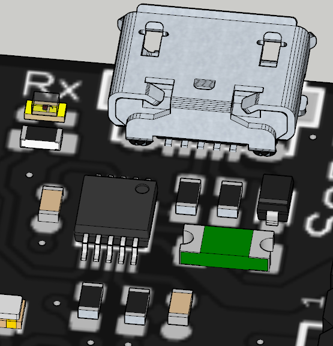

# Puesta en marcha Echidna Black

<!-- https://echidna.es/hardware/echidnablack/puesta-en-marcha-echidna-black/ -->

Mediante USB podemos conectar nuestra Echidna Black al ordenador, dándole alimentación y permitiendo que el PC se comunique con ella. La comunicación con el PC de la Echidna Black se realiza mediante el programa [StandardFirmata](https://github.com/firmata/arduino/blob/master/examples/StandardFirmata/StandardFirmata.ino) ya instalado y con el [Bootloader Optiboot](https://github.com/Optiboot/optiboot) configurado como Arduino Nano que nos permite tener acceso a “A6 y A7”.

Para que Echidna Black se pueda comunicar con nuestro PC es necesario que nuestro sistema operativo (SO) le dé permiso de acceso al puerto serie (USB) y que tenga el driver del controlador de comunicación (CH430) instalado.

– **Driver de comunicación:**

Echidna Black utiliza el chip CH430E, por lo que dependiendo del SO necesitarás instalar el controlador “[Driver CH341](http://www.wch-ic.com/search?q=CH340&t=downloads)”

- GNU Linux: En caso de que seas usuario Linux, no debería ser necesario instalar el driver. Si necesitas el [driver para GNU Linux](http://www.wch-ic.com/downloads/file/177.html).
- MAC: Aquí tienes acceso al [driver para MAC](https://www.wch-ic.com/downloads/CH341SER_MAC_ZIP.html).
- Windows: Aquí tienes acceso al [driver para Windows](https://www.wch-ic.com/downloads/CH341SER_ZIP.html).
- Android: Aquí tienes acceso al [driver para Android](https://www.wch-ic.com/downloads/CH341SER_ANDROID_ZIP.html).

– **Permiso de acceso al puerto serie:**

Dependiendo del SO es necesario dar o no permisos de acceso al puerto serie. Si ya has instalado el IDE de Arduino, estos permisos deberían estar ya dados.

- GNU Linux: Si no no tuvieras acceso al puerto serie puede que tengas que darle permiso desde una terminal usando el comando: *sudo usermod -a -G dialout «usuario».*
- MAC: por defecto ya tenemos acceso al puerto serie.
- Windows: por defecto ya tenemos acceso al puerto serie.

Ahora ya puedes conectar EchidnaBlack a tu software favorito. En “[A programar](/ecosistema/)” explicamos como empezar con EchidnaScratch o Snap4Arduino.

Si quieres también dispones de las instrucciones para [instalar el Standardfirmata.](/ecosistema/echidnaml/instalar-standardfirmata/)

Si quisieras modificar el programa que viene instalado en Echidna Black, podrás hacerlo con Arduino. A continuación te contamos cómo instalar Arduino:

– **Instalar Arduino:**

Para instalar Arduino nos debemos [descargar el IDE](https://www.arduino.cc/en/software) de la página oficial:

En la guía [Getting Started](https://docs.arduino.cc/software/ide-v2/tutorials/getting-started-ide-v2/) tenemos indicaciones sobre como instalar Arduino según nuestro sistema operativo.
