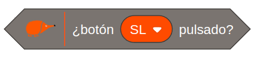

# Pulsadores

<!-- https://echidna.es/hardware/componentes/pulsadores/ -->

## Descripción

Es un componente electromecánico que permite abrir o cerrar un circuito con un solo estado estable.

## Funcionamiento:

Está conectado con una resistencia a masa formando un  circuito denominado pull-down, que proporciona un “0” (0V) sin pulsar y un “1” (5V) cuando pulsamos.

## Programación:

Entrada Digital: **D2** “SL”, **D3** “SR”

En **EchidnaML** para leer los pulsadores usamos un bloque que nos dice su estado: false (0) si no está pulsado  o true (1) si está pulsado.

## [Hoja de características](./DataSheet-button.pdf)
