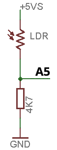
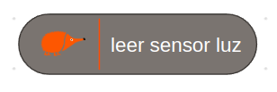

# Sensor Luz LDR

<!-- https://echidna.es/hardware/componentes/sensor-luz-ldr/ -->

## Descripción

LDR es el acrónimo de “Light Dependent Resistor”, es una resistencia cuyo valor depende de la cantidad de luz que incide sobre ella. Generalmente se fabrica con sulfuro de cadmio.

## Funcionamiento:

La LDR proporciona valores altos de resistencia (en torno al MΩ) con poca luz y valores bajos con mucha luz. Gracias a conectarla con una resistencia en serie forma un divisor de tensión que consigue invertir la lógica del funcionamiento, de forma que con mucha luz proporciona valores altos de tensión 4,9V = 999 (de lectura analógica) \* y valores bajos con poca luz (0,0V = 000).

\* Debido a las tolerancias de los componentes estos valores pueden ser distintos en cada placa.

## Programación:

EchidnaBlack2: A3 “LDR”: Entrada analógica

EchidnaBlack: A5 “LDR”: Entrada analógica

EchidnaML: bloque para leer los valores del sensor.

## [Hoja de características](https://www.advancedphotonix.com/wp-content/uploads/2015/07/DS-NSL-4132.pdf)
