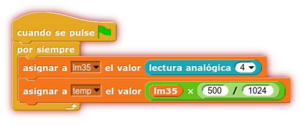

# Sensor temperatura LM35 Shield

<!-- https://echidna.es/hardware/complementos/sensor-temperatura-lm35-shield/ -->

## Descripción

Es un sensor de temperatura calibrado cuya salida es lineal y donde cada 10 mv equivale a 1 ºC

## Funcionamiento:

Se conecta directamente al conector IN (5V, GND, A4). Proporciona 10 mv por ºC. Teniendo en cuenta que 5V son 1024 “pasos” en la medida analógica, podemos obtener la temperatura mediante la siguiente operación:

temperatura = (lectura Analogica\* 5.0 \* 100.0)/1024.0

## Elementos de conexión:

Para conectar el sensor necesitamos tres cables dupont-dupont hembra-hembra. También se puede usar una protoboard y tres cables dupont-dupont macho hembra.

## Programación:

Entrada Analógica A4 (IN)

Para conocer la temperatura, primero leemos el valor del sensor y luego aplicamos la fórmula para convertir cada 10 mV en ºC

## [Hoja de características](./lm35.pdf)
