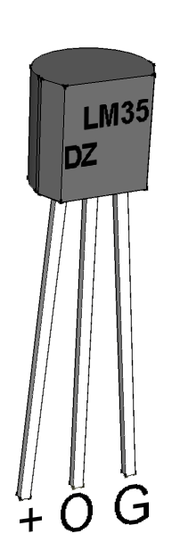
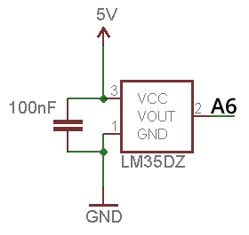

# Sensor temperatura LM35

<!-- https://echidna.es/hardware/componentes/sensor-temperatura-lm35/ -->

## Descripción

Es un sensor de temperatura calibrado cuya salida es lineal y donde cada 10 mv equivale a 1 ºC

## Funcionamiento:

Proporciona 10 mv por ºC. Teniendo en cuenta que 5V son 1024 “pasos” en la medida analógica, podemos obtener la temperatura mediante la siguiente operación:

temperatura = (lectura Analogica\* 5.0 \* 100.0)/1024.0

## Programación:

Entrada Analógica A6 (IN)

Para conocer la temperatura, primero leemos el valor del sensor y luego aplicamos la fórmula para convertir cada 10 mV en ºC

## [Hoja de características](http://www.ti.com/lit/ds/symlink/lm35.pdf)
