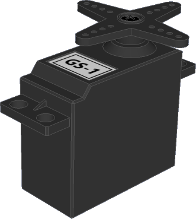
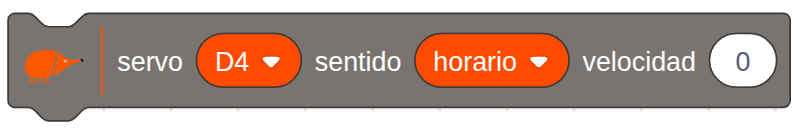

# Servomotor continuo Black

<!-- https://echidna.es/hardware/complementos/servomotor-continuo-black/ -->

# 

Descripción

Son motores de corriente continua con una reductora y electrónica de control que permiten controlar el sentido de giro.

# 

Funcionamiento:

Se controla mediante pulsos de 1-2 ms en periodos de 20 ms.

En la práctica se usa una librería que nos permite indicar directamente el el sentido de giro.

# 

Elementos de conexión:

Para conectarlo usamos los pines I/O de entrada-salidaPara conectarlo usamos los pines I/O de entrada-salida. Se conecta directamente con sus cables.

Es aconsejable colocar el jumper de alimentación en Vin y alimentar EchidnaBlack mediante el jack  de alimentación.

**Pines EchidnaBlack2:**

1. I/O 1= PIN A2
2. I/O 2= PIN D4
3. I/O 3= PIN D7
4. I/O 4= PIN D8

**Pines EchidnaBlack:**

1. I/O 1= PIN D4
2. I/O 2= PIN D7
3. I/O 3= PIN D8

# 

Programación:

En **EchidnaML** el servomotor lo controlamos con el siguiente bloque.

En el bloque podemos seleccionar el pin al que conectamos nuestro servo, el sentido de giro y la velocidad.

**Sentido de giro**: horario/ antihorario

**Velocidad**: 0-100%

# 

Hoja de características
