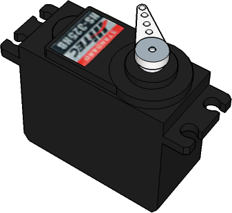
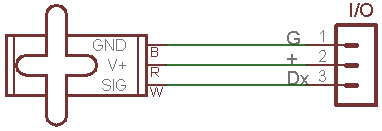
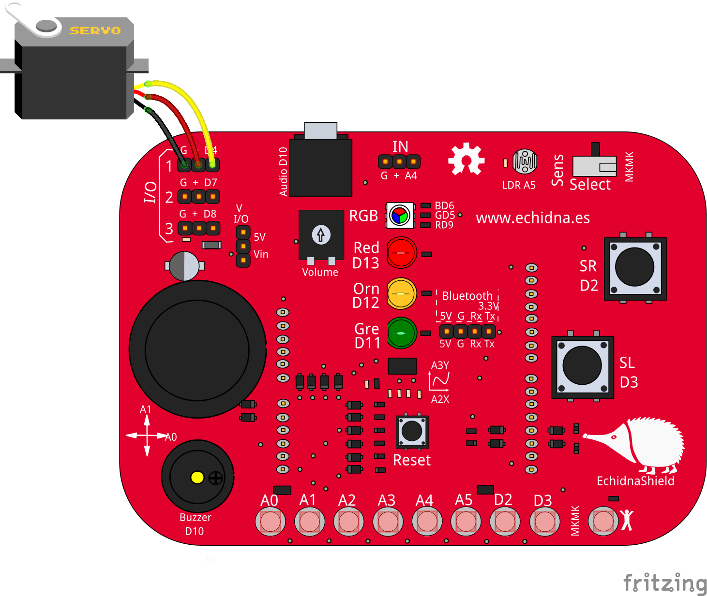

# Servomotor de posición Shield

<!-- https://echidna.es/hardware/complementos/servomotor-de-posicion-shield/ -->

## Descripción

Son motores de corriente continua con una reductora y electrónica de control que permiten posicionarlo en un ángulo entre 0 y 180º.

## Funcionamiento:

Se controla mediante pulsos de 1-2 ms en periodos de 20 ms.

En la práctica se usa una librería que nos permite indicar directamente el ángulo.

## Elementos de conexión:

Se conecta directamente con sus cables. Es aconsejable colocar el jumper de alimentación en Vin y alimentar Arduino mediante el jack  de alimentación.

## Programación:

- I/O 1= PIN D4
- I/O 2= PIN D7
- I/O 3= PIN D8

El servomotor de posición lo controlamos directamente indicando en el bloque el ángulo 0-180.

## [Hoja de características](./DatasheetServoPosicion.pdf)
