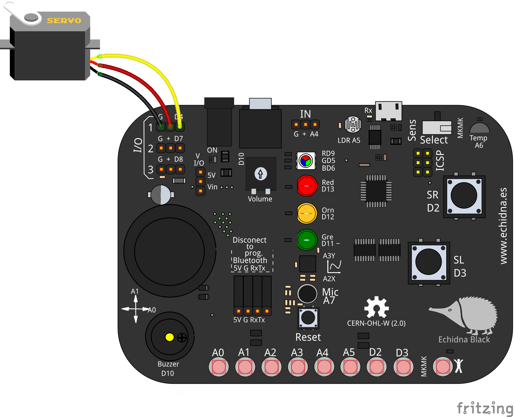

# Servomotor posicion Black

<!-- https://echidna.es/hardware/complementos/servomotor-posicion-black/ -->

## Descripción

Son motores de corriente continua con una reductora y electrónica de control que permiten posicionarlo en un ángulo entre 0 y 180º.

## Funcionamiento:

Se controla mediante pulsos de 1-2 ms en periodos de 20 ms.

En la práctica se usa una librería que nos permite indicar directamente el ángulo.

## Elementos de conexión:

Para conectarlo usamos los pines I/O de entrada-salida. Se conecta directamente con sus cables.

Es aconsejable colocar el jumper de alimentación en Vin y alimentar EchidnaBlack mediante el jack  de alimentación.

**Pines EchidnaBlack2:**

1. I/O 1= PIN A2
2. I/O 2= PIN D4
3. I/O 3= PIN D7
4. I/O 4= PIN D8

**Pines EchidnaBlack:**

1. I/O 1= PIN D4
2. I/O 2= PIN D7
3. I/O 3= PIN D8

## Programación:

En **EchidnaML** el servomotor de posición lo controlamos directamente indicando en el bloque pin y el ángulo 0-180.

Ángulo de giro: 0-180º.

## [Hoja de características](http://nomada-e.com/descargas/datasheet/13-Servomotor%20FUTABA%20%5BS3003%5D.pdf)
