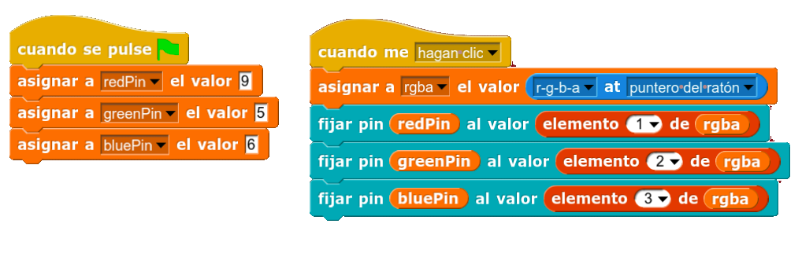

Una de las funcionalidades que trae la nueva versión de [Snap4Arduino](http://snap4arduino.rocks/) 5.1.0 es el selector de colores RGB, que podemos encontrar en el menú de sensores.

Vamos a ver cómo podemos usarlo para seleccionar un color en una paleta de colores y reproducir el color en el LED RGB de la Echidna. Para ello insertamos una imagen de una paleta de colores en el objeto.

El sensor RGB  al clicar sobre un color genera una lista con las componentes del color R, G, y B. y alpha. Para almacenarlos creamos una variable denominada **rgba** que genera una lista donde se almacenan los valores del color seleccionado.

Ya solo nos queda decirle a cada pin RGB de la Echidna que tome el color de la lista. Siendo 1 el rojo, 2 el verde y 3 el azul. Para facilitar la legibilidad declaramos los pines de los LEDs previamente.

