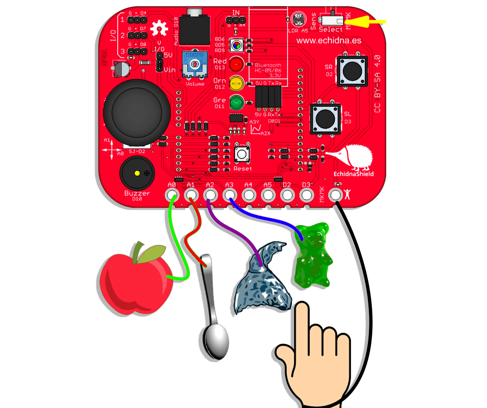
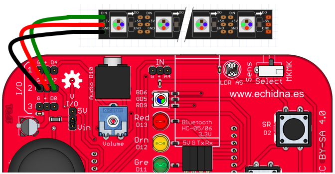

Hoy os vamos a hablar de la adaptación del proyecto [Open LED race](https://openledrace.net/), simulador de coches de carreras minimalista, para Echidna, un proyecto muy entretenido para estos días en los que hay que quedarse en casa:-)

En el [GitHub de Echidna](https://github.com/EchidnaShield/Recursos/tree/master/Aplicaciones%20Varias/Echidna_OLR_4P) podéis encontrar el programa que hay que cargar en la placa.

[DESCARGAR](https://github.com/EchidnaShield/Recursos/blob/master/Programas_y_Aplicaciones/Echidna_OLR_4P/Echidna_OLR_4P.ino)

Las conexiones son muy sencillas:

**«PULSADORES»**

- Coloca el conmutador SENSORES/MKMK en modo MKMK
- Conecta los elementos que vayas a usar como pulsadores (frutas, gominolas, papel de aluminio, otras personas…) a:
  - Coche Verde: A0
  - Coche Rojo: A1
  - Coche Rosa: A2
  - Coche Azul: A3

Conecta a las personas que vayan a jugar a MKMK (por ejemplo, tocando todas una bandeja metálica que se ha conectado a MKMK.

**TIRA DE NEOPIXEL**

Para conectar la tira de neopixel utilizaremos los pines I/O D7.

En el conector vendrán tres cables, probablemente ROJO, VERDE y BLANCO. Además tendrá otros dos cables de alimentación externa, pero el software que hemos adaptado para Echidna hace que no sean necesarios, la alimentación pude hacerse desde la misma placa :-)

Es posible que necesites cables dupont macho-hembra, muchas de las tiras de neopixel tienen el orden de los cables del conector distinto al de la I/O de la Echidna. Debes conectarlo de la siguiente manera:

- Verde (señal) a D7
- Rojo (5v) a +
- Blanco (GND) a GND

**¡¡RECUERDA!!  
EN TU TIRA DE NEOPIXEL LOS PINES PUEDEN ESTAR EN UN ORDEN DISTINTO**

**FUNCIONAMIENTO**

1. Antes de comenzar la carrera sonarán tres pitidos con distinto tono mientras se encienden diferentes luces. La carrera no empieza hasta que termine la secuencia (por mucho que des al «pulsador» no saldrá tu coche).
2. La carrera está configurada para terminar a la 3ª vuelta, pero este dato es fácilmente configurable en la línea 77 del código. Si quieres carreras más largas, pon más vueltas.
3. Cuanto más rápido se accione el «pulsador» más rápido irá el coche. Accionar implica conectar y desconectar, dejándolo simplemente conectado no basta.
4. Según termine una carrera comenzará otra. Si quieres parar a mitad de carrera y empezar de nuevo, pulsa el botón de RESET

¡¡A disfrutar de Echidna Open LED Race!!
