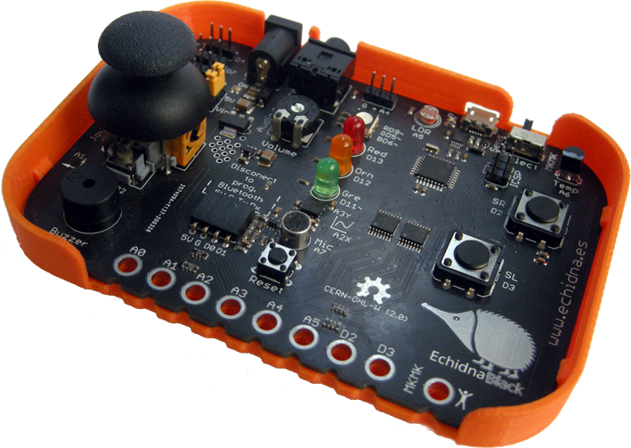
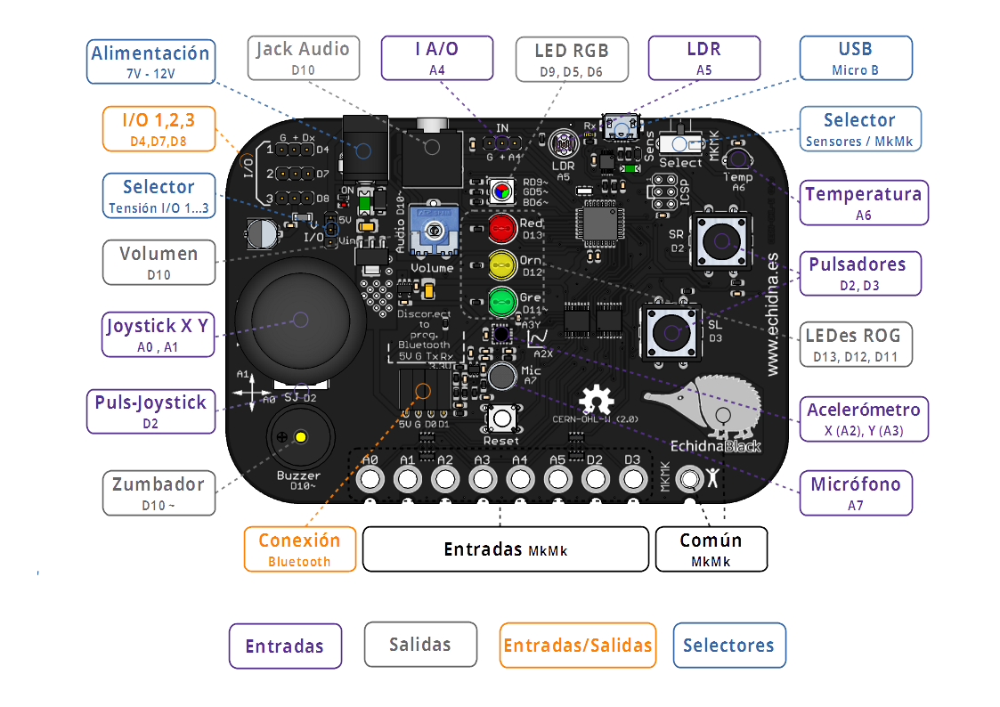

Tenía que pasar, **Echidna** se nos ha hecho mayor y se **independiza** de papá Arduino. Para ser autónoma ha elegido un **microcontrolador** **ATmega328P** el mismo que usa Arduino Uno para así aprovechar al máximo la compatibilidad con los programas. Para la  comunicación hemos usado un clásico rejuvenecido el CH340E que nos permite comunicarnos vía USB hasta 2Mbps, además cuenta con un fusible rearmable para proteger tanto el ordenador como la propia EchidnaBlack.

A la hora de diseñar Echidna Black se ha buscado maximizar la **compatibilidad** con Echidna Shield por lo que mantiene la misma numeración de pines y componentes. Sin embargo Echidna Black cuenta con varias **mejoras**, como son aumentar el **número** de **sensores** disponibles incluyendo en un sensor de **temperatura LM35 (A6)** y un **micrófono (A7)**, hemos actualizado el **acelerómetro ADXL335** de Analog Devices, y mejoramos el aislamiento entre el modo sensores y el modo MkMk, ahora tenemos acceso al rango completo de los sensores.

Resumiendo, **Echidna Black** es como Echidna Shield pero añade las **siguientes** **mejoras**:

- Placa autónoma con microcotrolador ATmega328P
- Sensor de temperatura LM35
- Micrófono con sistema de preamplificación
- Nuevo acelerómetro
- Mejora en el aislamiento entre el modo sensores y el modo MkMk
- Placa más estrecha y compacta

El **esquema de componente**s de Echidna Black:

Ah, y por supuesto Echidna Black es ya Open Source certificada ES000010. Un auténtico sistema STEAM.

Actualmente estamos en periodo de reservas, para fabricar en septiembre, si estás interesado [¡puedes reservar ya la tuya!](/quiero-una/)
