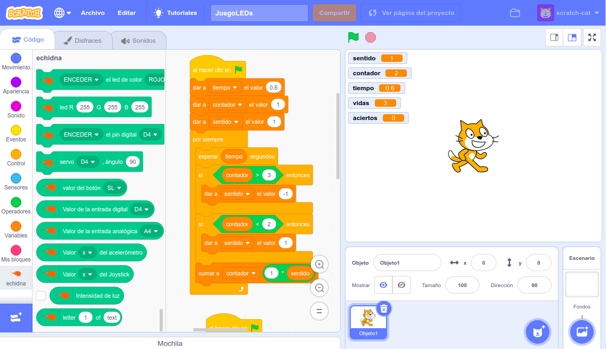

El **proyecto Echidna** coge fuerza, en el apartado humano contamos con dos nuevos integrantes: [Juanda y Javier](/quienes-somos/), que nos traen energías renovadas y que aportan para que el proyecto tome un nuevo impulso en diferentes áreas como son la nueva **página web**, la placa **Echidna Black** o el **entorno de programación** basado en Scratch y personalizado para Echidna.

En la **web** se ha trabajado en un diseño más actual y personalizado, para lo cual hemos tenido la colaboración de [Maria Clares](http://www.maclares.es/). Se ha apostado por un formato más visual, la inclusión de nuevos apartados como “A programar” y se ha reforzado el apartado Hardware mejorando la documentación, esperamos que os guste.

Tenemos **nuevo Hardware**, Echidna se hace mayor y se independiza, **Echidna Black** es ya una placa autónoma basada en Arduino UNO, y que incluye varias mejoras respecto a Echidna Shield, y de la que os iremos hablando en las próximas entradas del blog.

Para completar el proyecto estamos desarrollando un **entorno** de **programación** basado en **Scratch**. A partir de ahora programar la placa será más fácil que nunca. Así que en breve podrás incorporar la placa a tus proyectos Scratch.

¡Permaneced atentos! En las próximas semanas iremos contando más noticias.
