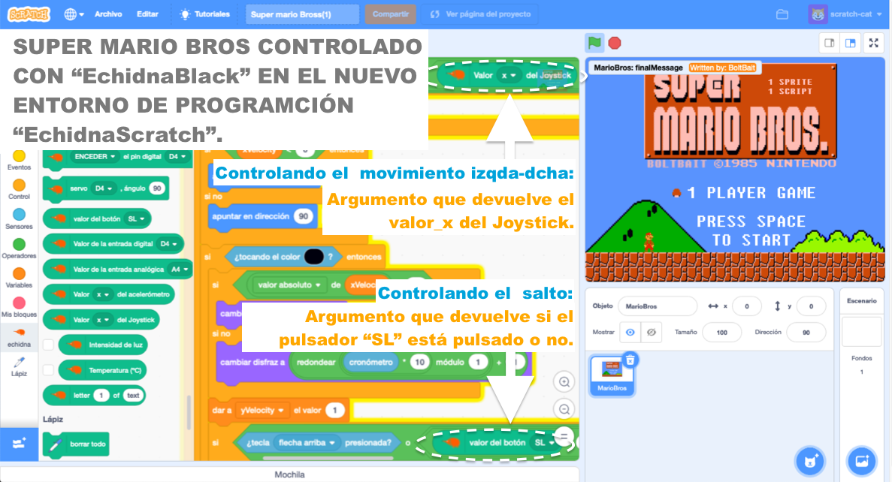
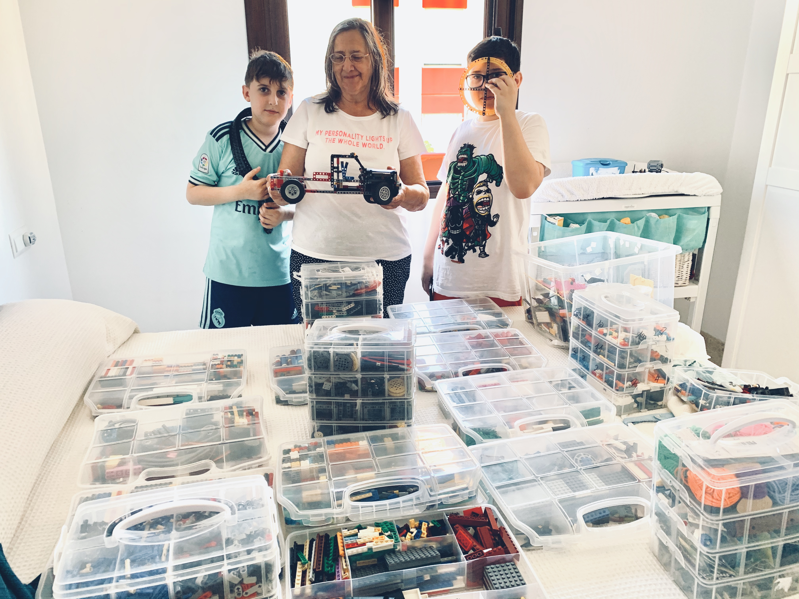

Desde que en 1983, [**Seymour Papert**](https://en.wikipedia.org/wiki/Seymour_Papert) creara un grupo de investigación formado unos jóvenes **[Mitchel Resnick](https://en.wikipedia.org/wiki/Mitchel_Resnick),** Steve Ocko y [**Brian Silverman**](https://en.wikipedia.org/wiki/Brian_Silverman)**;** de alguna forma la Robótica Educativa quedaría ligada hasta nuestros días a los bloques de construcción.

Este grupo trabajaba en una idea revolucionaria, la conexión de [**Logo**](https://el.media.mit.edu/logo-foundation/what_is_logo/logo_and_learning.html), el primer lenguaje de programación orientado a escolares, con las posibilidades constructivas de los famosos bloques de Lego; convencidos, de que esa unión ayudaría a implementar con éxito la filosofía [**construccionista**](http://web.media.mit.edu/~calla/web_comunidad/Readings/situar_el_construccionismo.pdf) en la enseñanza de las ciencias computacionales y la robótica a edades tempranas. Se creó así el primer kit de robótica por bloques de construcción: [**Lego TC Logo**](https://el.media.mit.edu/logo-foundation/what_is_logo/history.html). La idea general del proyecto la explica así el propio Resnick:

> *“LEGO/Logo projects provided children with multiple opportunities for learning through making, by combining two different types of making: making LEGO models and making Logo programs”.* Resnick, Mitchel. Lifelong Kindergarten (The MIT Press) (p. 42).

Fue esa misma idea de **construcción por bloques,** la que inspiró al propio Resnick a crear [**Scratch**](https://scratch.mit.edu/)**.  
**

En el [**equipo**](/quienes-somos/) [**EchidnaSTEAM**](/) también estamos convencidos de que ese cóctel puede enriquecer nuestras propuestas didácticas de robótica, ya que en ocasiones, se nos olvida que **la** **parte mecánica y estructural son tan importantes como la** **electrónica o la programación** si queremos realizar una propuesta global **en el ámbito STEAM**.

## Pero…¿cómo hacerlo?

Seguro que si conoces un poco la diversidad de materiales que hay en el mercado para desarrollar la construcción por bloques, sabrás que la oferta es muy limitada. Los Kits más completos para trabajar en esta línea con Lego, la serie [**Lego MindStorm**](https://www.lego.com/es-es/product/lego-mindstorms-ev3-31313), por cierto, bautizada con ese nombre en honor (quizás también en agradecimiento) al libro «*Mindstorms: Children, Computers, and Powerful Ideas, (1980)»* de Seymour Papert, ronda los 400€; al igual que la nueva serie [**Spike**](https://www.lego.com/es-es/product/lego-education-spike-prime-set-45678). El ya clásico [**Lego We Do 2.0**](https://www.lego.com/es-es/product/lego-education-wedo-2-0-core-set-45300), en su versión más sencilla también está entorno a los 200€ por kit.

Si el plano **económico** no fuese un problema, hay un segundo **hándicap** casi más determinante y es que **ninguno de estos Kits funciona en plataformas bajo licencia GNU/Linux**. Por lo que si trabajas en un centro que cuente con sistemas operativos libres, directamente deberás **descartar esta opción**. **Lego** siempre ha trabajado desde la óptica de mantener a buen recaudo las [**cajas negras**](https://es.wikipedia.org/wiki/Caja_negra_\(sistemas\)) de su hardware controladas con software privativo.

En [**echidnaSTEAM**](/) estamos en las antípodas de esa filosofía. Apostamos claramente por el [**Open Source Software**](https://opensource.com/resources/what-open-source), de hecho, la nueva **[EchidnaBlack](/ecosistema/#placas-anteriores)** viene acompañada por un [**entorno de programación**](/ecosistema/) **multiplataforma basado en Scratch 3.0** (un Fork idéntico al original) que incluirá bloques específicos para cada sensor y actuador. En el plano del [**hardware**](/ecosistema/#placas-anteriores), también bajo la concepción del [**Open Source Hardware**](https://en.wikipedia.org/wiki/OSH) como no podía ser de otra forma, con una placa autónoma compatible con [**Arduino**](https://www.arduino.cc/) UNO. De este nuevo entorno daremos más detalles en siguientes publicaciones.

#### Nuevo entorno de programaión de echidnaSTEAM: **[EchidnaScratch](https://learningml.org/echidnascratch/)**.

Y como respuesta al planteamiento del artículo, a la **conexión de EchidnaBlack con los bloques de construcción,** también hemos estado trabajando en creación de una carcasa, que podrás descargar e imprimir en la sección [**Impresión 3D**](/docentes/impresion-3d/) de nuestra web, compatible con las piezas de Lego Classic y Technic y con la que podrás hacer cosas tan alucinantes como estas:

[YouTube video player 4](https://www.youtube.com/watch?v=lWDV6h25p6Y)

Para conectar sensores, motores y otros actuadores externos también estamos fabricando algunos modelos específicos, pero podrás encontrar muchos y muy parecidos en [**thingiverse.com**](https://www.thingiverse.com/)

## ¿Y cómo me hago con las piezas de Lego?

Como en EchidnaSTEAM creemos que compartir es una muy sana filosofía de vida, vamos a daros algunas ideas para esto.

Una opción muy interesante sería explorar el modelo [**BYOD**](https://es.wikipedia.org/wiki/Bring_your_own_device) (Bring Your Own Device) reconvertida para la causa en: **BYOB** (Bring Your Own Bricks). El alumnado podría traer y dejar en el aula sus propias piezas de Lego, de manera temporal o incluso permanente.

En esa línea se podrían crear puntos de **donación de piezas en desuso** en los Centros escolares, en el que podrían hacer sus donaciones los familiares del alumnado, antiguos alumnos y alumnas, profesorado, y otros organismos e instituciones. Al mismo tiempo estaríamos concienciando al alumnado del valor de la **reutilización de materiales**, como una actitud vital, **respetuosa con el cuidado del medio ambiente**.

Otra opción, la que de momento nos ha servido al equipo Echidna para hacer distintas pruebas, sería explorar el **mercado de segunda mano.** Podrás encontrar lotes de piezas a un precio, en ocasiones, hasta **diez veces más económico** que si las comprases en tiendas. Por poner un ejemplo, hemos llegado comprar veinte kilos piezas de todo tipo (Classic y Technic) por un coste de 200€, con las que hemos podido crear más de diez kits de robótica, bastante más completos que los que ofrece oficialmente la marca.

##### Lego a granel. 20 kg de piezas de Lego comprado en el mercado de segunda mano.

No habrá ya ninguna excusa a la hora de conectar la programación y los bloques de construcción que, junto al aprendizaje del funcionamiento del hardware y la electrónica que permite un sistema basado en el OSH, nos facilite la puesta en práctica de los aprendizajes propios del ámbito STEAM y que de alguna forma ya se encontraban en los de la Robótica Educativa.

En siguientes publicaciones y con la salida de **[EchidnaBlack](/ecosistema/#placas-anteriores)** compartiremos los diferentes proyectos que se vayan creando en esta línea, al tiempo que ofreceremos un banco con los distintos archivos *.stl* para que podáis imprimir las piezas.

Para cualquier consulta puedes ponerte en contacto vía [**Twitter**](https://twitter.com/EchidnaSTEAM) o en **[nuestra web](/contacta/)**, donde además podrás ir reservando tus [**Echidnas**](/ecosistema/). ¿A qué esperas para sumarte a la **#erizomanía**?
