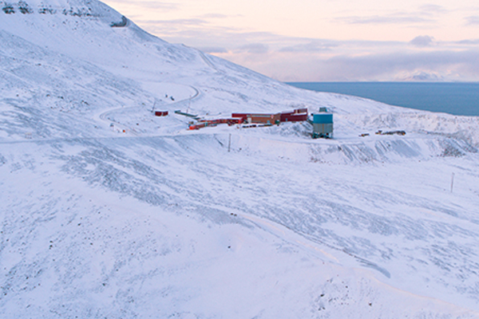
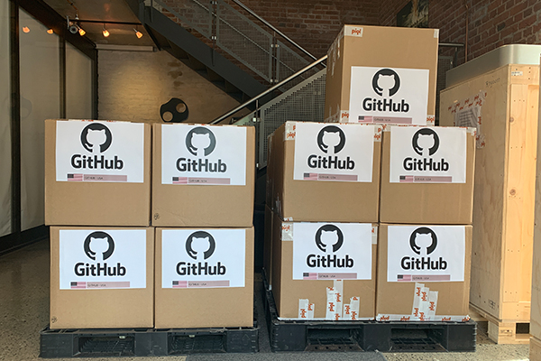
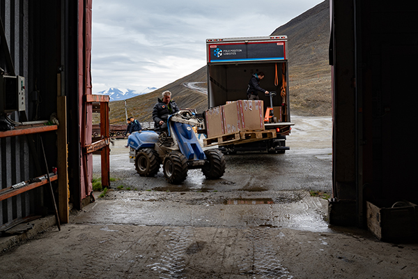
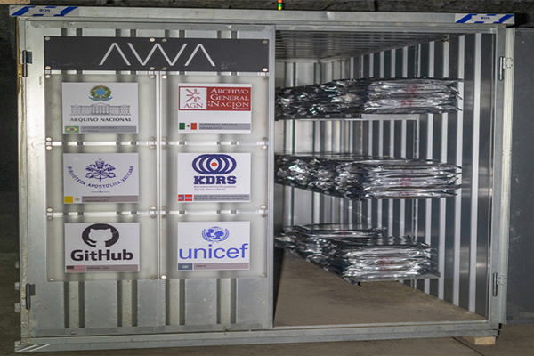

Estamos muy contentos de que la información sobre el proyecto **Echidna** esté conservada en el **Ártico** gracias a la iniciativa [**GitHub Archive Program**](https://archiveprogram.github.com/). La misión de GitHub Archive Program es **preservar** **open** **source** software para generaciones futuras.

[GitHub Arctic Code Vault](https://www.youtube.com/watch?v=fzI9FNjXQ0o)

**¿Cómo lo hacen?** Almacenando el código en múltiples formatos y localizaciones, entre ellas una de las localizaciones está diseñada para durar más de 1000 años. Situada en Artic World Archive (AWA) en una mina a 250 metros de profundidad en el archipiélago Svalbard cercano al Polo Norte. La información es almacenada en films, y empaquetadas en cajas que viajan desde Noruega hasta Longyearbyen (Svalbard), donde finalmente es introducida en containers que son alojados en la mina.

Así que en caso de catástrofe natural el proyecto Echidna podrá ser replicado por futuras generaciones.

Aquí puede ver el [**repositorio de GitHub de Echidna**](https://github.com/EchidnaShield/Recursos) con información sobre el hardware de la placa, actividades, complementos 3D, y códigos de Arduino.
