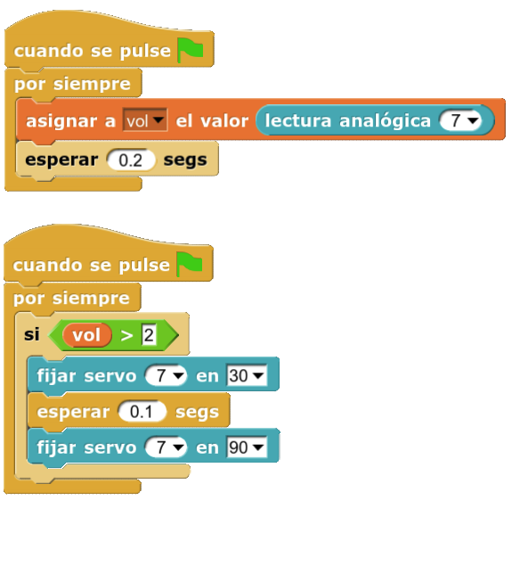

Para probar el **micrófono** de la nueva **Echidna Black** voy a proponeros un proyectito sencillo de programar y que fomentará la imaginación y creatividad de los los más pequeños.

[BlackIsBlack - Control de motor servo por nivel de sonido capturado por el micro de la EchidnaBlack.](https://www.youtube.com/watch?v=7TbHTemsUUI)

Aquí os dejo los pasos para construir vuestra marioneta. Veréis que es muy fácil:

[Ver la presentación (Google Slides)](https://docs.google.com/presentation/d/e/2PACX-1vTMnttiyaWMH5dWrHvkH_zkQKa2iHxa3XPciJQyy00sIO9CLryZc2wj87xaKTOWYXC2ht4_eIsuIu0j/pub?start=false&loop=false&delayms=30000)

El código para este proyecto es muy simple. Únicamente debemos comprobar cual es el valor de umbral que queremos utilizar para que el servomotor comience a moverse, y con un condicional indicaremos cuanto queremos que rote el servomotor al alcanzar dicho valor. Aquí podéis ver un ejemplo de programación en Snap4Arduino:

Ya está preparada para cantar vuestros temas favoritos :-)
