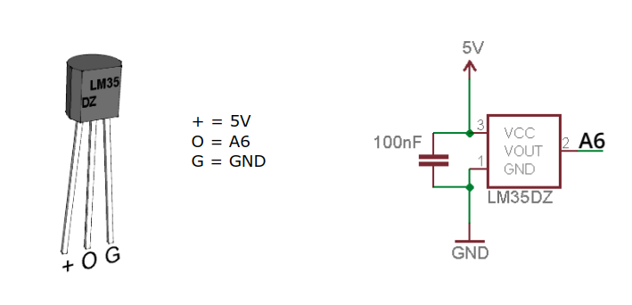
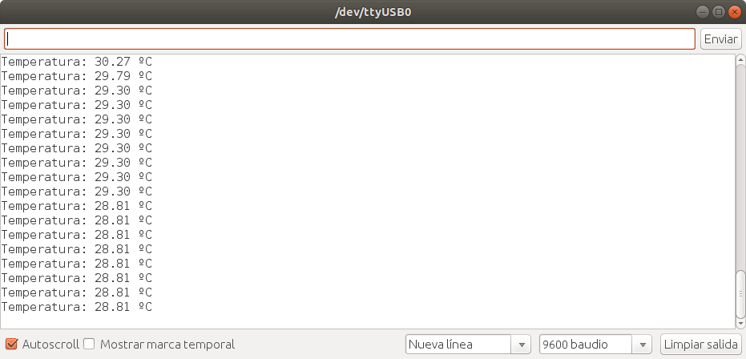
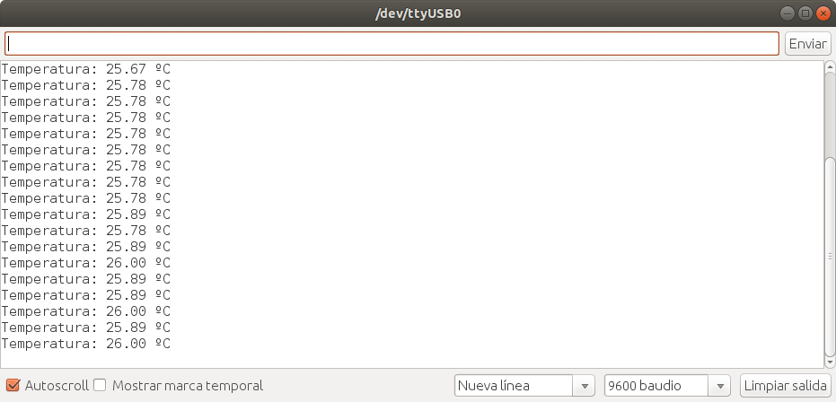

En esta entrada vamos a ver cómo **medir** la **temperatura** con el sensor **LM35** incluído en Echidna Black usando **Arduino IDE** como plataforma de programación y **analogReference** para mejorar la [resolución\[1\]](/#section1) de la medida del sensor.

El [sensor de temperatura LM35](https://www.ti.com/lit/ds/symlink/lm35.pdf) es un sensor calibrado cuya salida es lineal.  El rango de medida del sensor es de 2-150ºC con una [precisión\[2\]](/#section2) de +-0,5ºC.

En la imagen podemos ver los pines del sensor LM35 y el esquema de conexión que hemos empleado en Echidna Black:

Para medir la tensión que proporciona el sensor usamos **[analogRead(pin)](https://www.arduino.cc/reference/en/language/functions/analog-io/analogread/)**, en nuestro caso pin=A6, que nos devuelve un valor entre 0 (0V) y 1023 (5V) proporcional a la tensión de salida medida en el pin. Para obtener la temperatura en ºC sabemos que proporciona 10 mV por ºC. Teniendo en cuenta que 5V son 1024 “pasos” en la medida analógica, podemos obtener la temperatura mediante la siguiente operación: *temperatura = (lectura Analogica\* 5.0 \* 100.0)/1024.0*

**¿Con qué problema nos encontramos?**

Como podemos comprobar en la imagen del monitor serie, al medir, veremos que los valores obtenidos de temperatura están separados por 0,49ºC, es decir, la resolución de la medida del sensor es de 0,49ºC. Por ejemplo,  si partimos de 29,30ºC, el siguiente valor sería, 29,79ºC.

Para medir sensores analógicos, el microcontrolador usa un convertidor analógico digital de 10 bits por lo que tenemos 2E10=1024 valores repartidos en el rango 0-5V. Dado que nuestro sensor proporciona una tensión de salida máxima de 1,5V (150ºC), solo estamos usando 1,5\*1024/5= 307 valores. Como el rango de medida del sensor es de 0 a 150ºC nos encontramos que: 150ºC/307= 0,489 ºC. Por lo que la medida del sensor sólo puede apreciar incrementos de 0,49 ºC.

**¿Cómo podemos mejorar la resolución de la medida con Arduino?**

Una de las formas que tenemos para mejorar la resolución de la medida de la temperatura es usar [**analogReference**](https://www.arduino.cc/reference/en/language/functions/analog-io/analogreference/) que permite configurar el valor del voltaje usado como referencia para la entrada analógica.

En nuestro microcontrolador, ATmega328 tenemos las siguientes posibilidades para analogReference (type):

- DEFAULT: 5V
- INTERNAL: 1,1V (ATmega328)
- EXTERNAL: the voltage applied to the AREF pin (0 to 5V only) is used as the reference

Nosotros, vamos a usar analogReference (INTERNAL) que, cambia la referencia de 5V a 1,1V. Ahora nuestro valor maximo de 1023 está referido a 1,1V que equivale 110ºC como máximo, que nos sirve para el uso que vamos a darle. Conseguimos aumentar la resolución de la medida del sensor: 110ºC/1024=0,107 ºC.

Aquí podemos ver un ejemplo de la impresión de la temperatura del sensor por puerto serie usando la referencia de 1,1V:

**Código:**

Solo tenemos que incluir en el setup: analogRefence(INTERNAL) y cambiar la ecuación; en vez de usar 5, usaremos 1,1:

*temperatura = (lectura Analogica\* 1.1 \* 100.0)/1024.0*.

El código completo lo tenéis [aquí](https://github.com/EchidnaShield/Recursos/blob/master/Didactica/Actividades_IDE_Arduino/Temperatura/TemperaturaLM35/TemperaturaLM35.ino):

/\*
 Medida de temperatura con sensor LM35
 Mostramos la temperatura por el monitor serie
 Usamos analogReference para aumentar la precision de la medida del sensor
 Referencia 1.1 valido para micro Atmega328= Arduino UNO

 Sensor LM35: 
 pin V del sensor conectado a 5V de Arduino
 pin central del sensor Vout a A6 de Arduino
 pin GND a GND de Arduino
 
 \*/

// constantes que no cambian
const int LM35Pin \= A6;     // pin al que conectamos sensor temperatura

// variables globales que cambian
float temperatura \= 0;         // variable para almacenar la temperatura medida

// Configuración
void setup() {
  
  analogReference(INTERNAL); // cambiamos la referencia analogica a 1.1V (AtMega328)
  **Serial**.begin(9600); // configuramos la velocidad de conexion con el puerto serie del PC

}

// Bucle que se repite
void loop() {
  int lectura \= analogRead(LM35Pin); // valor entre 0 y 1023
  temperatura \= (lectura\* 1.1 \* 100.0)/1024.0; // temperatura en º Celsius

  **Serial**.print("Temperatura: ");  
  **Serial**.print(temperatura);  // mostramos el valor de la temperatura 
  **Serial**.println(" ºC");
  delay(1000);              // tiempo de espera de 1s
}

* * *

**\[1\] Resolución**: es la mínima variación de la magnitud medida que da lugar a una variación perceptible de la indicación del correspondiente valor. Dicho de otra forma, la resolución nos indica el valor mínimo a partir del cual notaremos una variación o salto en la medida de aquello que estemos midiendo.

**\[2\] Precisión**: en un instrumento de medición nos determina con qué exactitud podremos hacer esta medida y está directamente relacionada con el error intrínseco de dicho instrumental, en un sentido inversamente proporcional. A una mayor precisión, menor error.
