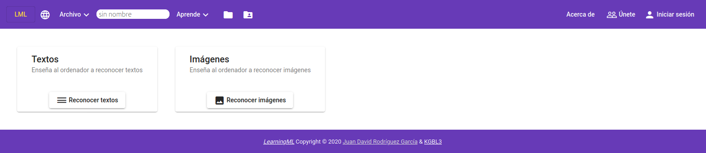
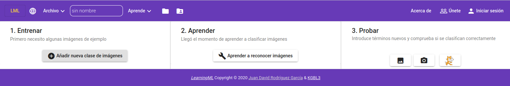
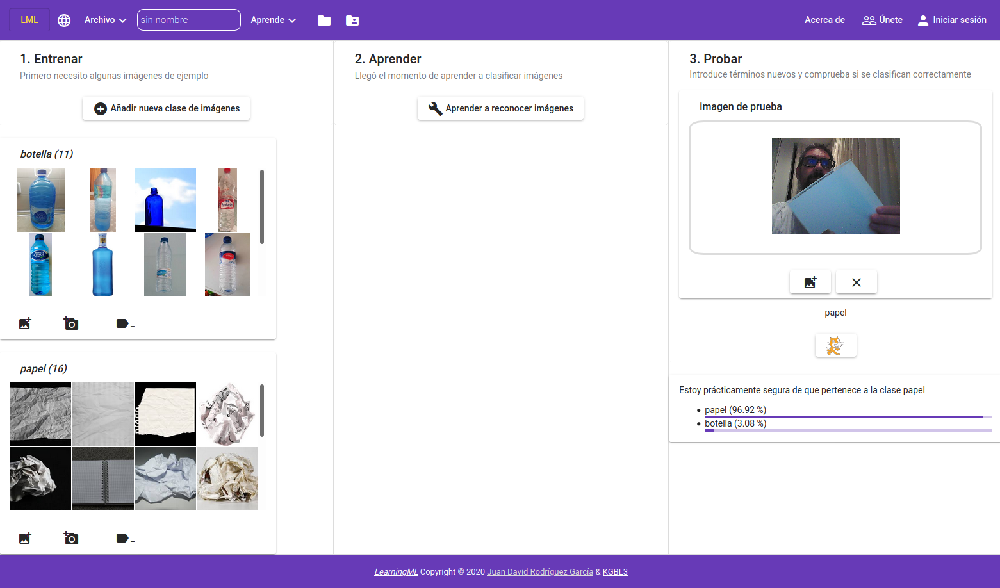
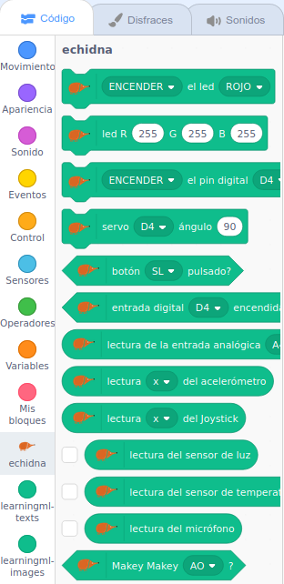
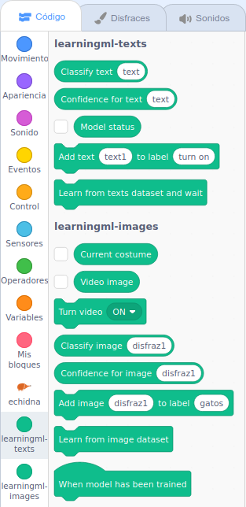
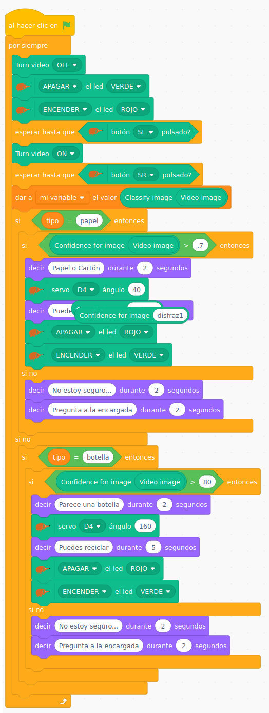

Aunque no se haya presentado formalmente, una de las grandes novedades que Echidna Educación propone para este nuevo curso es [**EchidnaScratch**](/ecosistema/echidnaml/) (que podéis encontrar en la sección [A programar](/ecosistema/) de la web), un entorno de programación por bloques para controlar las placas Echidna creado por [Juan David Rodríguez](https://twitter.com/juandalibaba).

Para poneros un poco en contexto, Juan David, uno de los nuevos miembros de Echidna Educación, es el desarrollador de un fork de Scratch que incluye bloques de **Machine Learning** para enriquecer nuestros proyectos con Inteligencia Artificial, [LearninML](https://web.learningml.org/). Sobre este fork ha desarrollado los bloques para controlar las placas Echidna pero, y aquí viene lo bueno, ambas extensiones pueden convivir conjuntamente. Así que, a contrarreloj, ha preparado el entorno, que pronto podréis encontrar de manera más accesible en la web, y he tenido el lujo de probar hace un par de días.

No me corresponde a mí hablar en profundidad de estas herramientas ya que nadie las va a explicar mejor que su desarrollador, por lo que pronto podréis disfrutar de un post muy interesante de la mano del autor, pero dado que ha habido gente que ya ha preguntado, me he permitido ofreceros este pequeño adelanto.

**Sobre la Inteligencia Artificial**

No me extenderé mucho en esto, pero creo que es interesante hablar un poco sobre la Inteligencia Artificial para poner en contexto a quienes no estén familiarizados con el tema. En cualquier caso, seré breve, pues no es el objetivo del post.

Cuando hablamos de Inteligencia Artificial nos referimos la capacidad de las máquinas de demostrar inteligencia gracias a una serie de procesos y algoritmos enfocados que resuelvan problemas de forma autónoma, emulando de esta manera lo que abstractamente conocemos con inteligencia.

El método para entrenar una Inteligencia Artificial para clasificar información y llegar a hacer predicciones es **alimentarla con datos,** cuantos más, mejor. Para este fin, la ciencia computacional busca desarrollar algoritmos y técnicas para construir **modelos de predicción y clasificación** a partir de datos conocidos. Esto es lo que se conoce como Aprendizaje Automático, Aprendizaje Automatizado o Aprendizaje de Máquinas (del inglés, **Machine Learning**)

Hay distintos modelos de aprendizaje, pero LML utiliza el modelo de **Aprendizaje Supervisado**, es decir, se entrena al algoritmo mediante un conjunto de entradas o “preguntas”, a las que se llama **caraterísticas**, y las salidas o “respuestas” correctas, a las que se llama **etiquetas,** con la finalidad de que el algoritmo pueda relacionarlas entre sí y hacer predicciones. Así, un modelo entrenado, al analizar las características de una entrada podrá clasificar el elemento dentro de una u otra etiqueta.

**¿Cómo utilizar EchidnaScratch con LML?**

Por el momento, hasta que esté definitivamente incluido en la web, accederemos desde este enlace: [http://scratch.echidna.es/learningml](http://scratch.echidna.es/learningml)

Nos encontraremos con la primera pantalla en la que la aplicación nos pide que elijamos el tipo de modelo que queremos crear: reconocer textos o reconocer imágenes. En este caso me centraré en imágenes, ya que es el que he utilizado para el proyecto del **Cubo de Reciclaje Inteligente.**

Una vez hacemos clic en Imágenes comenzamos por el paso 1: entrenar el modelo. Con el botón **Añadir una nueva clase de imágenes** vamos a crear las etiquetas. Podemos crear tantas como necesitemos, pero en este caso he creado dos: **papel** y **botella**. En cada una de ella iremos añadiendo imágenes de ejemplo. Recordad, cuantas más añadamos, mejor discriminará el modelo, pero doce o quince son suficientes para probar.

Una vez que tengamos las imágenes asignadas a cada clase pasamos a la fase 2: haremos clic en **Aprender a reconocer imágenes** para que el modelo obtenga las características de los datos introducidos para poder después tomar decisiones ante una nueva entrada.

El último paso antes de comenzar nuestro proyecto será **3\. Probar.** A través de la cámara o mediante la carga de nuevas imágenes podremos ver si el modelo está funcionando y los grados de fiabilidad en cada nueva muestra. Si nos parecen adecuados, haremos clic en el gatito de Scratch y pasaremos a desarrollar el proyecto. Si no nos convence el resultado, debemos introducir más imágenes para entrenar el modelo y repetir el paso **2\. Aprender.**

En el fork de Scratch EchidnaScratch LML podemos encontrar todos los bloques y extensiones de la popular entorno de programación por bloques con los dos interesantes añadidos que nos permitirán integrar en nuestros proyectos las placas de Echidna y la tecnología de Machine Learning:

         

En cuanto al proyecto, simplemente os dejo una imagen del mismo sin entrar en mucho detalle al final del post. En el vídeo se comenta un poco y no creo que no será difícil de entender si queréis hacer alguna prueba. En cualquier caso, en una próxima entrada Juan David nos hablará con más detalle de las diferentes posibilidades de EchidnaScratch y EchidnaScratch LML, pero si os surge alguna duda mientras tanto podéis hacérnosla llegar por Twitter y estaremos encantados de solucionarla.

¡Nos vemos!

[Robótica y Machine Learning con EchidnaBlack](https://www.youtube.com/watch?v=NFF5td3-YeM)

