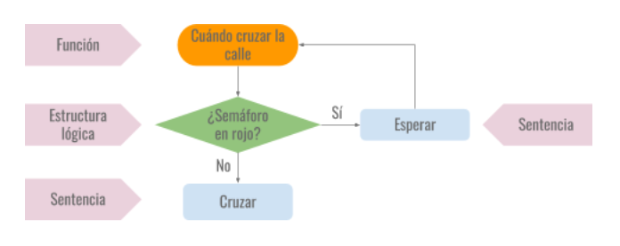
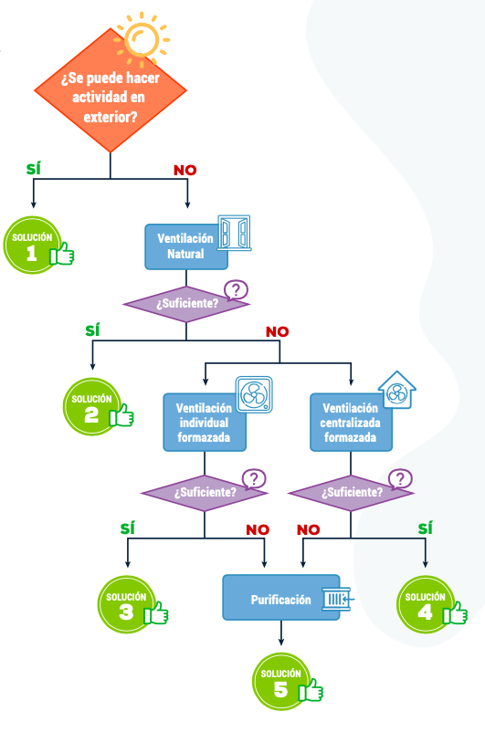

Una de las formas más efectivas para que los estudiantes recuerden un determinado aprendizaje y puedan aplicarlo en distintas situaciones futuras es profundizar en el mismo, entendiendo por profundizar como el *“dedicar tiempo a razonar sobre el mismo concepto en distintos contextos y dar la posibilidad al alumno de que pase de lo concreto a lo abstracto (H. Martín, 2020)”*.

Con esa idea, en el ámbito de la enseñanza de la [programación](https://es.wikipedia.org/wiki/Programaci%C3%B3n), [robótica](https://es.wikipedia.org/wiki/Rob%C3%B3tica_educativa) o la [Inteligencia artificial](https://es.wikipedia.org/wiki/Inteligencia_artificial)  y por supuesto en el [Pensamiento Computacional](https://programamos.es/pensamiento-computacional-y-programacion-no-son-lo-mismo/), nos encontramos con un esquema conceptual que está presente de manera constante en la elaboración de un programa; concretamente, en aquellos que recogen información del entorno (virtual: videojuego; o real: robótica) para dar posteriormente una determinada respuesta (virtual o real). Nos referimos a  los algoritmos que responden al modelo:

 ***Percepción – Análisis y Procesamiento – Respuesta***

Podemos encontrar multitud de ejemplos en los que se pone de manifiesto este esquema, desde un algoritmo de un sencillo juego tipo PONG, pasando por un coche que use un sistema de aparcamiento con sensores, o un asistente virtual que se sirva de IA, etc. Una herramienta que puede servirnos de ayuda para visualizar y comprender cómo funciona un programa básico de este tipo son los [diagramas de flujo](https://es.wikipedia.org/wiki/Diagrama_de_flujo).

Para que el todo el sistema funcione, el algoritmo que se desarrolla en este esquema debe contener y trabajar con la medición de los elementos perceptivos de los sensores, esto es, saber si el semáforo está en rojo o no (sean visuales o auditivos); las condiciones que determinan la respuesta usando operadores lógicos (¿Está o no está en rojo?) y las acciones o sentencias a realizar en caso de que se cumpla una condición u otra (cruzar o esperar).

Debemos *profundizar* en este esquema base, permitir situaciones en las que nuestro alumnado sea capaz de aplicarlo en el futuro en distintos contextos.

Por desgracia, el contexto en el que nos encontramos con la pandemia provocada por la COVID-19 está siendo muy difícil en todo el mundo, afectando a todos los ámbitos de la sociedad, por supuesto también en el educativo. Es aquí que como docentes, debería servirnos para contextualizar distintos aprendizajes y ayudarnos a vincular estos a esa realidad, que además, cuenta con una alta carga emocional, algo que también nos puede facilitar esta tarea dada la relación directa entre emoción y memoria. De los peores momentos también se debe, se puede aprender.

Si además somos capaces de presentar propuestas que ayuden a que el alumnado dé respuesta a una determinada situación problema de la sociedad en la que le ha tocado vivir y que le permita dar soluciones a esa realidad, estaremos transitando la senda del [Aprendizaje-Servicios](https://es.wikipedia.org/wiki/Aprendizaje-servicio), aprendizaje por servicios a la comunidad.

Quizás tengamos suerte y se produzca eso que todo docente persigue, que aquello que enseñamos pueda servir a los estudiantes para aplicarlo en un futuro, que ayudemos a que tengan la capacidad de ofrecer a los demás lo mejor de sí mismos.

Con estas ideas y partiendo del contexto en el que nos encontramos, hemos propuesto como proyecto un sistema de ventilación inteligente de un aula. El funcionamiento es muy simple. Hemos construido un aula en la que se ha instalado un sensor de CO2  que nos va servir para medir el nivel de dióxido de carbono en el interior del aula; se ha creado una estructura móvil para que las ventanas puedan abrirse automáticamente y, por último, también se han abierto dos orificios en el techo: uno permitirá la extracción de aire con alto contenido en CO2 del interior y otro introducirá aire limpio del exterior. De esta forma intentaremos bajar la incidencia de contagio por aerosoles.

En el proyecto se pueden ver varias fases en las que se pueden ir desgranando distintas áreas de conocimiento de lo que es un proyecto STEAM (bueno, la parte artística podría ser discutible). Una parte claramente **mecánica y estructural** (Engineering, ¿Arts? & Technology) en la construcción de estructuras y funcionamiento mecánico de las piezas móviles; otra parte en la que entran en juego elementos de **programación** a la hora de construir el algoritmo que hace que funcione el sistema (Maths & Technology); conocimientos básicos de **electrónica,** hardware de robótica usado: [EchidnaBlack](/ecosistema/#placas-anteriores), [sensor de CO2](https://www.luisllamas.es/arduino-detector-gas-mq/) y [servoMotor](https://es.slideshare.net/josepujolperez/s4-a-a7) (Technology), trabajando con las directrices propias del [método científico](https://es.wikipedia.org/wiki/M%C3%A9todo_cient%C3%ADfico) (Sciences): ensayo-error, medición de magnitudes, creación de hipótesis, estadística, etc.

El sistema de ventilación que se propone al final del proyecto es un sistema por extracción e impulsión de aire, uno de los más efectivos. Para comprender mejor cómo funcionan los sistemas de ventilación nos hemos servido de la [guía para la ventilación de las aulas](https://www.csic.es/sites/default/files/guia_para_ventilacion_en_aulas_csic-mesura.pdf) creada por el *Instituto de Diagnóstico Ambiental y Estudios del Agua, IDAEA-CSIC Mesura.* 

[Ver la presentación (Google Slides)](https://docs.google.com/presentation/d/e/2PACX-1vSXr4nQhlP4qy2p5eR9vtmX84PvTMhPcr68Xjs1-xSdeIJbG9IGrs8d0Lu3mYDJJdZr_gXuEPKLyM-5/pub?start=false&loop=false&delayms=3000)

Esta guía nos servirá para realizar la propuesta de aula, ya que en ella podremos encontrar recomendaciones generales para la ventilación de las mismas y otros aspectos más específicos y técnicos sobre distintos sistema de ventilación: cantidad de CO2 aconsejada en un espacio cerrado, lectura de gráficas, aplicar distintas fórmulas de cálculo de caudales/volumen de aula.

Un recurso que no podemos dejar pasar y que está incluido en la guía es el de analizar con nuestro alumnado el diagrama de flujo que se presenta en la “*búsqueda de soluciones al problema de la ventilación”* y que nos permitirá volver a *profundizar* en este importantísimo concepto del Pensamiento Computacional.

Por último, señalar que este trabajo se ha realizado con la nueva placa [EchidnaBlack](/ecosistema/#placas-anteriores) y progamado en el entorno [EchidnaScratch](/ecosistema/echidnaml/) integrando las posibilidades constructivas de Lego, algo que seguro va a enriquecer nuestras propuestas de aula a la hora de abordar nuestros proyectos [STEAM](https://es.wikipedia.org/wiki/Educaci%C3%B3n_STEM#STEAM_como_aprendizaje_interdisciplinar). Este trabajo será presentado por el alumnado del CEIP Carlos V en la [Feria de la Ciencia de Sevilla](http://www.feriadelaciencia.org/) 2021 y en la [FANTEC](http://www.feriadetecnologia.com/) de Málaga.

Os dejamos el video con el resultado final.

[YouTube video player 2](https://www.youtube.com/watch?v=fOhR8siFqCo)
