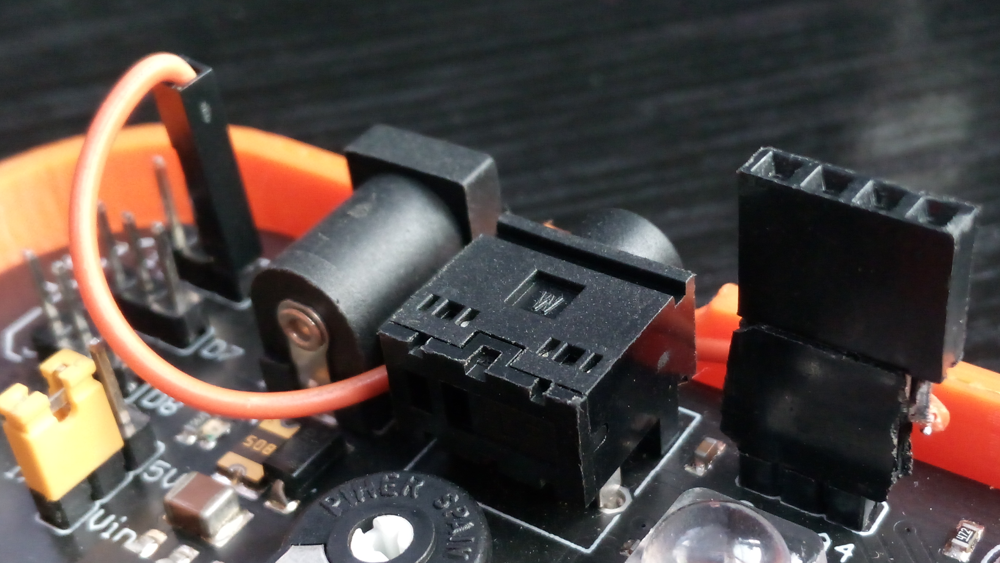
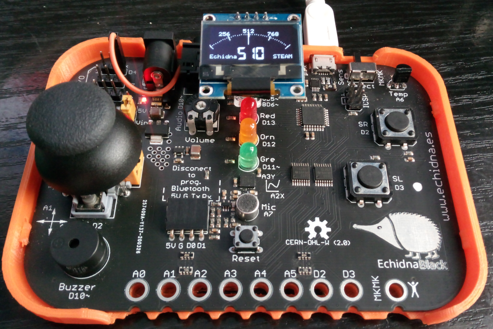
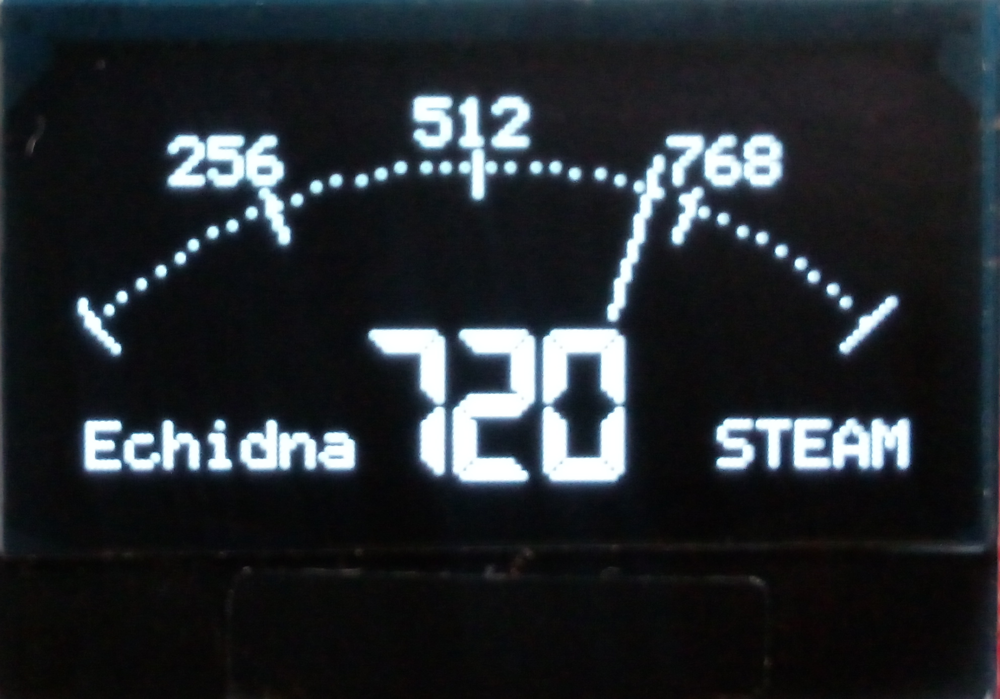
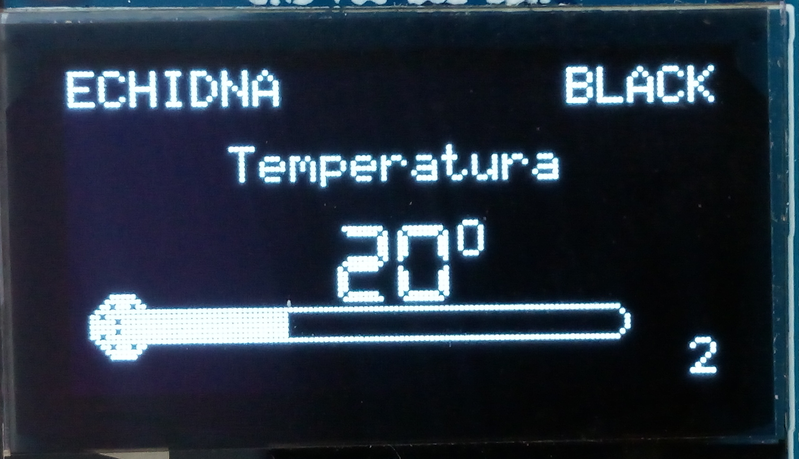
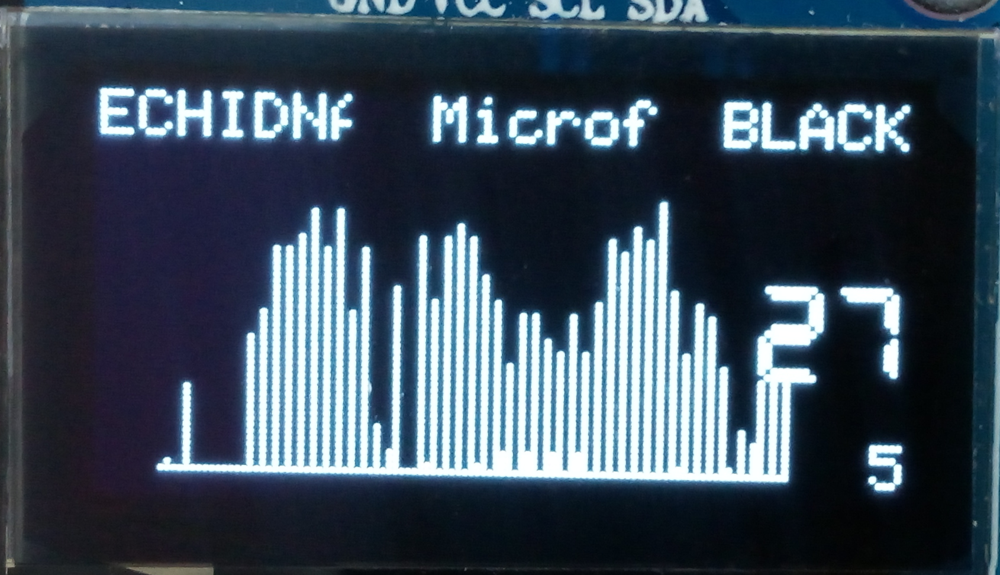
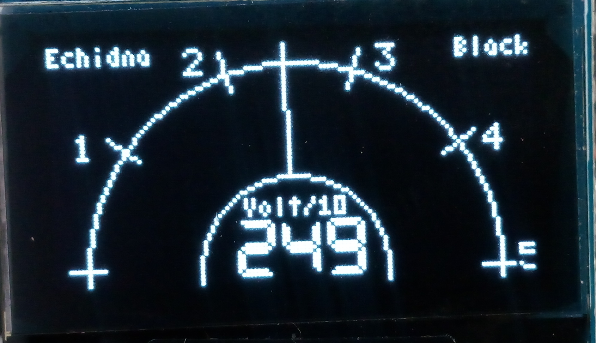
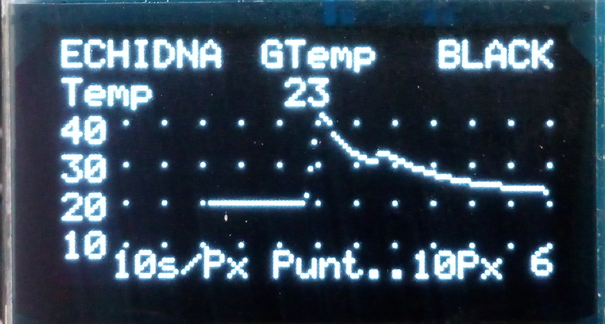
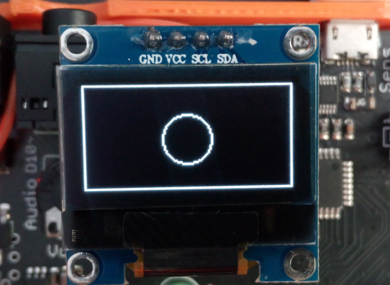
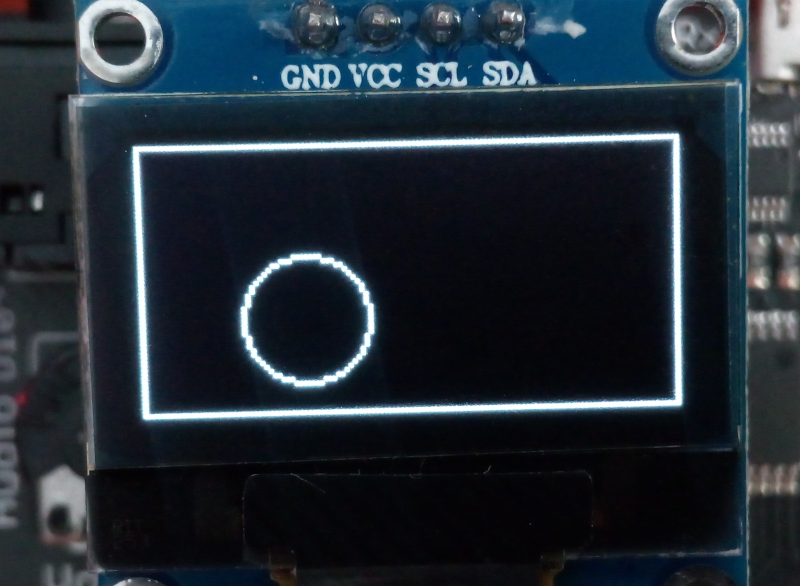

Usaremos la pantalla SSD1306 de 0,96” (2,43cm) de 128 x 64 

Es una pantalla de bajo precio, pero que tiene las ventajas que presenta la tecnología **OLED** y un bus de comunicaciones con solo 2 pines SDA y SCL.

[Pantalla OLED en EchidnaBlack.](https://www.youtube.com/watch?v=CzpXS4vaoeM)

**¿Pero que es OLED? :**

OLED es el acrónimo de Organic Light-Emitting Diode, diodo emisor de luz compuesto por materiales orgánicos electro-luminiscentes. Descubiertos por Heeger, MacDarmid y Shirakawa, galardonados con el premio Nobel de química en el año 2000.

Producen una gran luminosidad, ya que son muy delgados, se pueden fabricar en grandes formatos, no necesitan iluminación externa, consumen menos que otras pantallas, ofrecen un amplio ángulo de visión, de en torno a los 170 grados, tienen una larga vida de funcionamiento de 10 000 a 40 000 horas, (los azules duran menos), tienen tiempos de respuesta menores, y un gran contraste, por la contra son sensibles a la humedad que los degrada rápidamente.

Puedes consultar más información en:

Fundamentos de la Tecnología OLED, editado por P. CHAMORRO POSADA, J. MARTÍN GIL, P. MARTÍN RAMOS, L. M. NAVAS GRACIA en la Universidad de Valladolid.

**Conexiones**:

Usaremos la pantalla SSD1306 con conexión I2C, en EchidnaBlack tenemos disponible la señal SCL en el pin A4, pero la señal SDA está ocupada por la LDR A5

Para poder conectar la pantalla necesitamos una librería de manejo de la pantalla que nos permita re-encaminar la señal SDA a otro pin.

Ojo en algunas versiones de pantalla cambia la disposición de los pines

<table width="333" cellspacing="0" cellpadding="4"><tbody><tr valign="top"><td width="149">
Pantalla OLED
</td><td width="165">
Echidna
</td></tr><tr valign="top"><td width="149">
GND
</td><td width="165">
GND
</td></tr><tr valign="top"><td width="149">
VCC
</td><td width="165">
VCC
</td></tr><tr valign="top"><td width="149">
SCL (System Clock)
</td><td width="165">
A4
</td></tr><tr valign="top"><td width="149">
SDA (System Data)
</td><td width="165">
D4
</td></tr></tbody></table>

En el conector IN de Echidna solo disponemos de GND, VCC y A4, nos faltaría la conexión SDA, con lo que tenemos que llevar esa conexión con un pequeño cable a la (I/O1) D4.

También tenemos la posibilidad de conectar la pantalla en los pines D4 y D7, pero en el conector IN la pantalla queda centrada. :-)

**Pasemos a la programación:**

Necesitamos una librería que nos permita controlar la pantalla, cambiando los pines de comunicaciones, he usado la librería “OLED\_I2C.h” 2019 de Henning Karlsen de Rinky-Dink Electronics con licencia CC BY-NC-SA 3.0.  es una librería muy sencilla, pero no cuenta con todas las soluciones gráficas de la librería de Adafruit “Adafruit\_GFX.h”. Aun así y con un poco de imaginación podemos realizar algunas gráficas interesantes.

 

 

Veamos un ejemplo simple, pintaremos un cuadro que marque los límites del visualizador, y una circunferencia que podamos mover con el Joystick.

// XDeSIG para Echidna
// Mover un círculo en la pantalla OLED SSD1306 128 X 64, mediante el Joystick

#include "config\_B.h" // Definición de todo los recursos de White "W" ou Black "B"

#include <OLED\_I2C.h\> //Copyright (C)2015-2019 Rinky-Dink Electronics, Henning Karlsen.CC BY-NC-SA 3.0 license.
OLED  myOLED(4, A4);  //Establece los pines de comunicación I2C OLED (SDA, SCL)

//\*\*\*\*\*\*\*\* Establece las entradas de señal a medir \*\*\*\*\*
#define EntradaX Joy\_X
#define EntradaY Joy\_Y

//\*\*\*\*\*\*\*\* Establece los valores mínimos y máximos que queremos escalar al tamaño de pantalla
//para adaptarlos a los valores de las entradas (por si quieres probar otras :-) ).
const int VXmin \= 0;
const int VXmax \= 1023;
const int VYmin \= 0;
const int VYmax \= 1023;

//\*\*\*\*\*\*\*\*\*\*\*\*\*\*\*\*\*\*\*\*\*\*\*\*\*\*\*\*\*\*\*\*\*\*\*\*\*\*\*\*\*\*\*\*\*\*\*\*\*\*\*\*\*\*\*\*\*\*\*\*\*\*\*\*\*\*\*\*\*\*\*\*\*\*\*\*\*\*\*\*\*\*\*\*\*\*\*\*\*\*\*\*\*\*\*\*\*\*\*\*\*\*
const int Radio \=   15;   //Radio de la circunferencia.
int PosX \= 64; //coordenada centro X
int PosY \= 32; //coordenada centro Y

//\*\*\*\*\*\*\*\*\*\*\*\*\*\*\*\*\*\*\*\*\*\*\*\*\*\*\*\*\*\*\*\*\*\*\*\*\*\*\*\*\*\*\*\*\*\*\*\*\*\*\*\*\*\*\*\*\*\*\*\*\*\*\*\*\*\*\*\*\*\*\*\*\*\*\*\*\*\*\*\*\*\*\*\*\*\*\*\*\*\*\*\*\*\*\*\*\*\*\*\*\*\*
int MedidaX; // variable para la lectura del valor X
int MedidaY; // variable para la lectura del valor Y

// Variable común
int i;

//\*\*\*\*\*\*\*\*\*\*\*\*\*\*\*\*\*\*\*\*\*\*\*\*\*\*\*\*\*\*\*\*\*\*\*\*\*\*\*\*\*\*\*\*\*\*\*\*\*\*\*\*\*\*\*\*\*\*\*\*\*\*\*\*\*\*\*\*\*\*\*\*\*\*\*\*\*\*\*\*\*\*\*\*\*\*\*\*\*\*\*\*\*\*\*\*\*\*\*\*\*\*
void setup()
{

  myOLED.begin(SSD1306\_128X64);  //inicializa el visualizador OLED 128x64

  **Serial**.begin(9600);         // inicializa la comunicación serie

}

void loop () {

  //\*\*\*\*\*\*\*\*\*\*\*\*\*\* Lee la entrada analógica \*\*\*\*\*\*\*\*\*\*\*\*\*\*\*\*\*\*\*\*\*\*\*
  int MedidaX \= analogRead(EntradaX);
  int MedidaY \= analogRead(EntradaY);

  //\*\*\*\*\*\*\*\*\*\*\*\*\*\* Envía el valor vía serie \*\*\*\*\*\*\*\*\*\*\*\*\*\*\*\*\*\*\*\*\*\*\*
  **Serial**.print (MedidaX);
  **Serial**.print ("\\t");
  **Serial**.println (MedidaY);

  //\*\*\*\*\*\*\*\*\*\*\*\*\*\* Escala los valores a los límites de la pantalla \*\*\*\*\*\*
  PosX \= map( MedidaX, VXmin, VXmax, 0, 128 );
  PosY \= map( MedidaY, VYmin, VYmax, 64, 0 );

  //\*\*\*\*\*\*\*\*\*\*\*\*\*\* Dibuja el rectángulo de borde de pantalla\*\*\*\*\*\*\*\*\*\*\*\*\*\*\*\*\*\*\*\*
  myOLED.drawRect(0, 0, 127, 63); // coordenadas inicio x,y fin x,y

  //\*\*\*\*\*\*\*\*\*\*\*\*\*\* Dibuja el círculo en la posición escalada \*\*\*\*\*\*\*\*\*\*\*\*\*\*\*\*\*\*\*\*\*\*\*
  myOLED.drawCircle( PosX, PosY, Radio); 

  //\*\*\*\*\*\*\*\*\*\*\*\*\*\* Presenta toda la información que tiene a la memoria de la OLED \*\*
  myOLED.update();
  delay(1);
  //\*\*\*\*\*\*\*\*\*\*\*\*\*\*  Borra el contenido del visualizador \*\*\*\*\*\*\*\*\*\*\*\*\*\*\*\*\*\*\*\*\*\*\*
  myOLED.clrScr();
}

Resultado:

MedidaX = 510,  MedidaY = 508

MedidaX = 311,  MedidaY = 384

[Vídeo del ejemplo del círculo (MP4)](/2021/01/pantalla-oled-en-echidna-shield-y-black/Circulo_solve.mp4)

Musica dePatrick de Arteaga [https://patrickdearteaga.com/](https://patrickdearteaga.com/)

Aquí se abre la posibilidad de que interactúe la circunferencia con los bordes, detectando la colisión entre las líneas para hacer algún juego tipo laberinto…

En el repositorio “[Actividades\_IDE\_Arduino](https://github.com/EchidnaShield/Recursos/tree/master/Didactica/Actividades_IDE_Arduino)” podrás encontrar más ejemplos.

[Pasaros por el canal de VIDEOS de EchidnaSTEAM](https://www.youtube.com/channel/UCYmPpIWazAOc7dLs4CZEqew)

xdesig 2021
