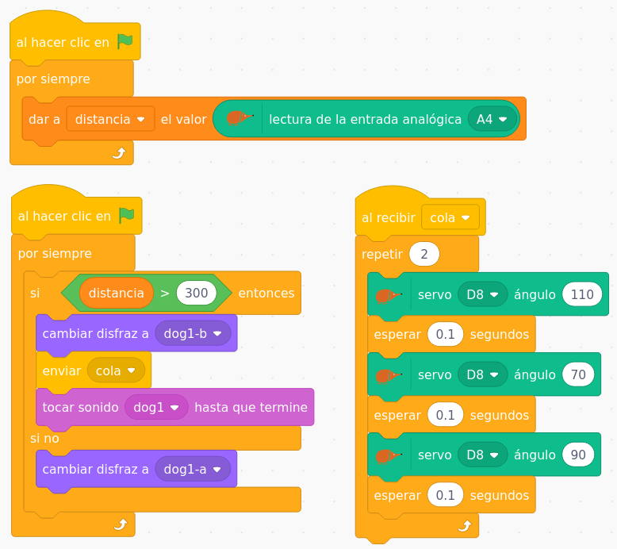

Las placas de EchidnaSTEAM, además de incorporar sensores y actuadores integrados, tienen entradas y salidas digitales y analógicas que podemos utilizar para trabajar con más componentes. En esta ocasión vamos a utilizar un sensor bastante común, el **Sensor de Distancia SHARP**

El sensor SHARP es un sensor óptico que permite medir la distancia desde un objeto hasta el sensor. Incorpora un emisor y un receptor de infrarrojos. Cuando la señal emitida rebota contra un objeto, es devuelta con un ángulo proporcional a la distancia a la que se encuentra, cuanto más lejano, un ángulo más agudo. El receptor la recibe mediante triangulación se puede conocer la distancia.

Os presento a **Perrobot**, un proyecto con el que podemos empezar a familiarizarnos con este tipo de sensores:

[Perrobot con sensor SHARP y EchidnaBlack](https://www.youtube.com/watch?v=PsizKPQ8358)

Como habéis podido comprobar, con muy pocos materiales, y además bastante comunes, podemos crear nuestro perrito robótico… o cualquier otro animal, real o imaginario. En esta presentación podéis ver los pasos:

[Ver la presentación (Google Slides)](https://docs.google.com/presentation/d/e/2PACX-1vT0wr8xkJkQsirZtLVMv9GWpV7jpeqEfFyfdwYbqxfvAGDQWMSNntjbYcFM2qi8W6JjfVroxFRoH19Y/pub?start=false&loop=false&delayms=3000)

Aquí os dejo un vídeo de ejemplo de una sencilla programación usando la placa [EchidnaBlack](/ecosistema/placas-anteriores/) con EchidnaScratch:

[Programación Perrobot con EchidnaScratch](https://www.youtube.com/watch?v=Qmojby52QME)

Y por último, una imagen de los bloques del proyecto y el [archivo sb3](https://github.com/lobotic/Proyectitos/blob/master/Echidna/Perrobot/Perrobot.sb3). Espero que os guste :-)

