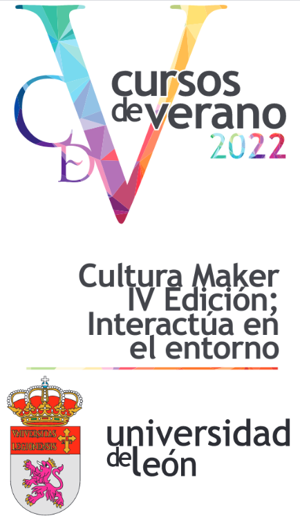

Este verano  participamos en el curso de verano CULTURA MAKER – IV EDICIÓN. INTERACTÚA EN EL ENTORNO, organizado por la Universidad de León, cuyo objetivo es conocer algunos aspectos esenciales del movimiento maker.

En el taller hablamos del Movimiento Maker, Pensamiento Computacional, Inteligencia Artificial, Echidna Educación y trabajamos con diferentes propuestas que incluyen Programación, Robótica e Inteligencia Artificial.

Enlaces de interés para el curso:

- [scratch.echidna](https://scratch.echidna.es/)
- [Echidna Link](/ecosistema/echidnaml/)
- [scratch.echidna.es/learningml](https://scratch.echidna.es/learningml/)
- [Snap4Arduino](https://snap4arduino.rocks/)

[Ver la presentación (Google Slides)](https://docs.google.com/presentation/d/e/2PACX-1vRxIoNVsYYa_k0vk-NmwGaBspSqSx_TgJWIGj-29V0j9ucnz3NuFRYJ66TDFJsALZVsirYI9_IYW8pB/pub?start=false&loop=false&delayms=3000)
