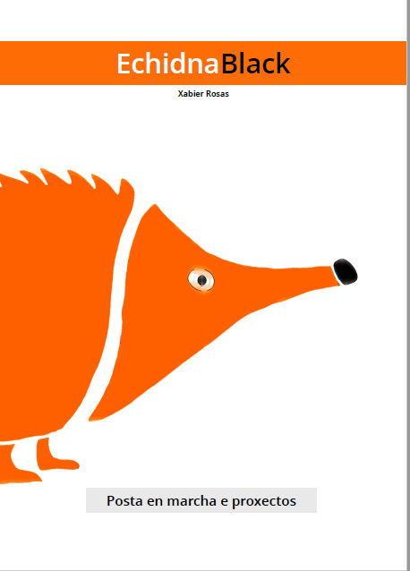
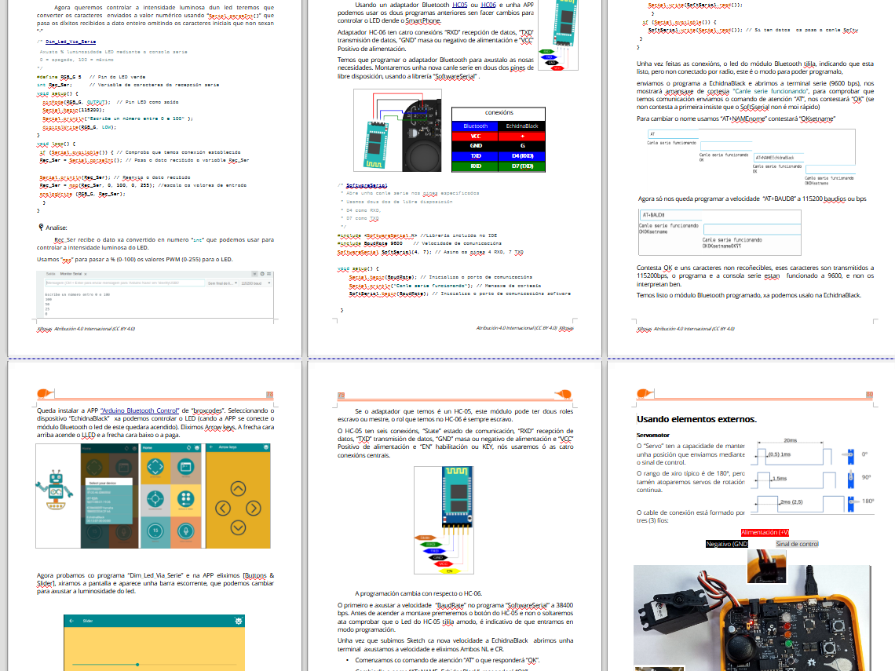

[Publicamos o manual  de posta en marcha de EchidnaBlack  Redactado en Galego.](https://github.com/EchidnaShield/Recursos/blob/master/Didactica/Manual/Manual_EchidnaBlack_001_Gal.pdf)

[Contando con  unha colección de proxectos de exemplo.](https://github.com/EchidnaEducacion/recursos/tree/master/Didactica/Manual/Firmware_Gal)

Comenza un período de uso/corrección co alumnado de FP.

Espero que sexa de utilidade.

