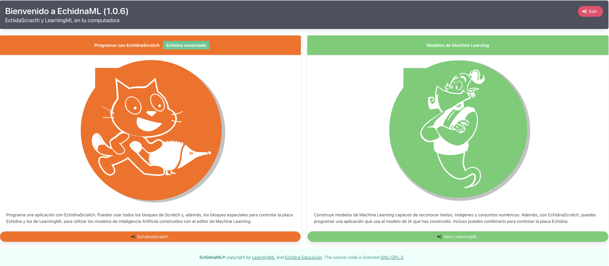

¡Hola a todos!

En Echidna estamos terminando de desarrollar una versión de escritorio que integra una modificación de Scratch para controlar la placa Echidna, y el software Learning ML para añadirle inteligencia artificial. Le hemos llamado **EchidnaML**.

Llevamos unos meses trabajando en el proyecto y hasta ahora todo parece funcionar bien, pero necesitamos que más gente lo pruebe para tener más variedad de experiencias con distintos sistemas operativos y máquinas, así que habíamos pensado que quizás a ti te interese, ¿te animas a probarlo?

### ¿Qué esperamos de un betatester?

1. Que instales el programa en tu máquina
2. Que realices una prueba rigurosa y reportes posibles errores
3. Feedback del uso

### Descargar la versión V1.09

Aqui tienes los enlaces de EchidnaML para los tres SO.

- [EchidnaML Linux](https://web.learningml.org/echidnaml/1.0.9/echidnaml_1.0.9_amd64.deb)
- [EchidnaML MACOs](https://web.learningml.org/echidnaml/1.0.9/EchidnaML-1.0.9.dmg)
- [EchidnaML Windows](https://web.learningml.org/echidnaml/1.0.9/EchidnaML_1.0.9.msi)

### Feedback

Para darnos Feedback hemos preparado dos formularios:

- [Formulario de reporte de errores](https://docs.google.com/forms/d/e/1FAIpQLSdGil1NfxUJ2VpbMaNDfNeVXF8ffIC2IjiKbNdfVKyh0PpxcA/viewform?usp=sf_link)
- [Formulario de uso](https://forms.gle/D8xty2WeChULn4Aw5)

### Procedimiento

Cada vez que encuentres un error, rellena el formulario de errores y envíalo. Es **importante** que  **reportes** **un** **solo** **error** en cada envío del formulario, y que seas lo más preciso posible cuando lo redactes. El propio formulario te ofrece las pautas que debes seguir. Piensa que el desarrollador, antes de resolver el error, debe ser capaz de reproducirlo para poder estudiarlo.

Cuando hayamos corregido uno o varios errores de los reportados por ti o por cualquier otro betatester, recibirás un correo electrónico en el que se indicarán los enlaces para descargar la nueva versión y los errores que se han corregido. Para cerrar el ciclo deberías probar si, realmente, el/los errores que reportaste se han corregido. Y en el caso de que no se hayan corregido volver a reportarlos haciendo uso del formulario de reporte de errores.

Cuando lleves un tiempo probando la aplicación es el momento de rellenar y enviar el formulario de uso. Se trata de contarnos cómo te ha ido con las pruebas. El propio formulario te indica las pautas a seguir para hacer esta descripción.

### ¿Te apuntas?

Si quieres ayudarnos a desarrollar **EchidnaML** solo tienes que escribirnos al correo de echidna (echidnashield de gmail), por twitter @echdinasteam o al [contacta de la web.](/contacta/) Si no tienes placa te podemos proporcionar una.

Y eso es todo. Esperamos poder contar con tu ayuda para depurar esta nueva aplicación que estamos desarrollando con la convicción de que la enseñanza y el aprendizaje de la programación, la robótica educativa y la inteligencia artificial serán mucho más fáciles y divertidos.

Por si te hace falta algo de motivación extra, algún regalito al final caerá.
