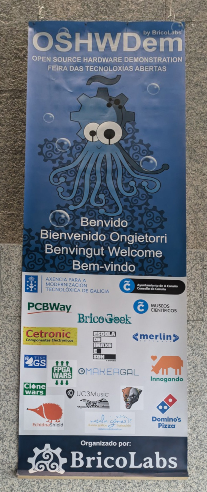
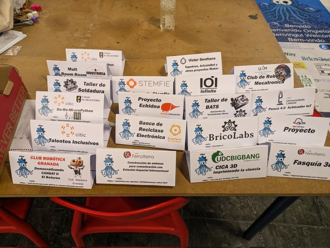
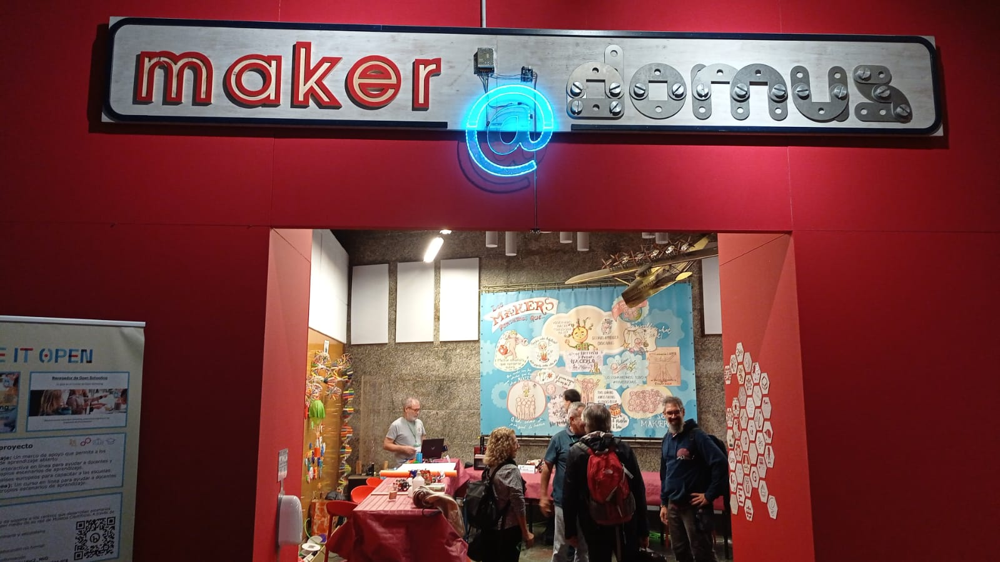
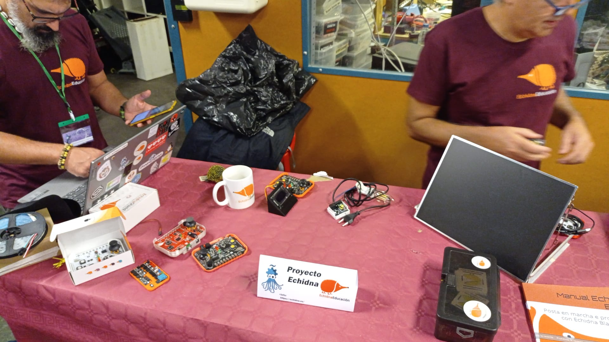
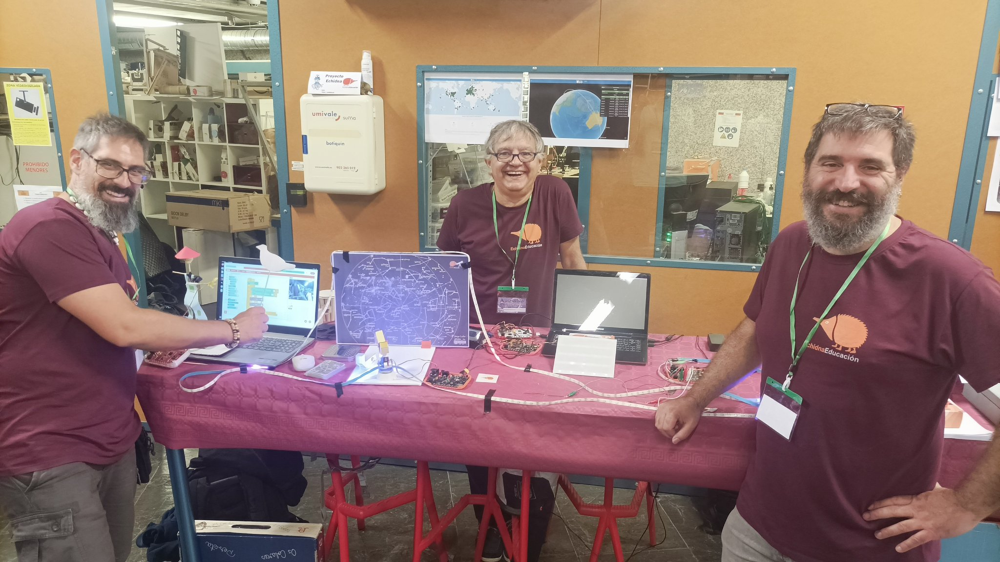
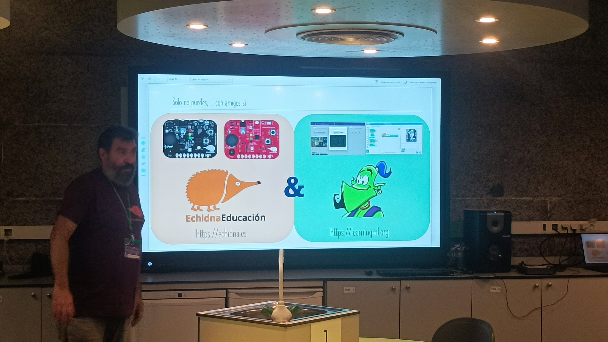
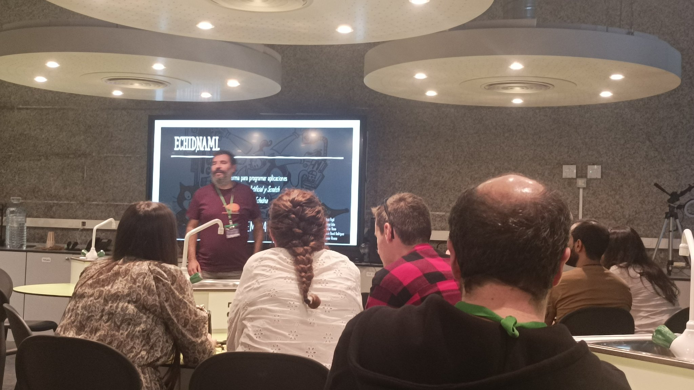

Volver a A Coruña a la OSHWDem es siempre una estupenda experiencia.

Un año más tuvimos el placer de llevar el proyecto de Echidna a nuestro encuentro maker favorito y, como siempre, rodeados de otros proyectos de los que disfrutar y de makers con quienes compartir.

Por nuestra parte, lo pasamos en grande mostrando algunos de nuestros proyectos educativos más recientes y presentando EchidnaML, el nuevo software de escritorio, mediante demostraciones prácticas en nuestro stand y a la charla sobre el mismo que nuestro compañero Juanda, desarrollador de EchidnaML impartió.

La OSHWDem es, sin duda, un espacio único para compartir, aprender y disfrutar. Una edición más nos volvemos de A Coruña con ganas más. De más compartir. De más charlas. De más juntarnos. De más hardware y software libre. Y, por supuesto, ¡de más pulpo!

Como siempre,queremos agradecer el esfuerzo, el cariño y la dedicación del equipo que hay detrás de este evento, ¡qué grandes sois!

¡Nos vemos en la próxima edición!  

