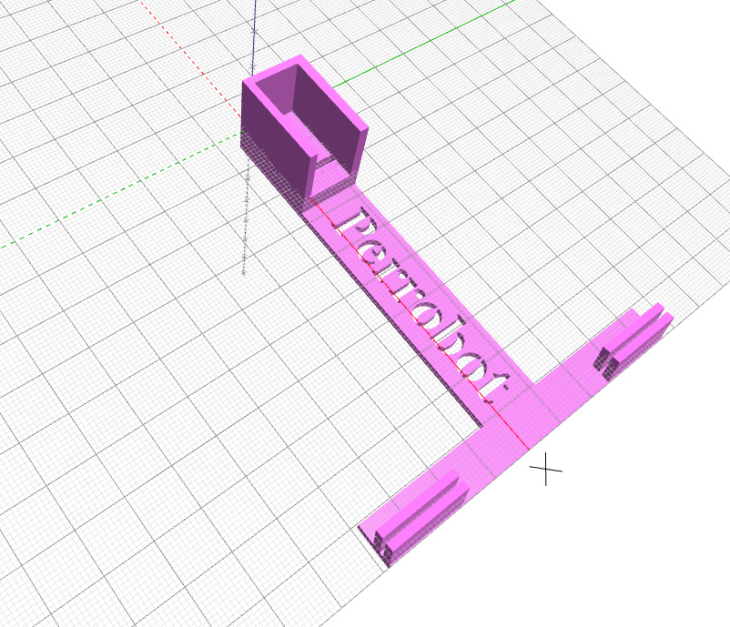

[EchidnaML](/2024/10/a-programar-con-echidna-ml/) ya está aquí… ¡y a pleno rendimiento!  
Con esta herramienta que permite combinar bloques de control de Echidna y bloques de Machine Learning gracias al LearningML podemos incluir Inteligencia Artificial en nuestros proyectos de forma sencilla. A continuación se propone un pequeño proyecto que combina la potencia de EchidnaML con Plástica para incluir la A de STEAM. Consiste en la creación de dos mascotas robóticas como el [Perrobot](/2021/03/perrobot/) que os mostramos hace ya tiempo, en este caso un perro y un gato, que reaccionarán moviendo su cola cuando se muestren sus comidas favoritas.

En esta entrada podéis encontrar la presentación que guía durante la construcción de la maqueta, para la cual se ha creado una ficha que facilitará su desarrollo en el aula, un vídeo resumen de cómo entrenar el modelo de Machine Learning y crear un programa básico, además de los archivos de la ficha y del soporte 3D para sujetar a nuestros animalitos.

¡Espero que os guste!

## **CONSTRUYENDO A PERROBOT Y GATOBOT**

[Ver la presentación (Google Slides)](https://docs.google.com/presentation/d/e/2PACX-1vT0wr8xkJkQsirZtLVMv9GWpV7jpeqEfFyfdwYbqxfvAGDQWMSNntjbYcFM2qi8W6JjfVroxFRoH19Y/pub?start=false&loop=false&delayms=3000)

## **VIDEO RESUMEN DE ENTRENAMIENTO DEL MODELO Y PROGRAMACIÓN.**

[Perro-gato un proyecto con IA](https://www.youtube.com/watch?v=cfjouotJt2o)

## RECURSOS

- [Ficha fotocopiable para la maqueta](https://github.com/lobotic/Proyectitos/blob/master/Echidna/IA_Perro_Gato/Ficha_Perro_Gato.pdf)

### **Modelo 3D**

**Modelo Perrobot 2.0 para sg90**

- [STL](https://github.com/lobotic/Proyectitos/blob/master/Echidna/IA_Perro_Gato/Perrobot20.stl)
- [Bloques BlockCAD](https://github.com/lobotic/Proyectitos/blob/master/Echidna/IA_Perro_Gato/Perrobot20.xml)
- [Código OpenCAD](https://github.com/lobotic/Proyectitos/blob/master/Echidna/IA_Perro_Gato/Perrobot20.scad)

**Modelo 3D Perrobot 2.0 Emax**

- [STL](https://github.com/lobotic/Proyectitos/blob/master/Echidna/IA_Perro_Gato/Perrobot20Emax.stl)
- [Bloques BlockCAD](https://github.com/lobotic/Proyectitos/blob/master/Echidna/IA_Perro_Gato/Perrobot20Emax.xml)
- [Código OpenCAD](https://github.com/lobotic/Proyectitos/blob/master/Echidna/IA_Perro_Gato/Perrobot20Emax.scad)
