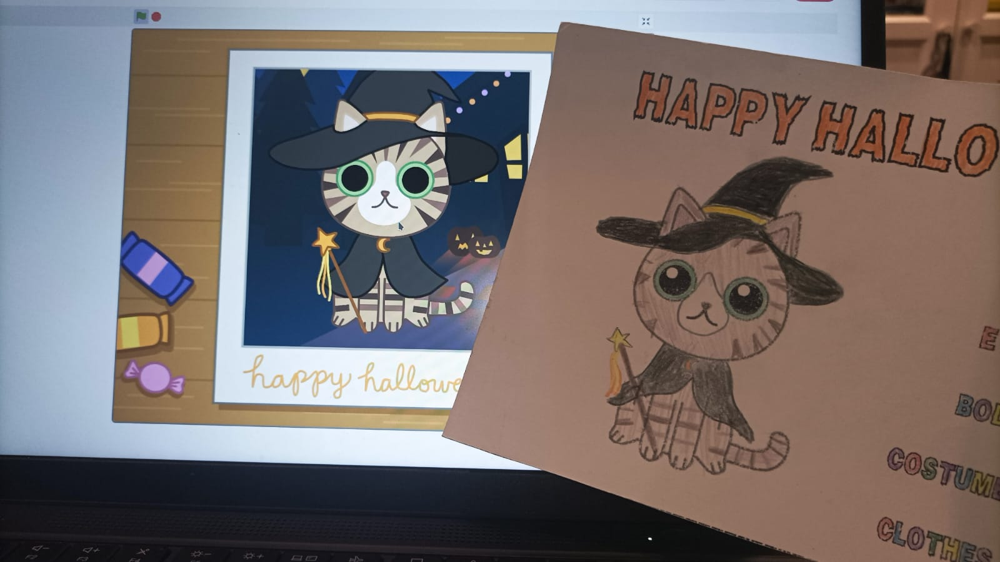

Para celebrar que Halloween está ya a la vuelta de la esquina, queremos presentar un proyecto lúdico para que nuestro alumnado se inice con las placas Echidna: **“Happy Halloween!”**, una actividad basada en un [proyecto](https://scratch.mit.edu/projects/245744567) de Scratch de [ipzy.](https://scratch.mit.edu/users/ipzy)

La propuesta permite al usuario cambiar el aspecto de un gatito: su aspecto, disfraz, sombrero y complementos. Esta idea se ha convertido en una propuesta interactiva mediante la placa EchidnaBlack conectada en **modo MkMk**. A continuación podéis ver un vídeo de cómo funciona:

[HAPPY HALLOWEEN! 2025](https://www.youtube.com/watch?v=e7-jVzoQbsg)

Los **objetivos** de este proyecto son los siguientes:

- Familiarizar al alumnado con el uso de la placa EchidnaBlack.
- Comprender el funcionamiento del modo MkMk y las entradas digitales.
- Aprender a conectar pinzas de cocodrilo de forma segura y funcional.
- Explorar cómo adaptar proyectos de Scratch al entorno físico mediante EchidnaML.
- Desarrollar la creatividad a través del dibujo y la expresión plástica.

Como veis, este  proyecto no está pensado para programar, solo que el alumnado se familiarice de forma sencilla y divertida con la placa Echidna, el modo MkMk, el uso de pinzas de cocodrilo y la carga de proyectos en EchidnaML. Podría ser una primera sesión introductoria antes de empezar a trabajar con la placa en profundidad.

El **proceso de trabajo** propuesto es el siguiente:

**1\. Carga del proyecto:** El alumnado comienza abriendo el entorno EchidnaML. Allí indicamos cómo podemos cargar  el proyecto previamente adaptado, que se puede descargar de aquí.

**2\. Preparación de la tarjeta interactiva**: Cada estudiante recibe una tarjeta que tendrá que preparar para hacerla interactiva con cinta adhesiva conductora o con papel de aluminio. Cada acción específica en el proyecto (cambiar el aspecto, disfraz, el sombrero o los complementos del gato) tiene un «botón» asociado que deberán preparar. Después tendrán que conectar los cables de cocodrilo a la tarjeta y a la placa. Se puede seguir este pequeño tutorial:

[Ver la presentación (Google Slides)](https://docs.google.com/presentation/d/e/2PACX-1vRFuWQquNmvxOczrHmCkDJiDrMaCe9GiSbeLTAfqsZx2y-pkIKUmXHOvhW4eoPxCruig9-HG-2pFeZv/pub?start=false&loop=false&delayms=3000)

**3\. Interacción con el proyecto**: Al tocar las distintas zonas de la tarjeta, el alumnado activa las entradas de la placa, lo que provoca cambios en el aspecto del gato virtual. De esta forma, pueden experimentar con diferentes combinaciones y personalizar su personaje de manera sencilla y divertida.

**4\. Representación artística:** Una vez que han elegido el diseño final de su gato virtual, lo dibujan en su postal, permitiendo que el alumnado represente gráficamente el resultado de su interacción digital y conectando así la actividad con el área de Plástica.

¡Además, podrán llevarse a casa un trabajo que les recuerde lo que han hecho en esta actividad!

Si tu alumnado ya ha avanzado en el uso de EchidnaML, puedes aumentar el reto proponiendo que modifiquen el proyecto original. ¡Es muy fácil!
