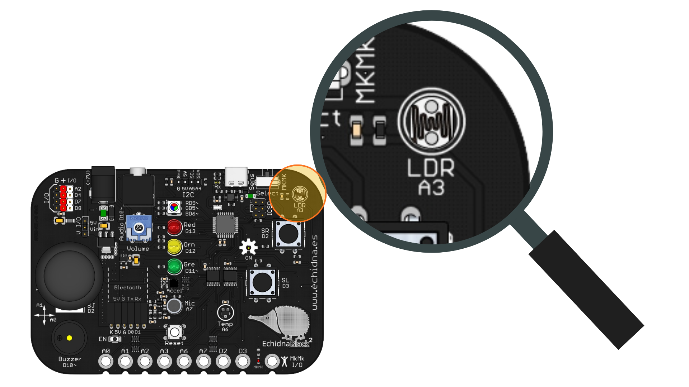
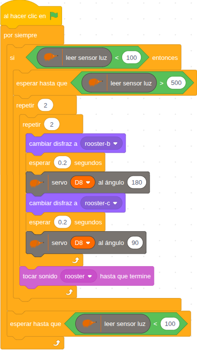
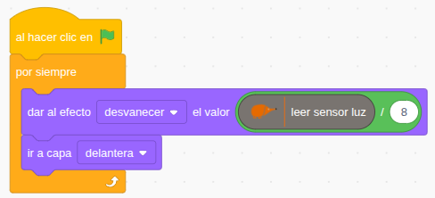

Los bloques de construcción siempre han tenido algo especial que atrae a personas de todas las edades: permiten convertir una idea en algo real de forma intuitiva y razonablemente sencilla.

Este proyecto permite unir esa magia de los bloques de construcción con la magia de Echidna para montar un **gallo mecánico** que mueve las alas y canta cuando amanece.

La base del proyecto está construida con bloques de un antiguo kit de construcciones. A partir de estas piezas se ha diseñado un gallo capaz de mover las alas mediante unos engranajes movidos por un servomotor.

Para facilitar que cualquiera pueda reproducirlo, [aquí](https://github.com/lobotic/Proyectitos/blob/master/Echidna/GalloDespertador/gallodespertador.pdf) tenéis una **guía de construcción** paso a paso creada con dos herramientas libres:

- LeoCAD para el diseño.
- LPub3D para generar las instrucciones.

El comportamiento del gallo está controlado por una **EchidnaBlack2** programada mediante **EchidnaML**. El elemento clave es la **LDR** (resistencia dependiente de la luz), que permite detectar cuándo amanece.

Durante la noche, la lectura de la LDR se mantiene por debajo de un umbral mínimo, que define el estado de “oscuridad”. El programa espera a que se alcance primero ese nivel mínimo (confirmando que ha sido de noche).

Cuando la luz sube y supera el umbral de amanecer, el gallo mueve las alas gracias al servomotor, y canta.

Además del modelo físico, el proyecto incluye una representación virtual del ciclo día–noche. Para ello se ha creado y programado un gran rectángulo negro que cubre la escena.

El nivel de oscurecimiento se controla mediante el efecto desvanecer, calculado con la fórmula **leer\_sensor\_luz / 8**.

De este modo, cuando hay poca luz, el efecto de desvanecer es menor y la pantalla se oscurece. A medida que aumenta la luz, el rectángulo se vuelve más transparente, simulando el amanecer. Esto permite ver de forma clara cómo la lectura del sensor afecta tanto al mundo real como al virtual.

En este vídeo puedes hacerte una idea de cómo queda:

[Gallo Despertador](https://www.youtube.com/watch?v=7ptqQNWfK_w)

¿Te animas a probarlo? [Aquí](https://github.com/lobotic/Proyectitos/blob/master/Echidna/GalloDespertador/Gallo-despertador.sb3) puedes descargar el archivo de EchidnaML con el programa completo.

Combinando bloques de construcción con Echidna, las posibilidades son tantas como la imaginación nos permita, así que sin duda llegarán más proyectos de este tipo :-)
