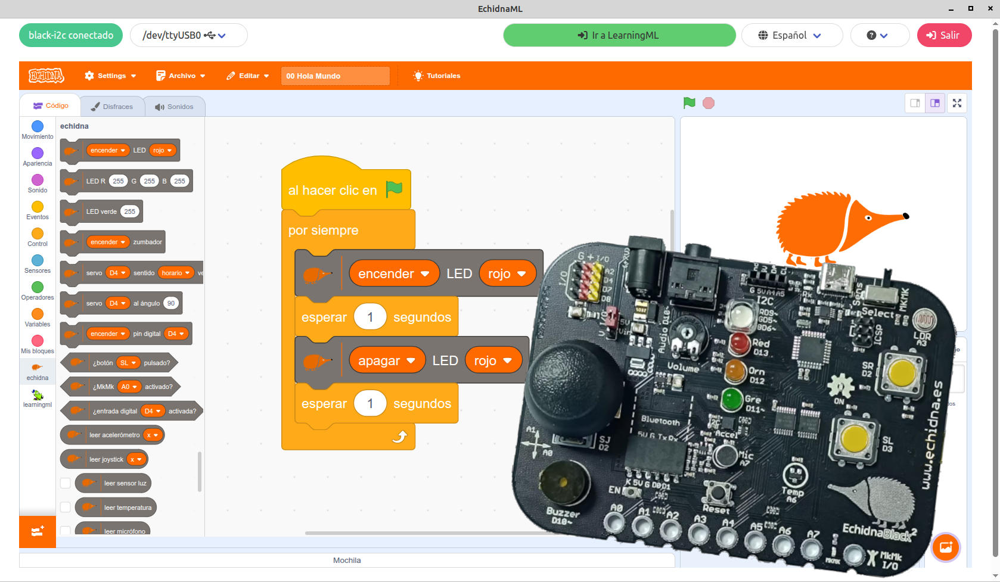
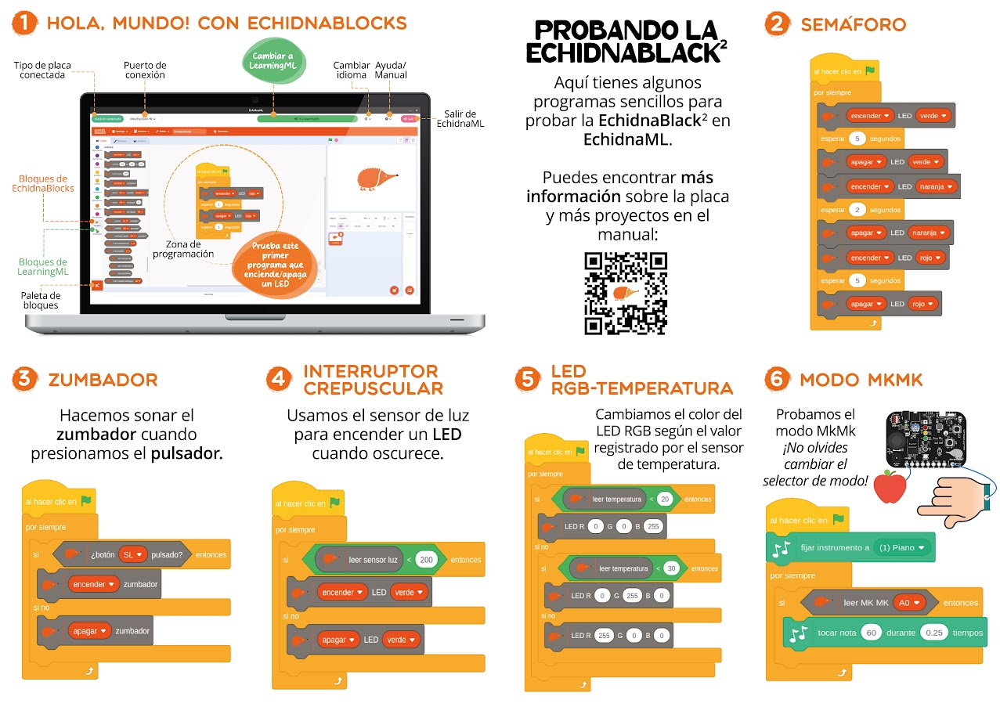

## ¡Tenemos buenas noticias!

Acabamos de publicar el [**manual de EchidnaBlack2** y de la **nueva versión de EchidnaML**](https://echidnaeducacion.github.io/manual/), pensados para facilitar aún más el trabajo con la placa en el aula y acompañar al profesorado desde las primeras sesiones hasta proyectos más avanzados.

El manual nace con una idea muy clara: que cualquier docente pueda empezar a trabajar con Echidna de forma sencilla, aunque no tenga experiencia previa en robótica. Por eso, comienza presentando el ecosistema Echidna y la placa **EchidnaBlack2**, explicando de manera clara sus componentes, modos de funcionamiento, alimentación y conexiones.

A lo largo del manual se proponen **actividades prácticas y proyectos guiados** para explicar cómo trabajar con cada uno de los componentes de la placa: LEDs, pulsadores, zumbador, sensores, *joystick*, acelerómetro, micrófono o el modo **MkMk**, con propuestas pensadas para llevar directamente al aula y adaptarlas a distintos niveles. Además, el *software* incluye una sección de ejemplos donde encontrarás los proyectos de estas actividades listos para cargar, probar y analizar. Son propuestas pensadas no solo para usarlas tal cual, sino para modificarlas, adaptarlas y remezclarlas, fomentando la cultura *open source* como base del aprendizaje: aprender observando cómo está hecho, cambiarlo y construir algo propio a partir de ello.

En la nueva versión de **EchidnaML** el entorno de programación sigue siendo una aplicación de escritorio, multiplataforma y sin necesidad de conexión a internet, pero hemos hecho una revisión de los bloques de **EchidnaBlocks** para controlar la placa, adaptando algunos y mejorando el funcionamiento general del software y la interfaz de usuario para que la experiencia sea aún mejor.

Además, el manual incluye un bloque completo dedicado a **LearningML**, la herramienta integrada para trabajar inteligencia artificial en el aula. A través de ejemplos sencillos, se muestra cómo crear modelos de texto, imágenes o números y utilizarlos directamente desde EchidnaML, introduciendo la IA de forma accesible y comprensible.

Para cerrar, el manual incorpora preguntas frecuentes, apartados técnicos y referencias que lo convierten en un recurso de consulta continua, no solo en una guía de inicio. Como todo lo que rodea a Echidna, este material lo hemos creado docentes, pensando en las necesidades del día a día en el aula.

Si ya trabajas con Echidna, este nuevo manual y la actualización de EchidnaML te van a facilitar mucho el camino. Y si estás pensando en empezar… ¡Anímate! ¡Con este detallado manual será más fácil que nunca!
