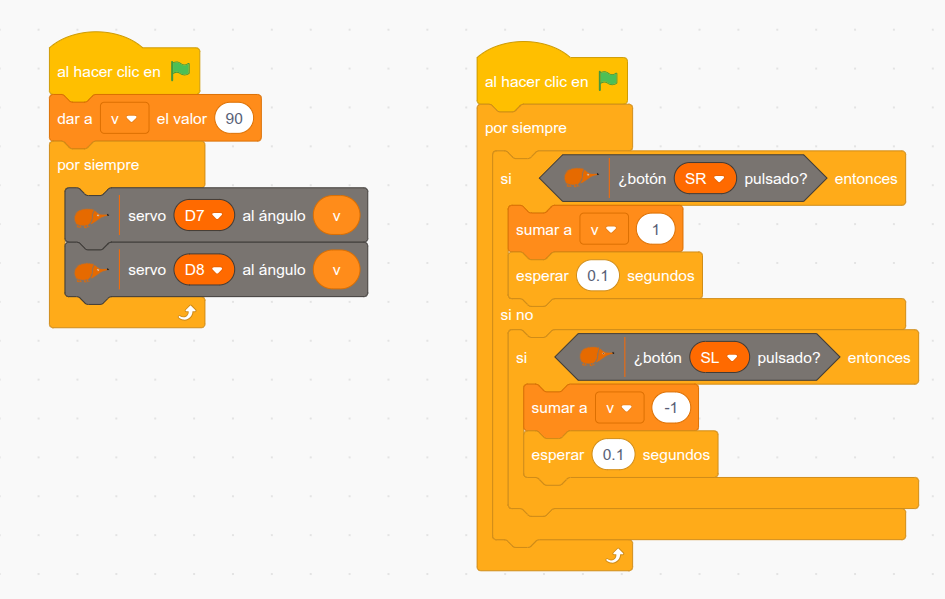

El **arte cinético** es una forma de arte en la que el **movimiento** es parte esencial de la obra. Se trata de algo que cambia, que en cierta medida depende del espectador o del entorno para funcionar: la obra no es siempre la misma, porque se transforma cuando te mueves alrededor (o incluso dentro) de la obra, o cambia mediante como incide la luz en ella, el movimiento del viento, de un mecanismo… El arte cinético precisa de una forma u otra del movimiento.

Además, el arte cinético conecta mucho con la **ciencia y la tecnología**. Utiliza luz, mecánica… o incluso como en este caso, sensores, actuadores y programación. Podríamos decir que es un puente entre el arte tradicional y el arte digital.

El arte cinético no busca representar algo, sino generar una **experiencia**. Y esa experiencia, posiblemente sea diferente para cada persona.

Inspirádonos en la obra de [David C. Roy](https://www.youtube.com/@DavidCRoy), os proponemos esta experiencia de creación de una escultura cinética para la que proporcionamos plantillas para reproducir un modelo en concreto, pero que busca ser la base para que vuestra propia inspiración os lleve a crear vuestra escultura personalizada.

## Instrucciones de montaje

[Ver la presentación (Google Slides)](https://docs.google.com/presentation/d/e/2PACX-1vSNHVnZDn2uwh4hlEST6JLAxYu-nGlKKTsn79ldOyYuzOFwpHI_t3QropwFnR3LMsSrZD_EQb5ucorr/pub?start=false&loop=false&delayms=3000)

## Programa sencillo

Al pulsar SR aumenta la velocidad, al pulsar SL, disminuye.

## Video del funcionamiento

[Escultura cinética](https://www.youtube.com/watch?v=Ul4QXBoMud8)

## Archivos descargables

- [Archivo sb3](https://github.com/lobotic/Proyectitos/blob/master/Echidna/EsculturaCinetica/EsculturaCineticaPlantilla.pdf)
- [Plantilla](https://github.com/lobotic/Proyectitos/blob/master/Echidna/EsculturaCinetica/EsculturaCineticaPlantilla.pdf)
