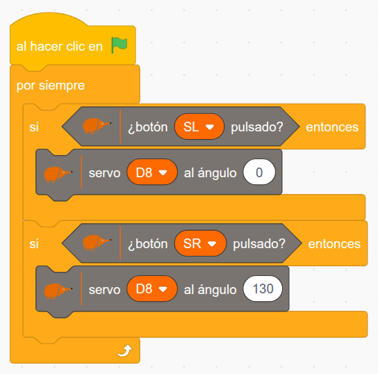
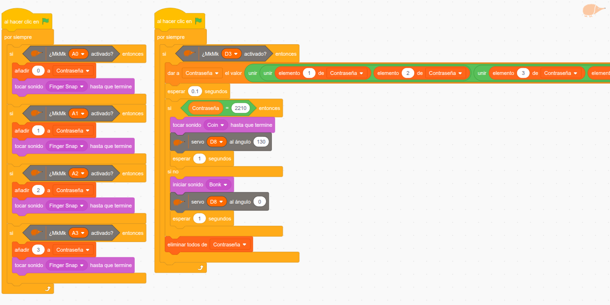
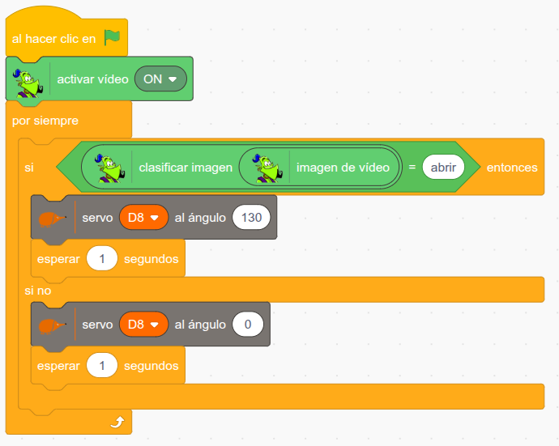

En este proyecto os proponemos la construcción de una caja formada con bloques de construcciones que se abre mediante un servomotor que, al hacer girar un engranaje, arrastra la puerta gracias a unas placas dentadas.

Como ya es costumbre, para facilitar que se pueda reproducir el modelo, se ha creado una **guía de construcción paso a paso** con el montaje de la caja, que podéis descargar [aquí](https://github.com/lobotic/Proyectitos/blob/master/Echidna/CajaFuerte/cajafuerte_150_DPI.pdf) y seguir fácilmente.

Hay diversas posibilidades que podemos explorar con la placa echidna para abrir y cerrar esta caja. Os proponemos 3 diferentes:

- **Apertura simple mediante pulsadores**: Al pulsar SL, la caja se abre. Al pulsar SR, se cierra. Un método fácil y rápido, ideal para trabajar con alumnado que está empezando. Con esta programación podrán entender el concepto de **entrada digital** de forma práctica.  
  
- **Contraseña mediante teclado con las entradas MkMk**: En este caso la apertura será mediante una lista en la que se van introduciendo números asociados a las entradas MkMk. Esta modalidad tiene la ventaja de poder trabajar conceptos más avanzados, como el de las **listas**, y permite crear un teclado personalizado para introducir la clave gracias a los conectores MkMk, fomentando la **creatividad**.  
  
- **Reconocimiento facial**: Mediante un modelo de reconocimiento de imágenes creado con LearningML, integrado en el software EchidnaML, la caja se abrirá cuando la cámara reconozca al usuario autorizado. El método más completo, ya que **aúna programación, robótica y machine learning.**  
  

Como siempre, os dejamos un **vídeo** en el que se muestra el funcionamiento, en este caso del último ejemplo: reconocimiento facial con machine learning.

[Caja Fuerte con apertura por reconocimiento visual](https://www.youtube.com/watch?v=TeTapxPNc24)

Aquí podéis descargar los archivos **.sb3** de cada una de las propuestas:

- [Archivo .sb3: pulsadores](https://github.com/lobotic/Proyectitos/blob/master/Echidna/CajaFuerte/caja%20fuerte%201.sb3)
- [Archivo .sb3: clave](https://github.com/lobotic/Proyectitos/blob/master/Echidna/CajaFuerte/caja%20fuerte%202.sb3)
- [Archivo .sb3: machine learning](https://github.com/lobotic/Proyectitos/blob/master/Echidna/CajaFuerte/caja%20fuerte%203.sb3)
