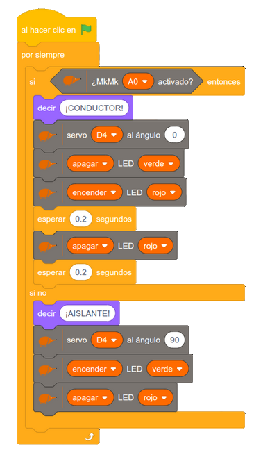

En el laboratorio de Frankenstein vamos a trabajar la **conductividad eléctrica** de una forma muy directa: probando materiales y viendo qué ocurre.

Prepararemos un circuito sencillo con un servomotor y la placa EchidnaBlack. El monstruo se “despierta” cuando conseguimos cerrar el circuito con un material que deje pasar la corriente. Si no conduce, el monstruo permanecerá tumbado en su camilla hasta que demos con un objeto que permita el paso de la corriente. El objetivo de esta actividad es aprender y descubrir haciendo, sin necesidad de mucha explicación previa.

La conductividad eléctrica es la capacidad de un material para permitir que la corriente eléctrica lo atraviese. Podemos imaginar que la electricidad necesita un camino para avanzar. Algunos materiales ofrecen ese camino sin dificultad: son los conductores. Otros lo bloquean o lo dificultan tanto que la corriente no pasa: son los aislantes.

Esto se puede comprobar con ejemplos muy cercanos. Los metales, como una moneda o un clip, permiten cerrar el circuito y activar el sistema. En cambio, materiales como el plástico, la madera o el cartón no lo consiguen. También aparecen casos interesantes: el agua, por ejemplo, no siempre se comporta igual. Si tiene sal, conduce mejor; si es destilada, apenas deja pasar la corriente.

En este caso utilizaremos el **modo MkMk** de la placa Echidna para comprobar la conductividad. Esto nos permite ampliar la gama de materiales conductores, ya que es capaz de detectar incluso pequeños pasos de corriente. Gracias a esa sensibilidad, podemos experimentar con un abanico de materiales bastante completo, desde metales hasta frutas, gominolas o incluso el propio cuerpo humano, que también puede cerrar el circuito.

Esta actividad parte de una idea original de [**José Manuel Padilla**](https://x.com/jmpadi2002) y se ha desarrollado con la colaboración de [**Susana Alonso**](https://www.instagram.com/susanaalonsolab/) y [**Eva Marín**](https://www.instagram.com/elretodelaeducacionfisica/), con quienes preparé una versión de esta actividad  con otra placa microcontroladora, pero desde el primer momento tuve claro que habría una versión Echidna, porque mola muchísimo :-)

## Instrucciones de montaje

[Ver la presentación (Google Slides)](https://docs.google.com/presentation/d/e/2PACX-1vSnX8GVH4I1RWOILJJOVR62yowDix0g8eTtUVrPakPug84gFdUu8p2bTA5imXkNe71qbYwX3rGCRyPh/pub?start=false&loop=false&delayms=3000)

## Programa sencillo

Con este ejemplo de programación, cuando no haya nada entre los bornes de prueba, o lo que pongamos sea aislante, se encenderá el LED verde y la echidna dirá ¡AISLANTE!  
Si lo que hay es conductor, el LED rojo lucirá de forma intermitente y la echidna dirá ¡CONDUCTOR!

## Video del funcionamiento

[El Laboratorio del Dr. Frankestain](https://www.youtube.com/watch?v=lxrw2IbM4Zk)

## Archivos descargables

- [Proyecto descargable para EchidnaML](https://github.com/lobotic/Proyectitos/blob/master/Echidna/LaboratorioFrankestein/Laboratorio%20del%20Dr.%20Frankestein.sb3)
- [Ficha de laboratorio](https://github.com/lobotic/Proyectitos/blob/master/Echidna/LaboratorioFrankestein/Plantilla%20frankestein.pdf)
- [Instrucciones en pdf](https://github.com/lobotic/Proyectitos/blob/master/Echidna/LaboratorioFrankestein/El%20Laboratorio%20del%20Dr.%20Frankestein.pdf)
