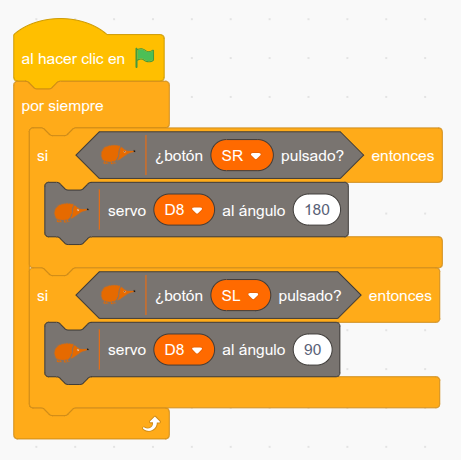

En este proyecto os proponemos construir un dispositivo para crear arte en espiral mediante el movimiento. Al pulsar el botón SR, un servomotor de rotación continua hace girar una cartulina sobre la que pintamos líneas espirales con un rotulador.

Como ya es costumbre, para que se pueda reproducir el modelo hemos preparado una [guía de construcción paso a paso](https://github.com/EchidnaEducacion/Bricks/blob/main/Rotografo/rot%C3%B3grafolpub3d_150_DPI.pdf) con el montaje de la caja.

Como siempre, os dejamos un vídeo en el que se ve cómo funciona:

[Rotógrafo con Echidna](https://www.youtube.com/watch?v=_AftM84t1DI)

Y aquí tenéis el [archivo .sb3 con la programación](https://github.com/EchidnaEducacion/Bricks/blob/main/Rotografo/rotografo.sb3):

