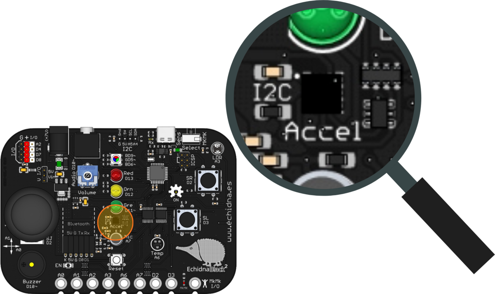
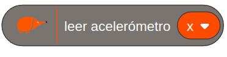
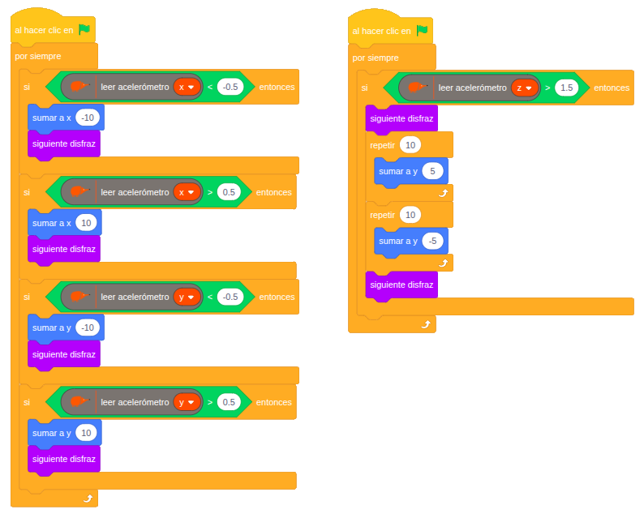

La EchidnaBlack2 tiene un acelerómetro que detecta cómo se inclina y se mueve la placa. Con él se puede, por ejemplo, manejar un personaje inclinando la placa, como en algunos videojuegos.

## Descripción

Es un sensor microelectromecánico (MEMS) de aceleración que mide los movimientos en los tres ejes: X, Y y Z.

- **Mide la inclinación en los ejes X e Y**: la gravedad provoca en el sensor un cambio proporcional al ángulo de inclinación.
- **Detecta los movimientos bruscos en el eje Z**: cualquier movimiento vertical repentino cambia rápidamente la aceleración medida en ese eje.

En la placa está en el centro, rotulado Accel, junto al conector I2C.

## Funcionamiento

El sensor mide la aceleración en cada eje y envía los datos en formato digital. Con ellos se puede detectar movimientos o vibraciones, medir la inclinación respecto a la vertical o detectar caídas e impactos.

Se comunica con el microcontrolador por el bus **I2C**, a través de los pines A4 y A5. Los datos técnicos completos están en la [hoja de características del LIS3DH](https://www.st.com/resource/en/datasheet/lis3dh.pdf) (en inglés).

## Cómo se programa

En **EchidnaML**, el acelerómetro se lee con este bloque, en el que se elige el eje, X, Y o Z:

Los valores son:

- **en reposo**, en torno a 0 en los ejes X e Y, y en torno a 1 en el eje Z;
- **eje X**: de 0 a −1 al levantar el lado derecho de la placa, y de 0 a 1 al levantar el izquierdo;
- **eje Y**: de 0 a −1 al levantar la parte trasera, y de 0 a 1 al levantar la delantera;
- **eje Z**: los movimientos verticales bruscos lo alejan de 1; al subir la placa de golpe, el valor aumenta.

## Ejemplos

### Movemos el echidna

Inclinando la placa, el personaje se mueve por la pantalla, y al levantarla de golpe, salta. El programa tiene dos partes que funcionan a la vez, cada una con su bandera verde.

La primera mueve el personaje según la inclinación:

- eje X menor que −0,5 (placa inclinada a la izquierda): se mueve a la izquierda;
- eje X mayor que 0,5 (inclinada a la derecha): se mueve a la derecha;
- eje Y menor que −0,5 (inclinada hacia atrás): se mueve hacia abajo;
- eje Y mayor que 0,5 (inclinada hacia delante): se mueve hacia arriba.

La segunda lo hace saltar: si el eje Z pasa de 1,5 al levantar la placa bruscamente, el personaje sube y vuelve a bajar.

