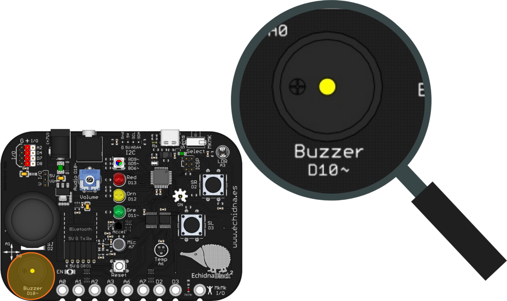
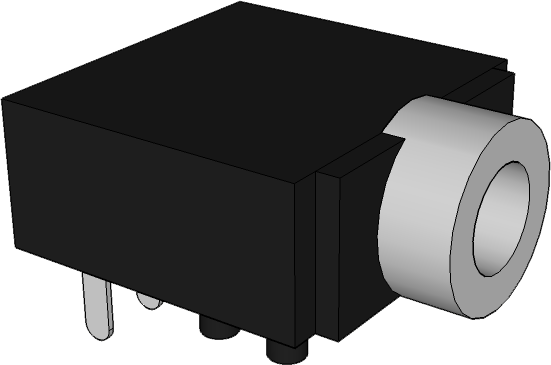
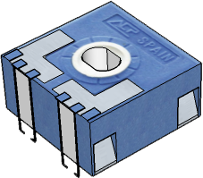
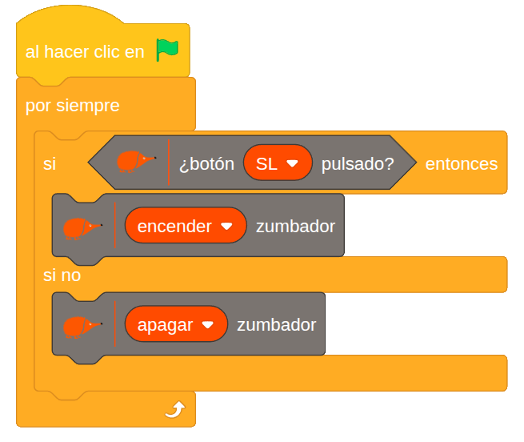

La EchidnaBlack2 puede emitir sonidos: avisos, melodías, un timbre… Para ello tiene dos salidas de audio y un control de volumen.

## Descripción

La placa tiene dos salidas para reproducir audio:

- el **zumbador**, que suena directamente en la placa;
- el **jack**, al que se pueden conectar auriculares o altavoces autoamplificados. Al conectar una clavija en el jack, el zumbador se desconecta.

Además, tiene un **potenciómetro** para ajustar el volumen del sonido.

## Funcionamiento

Las dos salidas están conectadas al pin D10~, que puede reproducir señales de entre 31 Hz y 20 kHz. La señal pasa primero por el potenciómetro de volumen y después llega al jack y al zumbador, como se ve en el esquema.

### Zumbador

El **zumbador** vibra y suena al recibir una señal de una frecuencia determinada. Su frecuencia central es de 2,3 kHz, así que, si nos alejamos mucho de ella, no sonará con calidad (como referencia, la nota do central, C4, tiene 262 Hz). Con el volumen muy bajo puede no oírse.

### Jack de audio

El **jack** es una toma de 3,5 mm, la misma que la de los auriculares del móvil o del ordenador. Permite conectar unos auriculares o unos altavoces autoamplificados (los que llevan su propia alimentación), que reproducen los sonidos con más calidad que el zumbador. Al enchufar una clavija, el zumbador se desconecta y el sonido sale solo por el jack.

Cuidado con el volumen: demasiado alto puede dañar los auriculares e incluso los oídos. Conviene bajarlo con el potenciómetro antes de ponerse los auriculares.

### Potenciómetro de volumen

El **potenciómetro** es una resistencia variable: al girar su eje cambia la resistencia y, con ella, la intensidad de la señal que llega a las salidas. Como está antes del jack y del zumbador, regula el volumen de los dos.

## Cómo se programa

En **EchidnaML**, el zumbador se controla con este bloque, que lo enciende o lo apaga:

## Ejemplos

### Timbre

Un pulsador hace de botón del timbre: el zumbador suena mientras se mantiene pulsado y deja de sonar al soltarlo. El programa comprueba sin parar:

- si el pulsador SL está pulsado, enciende el zumbador;
- si no, lo apaga.

