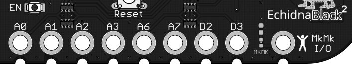
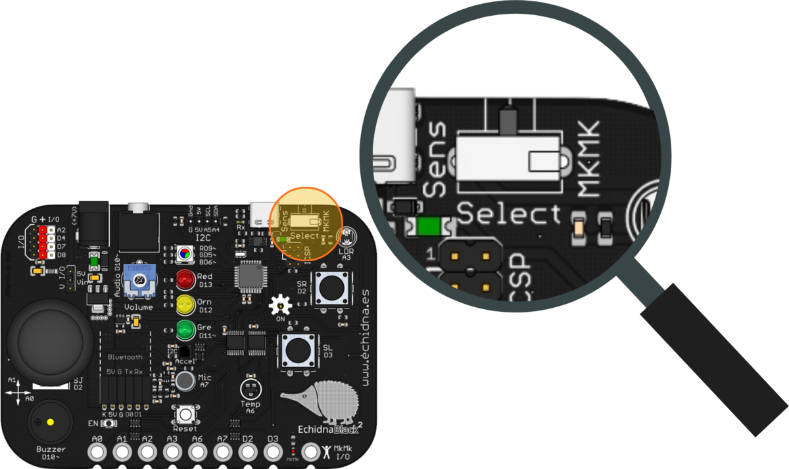
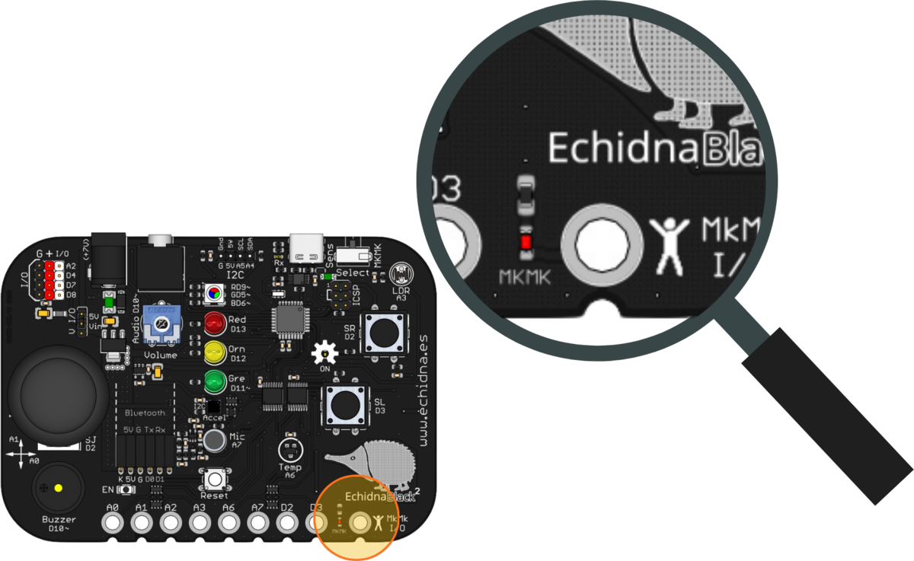
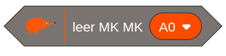
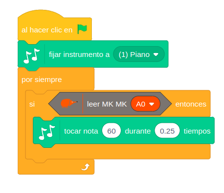
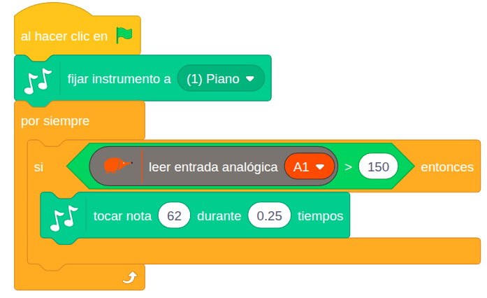

La EchidnaBlack2 tiene 8 entradas conductivas tipo **Makey Makey** (MkMk). Con ellas cualquier objeto que conduzca un poco la electricidad se convierte en un pulsador: frutas, plastilina conductiva, papel de aluminio, agua… Así se crean proyectos que unen el mundo físico con el digital de una forma sencilla, manipulativa y muy lúdica.

## Descripción

Las entradas MkMk detectan la **conductividad eléctrica** de una gran variedad de materiales. Se detecta un contacto cuando el circuito se cierra al tocar a la vez el objeto conectado a una entrada y el **común**: el conector MkMk de la placa o la superficie del símbolo de Echidna, que también hace de común.

Para usarlas, se conecta un cable a la entrada y otro al común. La placa tiene 8 entradas MkMk, en el borde inferior: A0, A1, A2, A3, A6, A7, D2 y D3.

## Activar el modo MkMk

La placa tiene dos modos de funcionamiento, que se eligen con un **conmutador**:

- **Modo sensores**: lee todos los sensores integrados (pulsadores SR y SL, joystick, sensor de temperatura, micrófono y acelerómetro) y todas las conexiones de entrada y salida, incluidas las I2C.
- **Modo MkMk**: da acceso a las 8 entradas MkMk y al resto de entradas que no se usan en este modo.

En los dos modos están disponibles todos los actuadores.

Para usar las entradas MkMk hay que poner el conmutador **hacia la derecha**:

**Atención**: cuando el modo MkMk está activo, se enciende un **LED rojo** de aviso en la parte inferior de la placa.

## Funcionamiento

Cada entrada MkMk forma parte de un divisor de tensión con una resistencia muy elevada. Al cerrar el circuito con el común a través de algo que conduce la electricidad, aunque sea poco, la tensión de la entrada sube y la placa lo detecta. Esa tensión depende de cada material y de cada persona.

## Cómo se programa

En **EchidnaML** hay un bloque para las entradas MkMk, en el que se elige la entrada:

Devuelve **verdadero** o **falso** según el circuito esté cerrado o abierto:

- con el circuito abierto, da **falso** (0);
- al cerrarlo, si la lectura analógica de la entrada (de 0 a 1023) pasa de **350**, da **verdadero** (1).

Ese **umbral** de 350 se puede cambiar leyendo la entrada con el bloque **leer entrada analógica**, como en el segundo ejemplo. Solo se puede hacer con las entradas analógicas (A0, A1, A2, A3, A6 y A7): D2 y D3 son digitales, detectan solo dos estados y su umbral no se puede ajustar.

## Ejemplos

### Piano

Cada vez que se toca la entrada A0 suena una nota de piano: la nota 60 durante 0,25 tiempos. El programa usa la extensión **Música** de Scratch, con el instrumento piano.

### Ajustar la sensibilidad

Con el bloque **leer entrada analógica** se elige el umbral. En este caso, la nota suena cuando la lectura de la entrada A1 pasa de 150, así que detecta contactos más débiles que con el umbral de 350.

