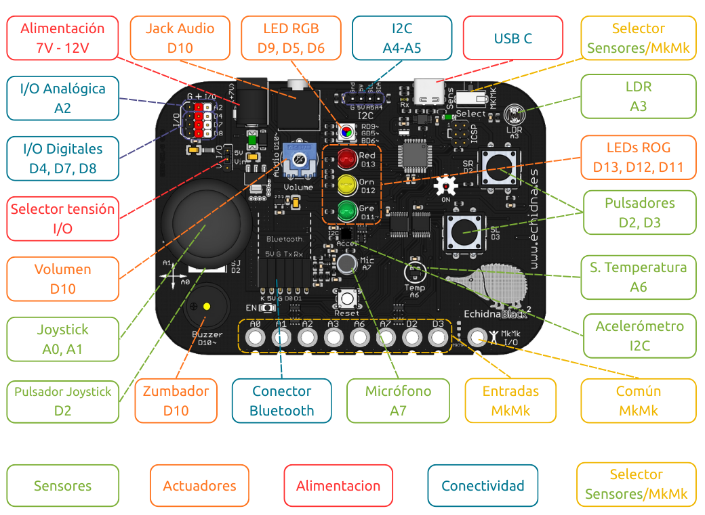

La EchidnaBlack2 es una placa **autónoma** basada en la arquitectura **Arduino**: es compatible con Arduino Nano y Arduino UNO. Lleva integrados los sensores y actuadores más habituales en el aula, así que se puede usar en cuanto se conecta al ordenador, sin montar circuitos.

## Características

- Placa autónoma compatible con Arduino Nano y Arduino UNO.
- Sensores integrados: pulsadores, joystick, acelerómetro, luz, temperatura y micrófono.
- Actuadores integrados: LED, LED RGB y audio.
- Flexible: entradas y salidas disponibles para conectar complementos.
- 8 entradas conductivas tipo Makey Makey (MkMk).
- Conector para un módulo Bluetooth.

## Esquema de componentes

Este esquema muestra dónde está cada componente en la placa y a qué pin va conectado:

Para conectar la placa al ordenador hace falta un cable USB-C.
