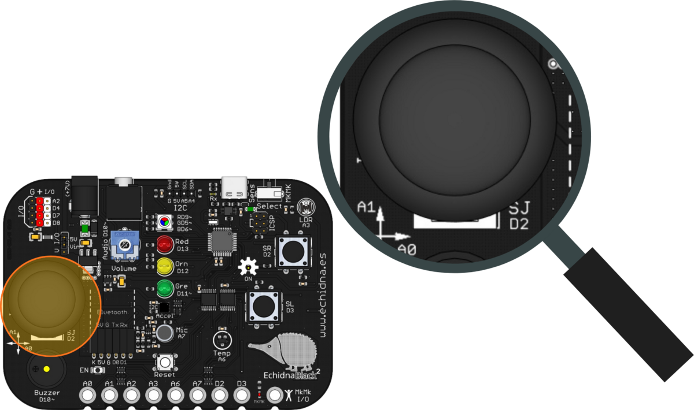
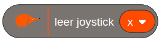
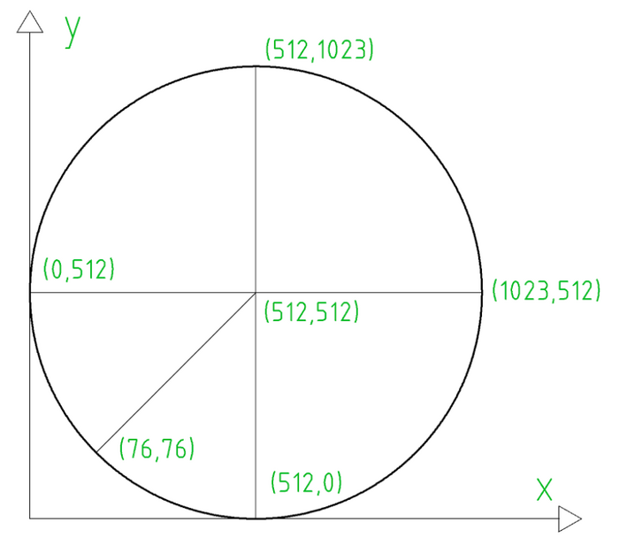
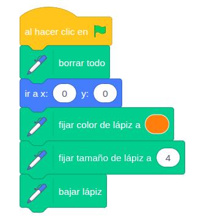
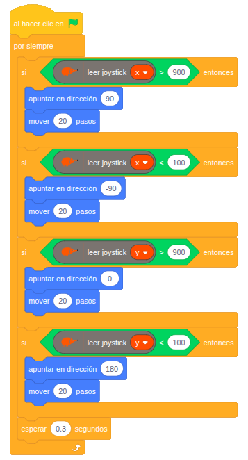

La EchidnaBlack2 tiene un joystick, como el de un mando de videojuegos, para mover personajes, dirigir un robot o dibujar en la pantalla.

## Descripción

El joystick es un dispositivo de entrada con una palanca que se mueve en varias direcciones. Al inclinarla, indica hacia dónde y cuánto se ha desplazado respecto a dos ejes: el horizontal (X) y el vertical (Y).

Por dentro tiene dos potenciómetros, uno para cada eje, que convierten la posición de la palanca en un valor de resistencia.

Además, tiene un **pulsador** que se activa al apretar la palanca hacia abajo. En la EchidnaBlack2, este pulsador está rotulado **SJ** y está conectado al mismo pin que el pulsador **SR**, el D2: al leer uno se lee también el otro.

## Funcionamiento

Cada eje da una tensión proporcional a la posición de la palanca, que la placa convierte en un valor de 0 a 1023. En reposo, los dos ejes dan valores en torno a 512. Por las tolerancias de los componentes, los valores pueden variar un poco de una placa a otra.

## Cómo se programa

En **EchidnaML**, el joystick se lee con este bloque, en el que se elige el eje, X o Y:

Los valores son:

- **en reposo**, en torno a 512 en los dos ejes;
- **eje X**: 0 a la izquierda y 1023 a la derecha;
- **eje Y**: 0 abajo y 1023 arriba.

El pulsador del joystick se lee con el bloque de los [pulsadores](/ecosistema/echidnablack2/pulsadores/), eligiendo SR.

## Ejemplos

### Pintamos

El joystick mueve un lápiz por la pantalla para dibujar. Primero hay que añadir la extensión **Lápiz** de Scratch y prepararlo al empezar: borrar el fondo, ir al punto (0, 0), fijar el color y el grosor del lápiz y bajarlo.

Después, el programa comprueba sin parar hacia dónde se inclina el joystick y mueve el lápiz en esa dirección:

- eje X mayor que 900: hacia la derecha;
- eje X menor que 100: hacia la izquierda;
- eje Y mayor que 900: hacia arriba;
- eje Y menor que 100: hacia abajo.

