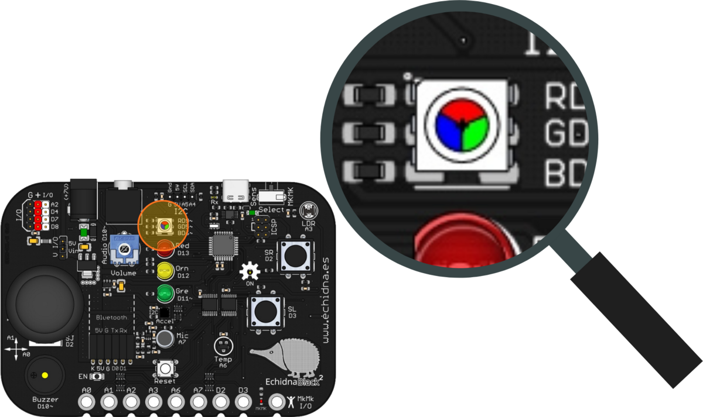
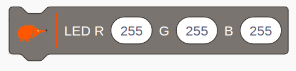
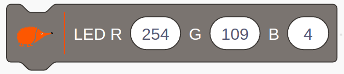
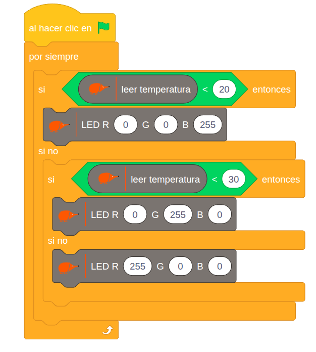
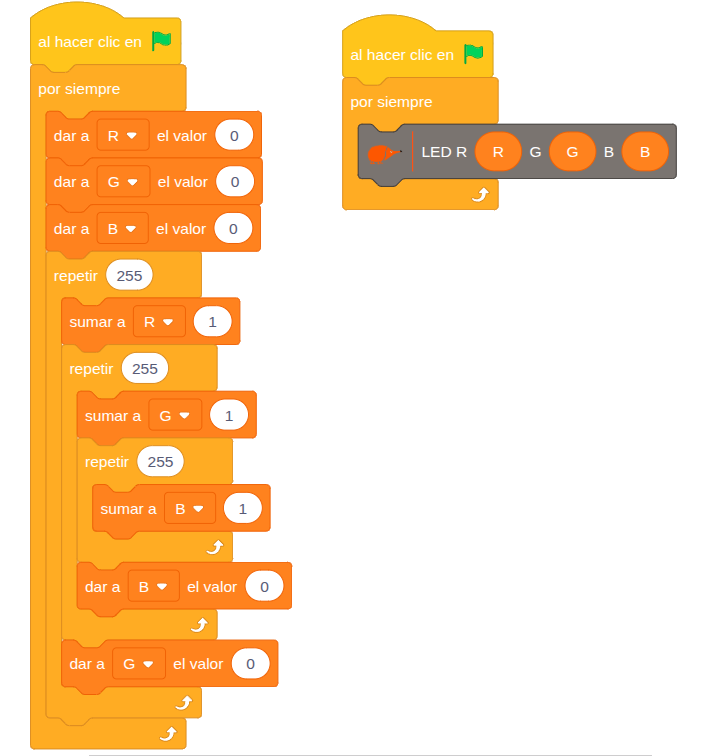

La EchidnaBlack2 tiene un LED RGB que puede encenderse de casi cualquier color, mezclando rojo, verde y azul.

## Descripción

El LED RGB es un único componente con **tres LED independientes**, rojo, verde y azul, dentro de la misma cápsula. Su nombre viene de *Light Emitting Diode* (diodo emisor de luz) y de *Red, Green, Blue* (rojo, verde y azul).

En la placa está en la parte superior, con sus pines rotulados al lado: R D9~, G D5~ y B D6~.

## Funcionamiento

El brillo de cada uno de los tres LED se ajusta por separado con **PWM** (modulación por ancho de pulso), con un valor de 0 (apagado) a 255 (máxima intensidad).

Mezclando los tres colores con distintas intensidades se obtienen los demás. Como cada color tiene 256 niveles, en total hay 256 × 256 × 256 = 16 777 216 combinaciones: **más de 16 millones de colores**.

Cada LED se conecta con una resistencia en serie que limita la corriente; en la placa ya están incluidas.

## Cómo se programa

En **EchidnaML**, el color del LED RGB se controla con este bloque, en el que se da a cada LED un valor de 0 a 255:

Por ejemplo, para reproducir el naranja de Echidna se usan estos valores:

## Ejemplos

### Termómetro de colores

El LED RGB cambia de color según la temperatura que mide el [sensor de temperatura](/ecosistema/echidnablack2/sensor-temperatura/), como un termómetro visual. El programa comprueba sin parar:

- si la temperatura es menor que 20 °C (frío), enciende el LED en azul;
- si no, y es menor que 30 °C (temperatura media), lo enciende en verde;
- si no (más de 30 °C, calor), lo enciende en rojo.

### Recorremos los 16,7 millones de colores

El programa recorre todas las combinaciones de color. Tiene dos partes que funcionan a la vez:

- la primera usa tres variables, R, G y B, y tres bucles **repetir**, uno dentro de otro: para cada valor de rojo recorre todos los de verde y, para cada uno de ellos, todos los de azul;
- la segunda enciende sin parar el LED RGB con los valores de esas tres variables.

Así el LED va mostrando, uno tras otro, los más de 16,7 millones de colores.

